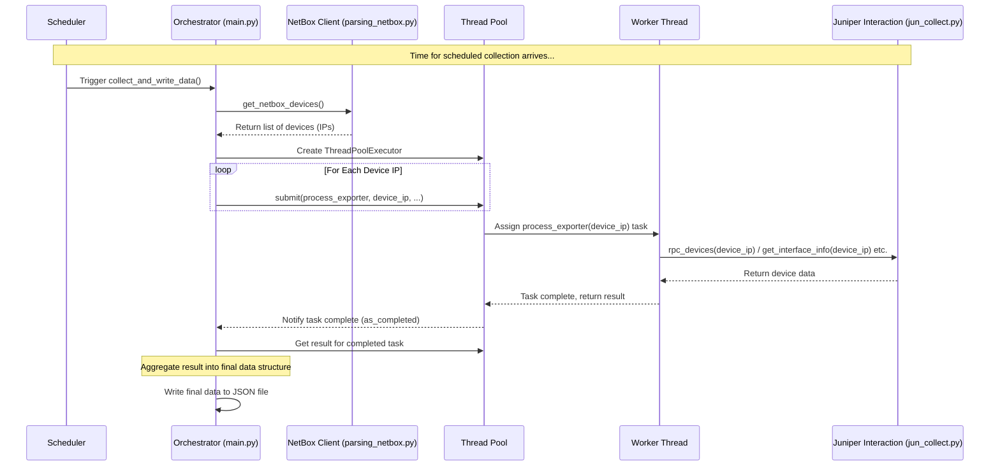

# Chapter 2: Data Collection Orchestrator

In the [previous chapter](01_configuration_management_.md), we learned how the `agent` keeps its important settings, like login details and how often to run, neatly organized in `config.py`. Now, let's meet the component that *uses* those settings to actually manage the work: the **Data Collection Orchestrator**.

## What Problem Does This Solve?

Imagine you're managing a project with several teams. Each team (like a team talking to a specific network device) needs instructions on what to do and when. You, as the project manager, need to:

1.  Know which teams (devices) are involved.
2.  Tell them when to start working (schedule).
3.  Coordinate their efforts efficiently (maybe have multiple teams work at the same time).
4.  Collect the results from everyone when they finish.

This is exactly what the Data Collection Orchestrator does for our `agent`. Without it, how would the application know *when* to collect data, *which* devices to contact, and how to handle talking to *many* devices without taking forever?

The orchestrator is the central coordinator that brings everything together. It's the "brain" that runs the main data gathering cycle.

## The Orchestrator's Plan

Our orchestrator, which lives mainly inside the `main.py` file, follows a clear plan for each data collection cycle:

1.  **Wait for the Signal:** It waits for the scheduled time, which we set using `update_time` in our [Configuration Management](01_configuration_management_.md).
2.  **Get the Guest List:** Before contacting any devices, it first asks the [NetBox API Client](05_netbox_api_client_.md) (using functions in `parsing_netbox.py`) for the latest list of Juniper devices (we call these 'exporters') and how they are connected. This ensures we always work with the current network state.
3.  **Delegate Efficiently:** It needs to collect data from *multiple* Juniper devices. Doing this one by one could be very slow. So, it uses a clever technique called a "thread pool". Think of it like having a team of workers (`max_workers` from `config.py` determines the team size). The orchestrator gives each worker a device to talk to, and they work *at the same time* (concurrently).
4.  **Use Specialists:** Each worker, when assigned a device, uses the specialized tools: the [Juniper Device Interaction](03_juniper_device_interaction_.md) component (in `jun_collect.py`) to talk to the device and the [Juniper Data Parsing](04_juniper_data_parsing_.md) component (also relies on `jun_collect.py`) to understand the device's response.
5.  **Gather Reports:** As each worker finishes collecting data from its assigned device, the orchestrator gathers the results.
6.  **Compile the Final Report:** Once all workers have reported back, the orchestrator puts all the collected data together into one final JSON file.

## How It Works: A High-Level Look

The core logic for this orchestration happens in the `collect_and_write_data` function within `main.py`. Let's look at a simplified version:

```python
# File: main.py (Simplified Snippet)
import config
import parsing_netbox # Our NetBox client helper
import jun_collect    # Our Juniper interaction/parsing helper
import json
from concurrent.futures import ThreadPoolExecutor, as_completed

# This function is the heart of the orchestration
def collect_and_write_data():
    print("[INFO] Starting data collection cycle...")

    # 1. Get device list & connections from NetBox
    connections = parsing_netbox.get_netbox_cables()
    exporters = parsing_netbox.get_netbox_devices() # 'exporters' is a dictionary of devices

    # Prepare a dictionary to hold all results
    data = {"exporters": exporters} # Start with NetBox info

    # 3. Create a pool of workers (threads)
    # Use max_workers from config.py to set the size
    with ThreadPoolExecutor(max_workers=config.max_workers) as executor:
        future_to_exporter = {}
        # 4. Assign work to the pool for each device
        for exporter_ip in exporters.keys():
            print(f"[DEBUG] Submitting task for device: {exporter_ip}")
            # Tell a worker to run 'process_exporter' for this device IP
            future = executor.submit(process_exporter, exporter_ip, connections, exporters)
            future_to_exporter[future] = exporter_ip # Keep track of which task is for which IP

        # 5. Gather results as workers finish
        for future in as_completed(future_to_exporter):
            exporter_ip = future_to_exporter[future]
            try:
                # Get the result from the completed task
                _ip, result_data = future.result()
                # Add the collected data to our main dictionary
                exporters[exporter_ip]["interfaces"] = result_data["interfaces"]
                exporters[exporter_ip]["nexthops"] = result_data["nexthops"]
                exporters[exporter_ip]["mpls_labels"] = result_data["mpls_labels"]
                print(f"[DEBUG] Collected data for: {exporter_ip}")
            except Exception as exc:
                print(f"[ERROR] Device {exporter_ip} generated an exception: {exc}")

    # 6. Write the final combined data to a file
    output_filename = "result/tmp.json"
    with open(output_filename, "w", encoding="utf-8") as file:
        json.dump(data, file, ensure_ascii=False, indent=4)

    print("[INFO] Data collection cycle complete.")

# (The 'process_exporter' function is called by the workers - see below)
# (The scheduler setup is also in main.py - see below)
```

**Explanation:**

*   This function first calls helper functions from `parsing_netbox.py` ([NetBox API Client](05_netbox_api_client_.md)) to get the list of devices (`exporters`) and their cabling (`connections`).
*   It then creates a `ThreadPoolExecutor`, our team of workers. The size of the team comes from `config.max_workers`.
*   It loops through each device IP address found in the `exporters` dictionary.
*   For each device, `executor.submit(...)` gives the task of running the `process_exporter` function (with the device IP and other needed info) to an available worker in the pool. This doesn't wait; it just hands off the job and moves to the next device.
*   The `as_completed(...)` loop waits until *any* worker finishes its task. When one finishes, it gets the result (`future.result()`) and adds the collected data (interfaces, nexthops, MPLS labels) back into the main `data` dictionary, under the correct device IP.
*   Finally, after all workers have finished and results are gathered, it writes the complete `data` dictionary into the `result/tmp.json` file.

## Under the Hood: The Workflow

Let's visualize the steps when a data collection cycle runs:



**Step-by-Step:**

1.  The `schedule` library (configured in `run_scheduler` in `main.py`) triggers the `collect_and_write_data` function based on `config.update_time`.
2.  The orchestrator calls the [NetBox API Client](05_netbox_api_client_.md) to fetch the current device list.
3.  A `ThreadPoolExecutor` is created.
4.  The orchestrator loops through the device list and submits a task for each device to the pool. The task is to run the `process_exporter` function.
5.  The Thread Pool assigns these tasks to available worker threads (up to `config.max_workers` running simultaneously).
6.  Each worker thread executes `process_exporter` for its assigned device. This function calls methods from the [Juniper Device Interaction](03_juniper_device_interaction_.md) component (`jun_collect.py`) to connect to the device, run commands, and parse the results.
7.  When a worker finishes, it returns the collected data for its device.
8.  The orchestrator, waiting via `as_completed`, receives the result and adds it to the main data structure.
9.  Once all tasks are complete, the orchestrator writes the aggregated data to a JSON file.

## Under the Hood: Key Code Snippets

Let's look at the other important parts in `main.py` that make this happen.

**1. Scheduling the Task:**

The `run_scheduler` function sets up the recurring execution of our orchestrator function.

```python
# File: main.py (Simplified Snippet)
import schedule
import time
import config

# (collect_and_write_data function is defined above)

def run_scheduler():
    print(f"[INFO] Scheduling data collection every {config.update_time} minutes.")
    # Tell the schedule library to run our main function periodically
    schedule.every(config.update_time).minutes.do(collect_and_write_data)

    # Keep checking if it's time to run a scheduled job
    while True:
        schedule.run_pending()
        time.sleep(1) # Wait 1 second before checking again

# This function runs in a separate thread so the web server can also run
# threading.Thread(target=run_scheduler, daemon=True).start()
```

**Explanation:**

*   It reads `config.update_time` (which we set in `config.py`).
*   `schedule.every(...).minutes.do(...)` tells the `schedule` library: "Run the function `collect_and_write_data` every `config.update_time` minutes."
*   The `while True` loop continuously checks if any scheduled jobs are due to run.

**2. The Worker's Job (`process_exporter`):**

This is the function that each worker thread actually executes for a single device.

```python
# File: main.py (Simplified Snippet)
import jun_collect # Our Juniper interaction/parsing helper

# This function is executed by each worker thread for one device
def process_exporter(exporter_ip, connections, exporters):
    try:
        print(f"[DEBUG] Worker processing: {exporter_ip}")
        # 1. Connect and maybe run initial commands (implementation in jun_collect)
        jun_collect.rpc_devices(exporter_ip) # Uses config.username/password by default

        # 2. Get specific data using helpers from jun_collect
        if_data = jun_collect.get_interface_info(exporter_ip)
        # (Code here adds connection info from NetBox data - omitted for brevity)

        if_nhs = jun_collect.get_nexthops(exporter_ip)
        # (Code here adds more details to nexthops - omitted for brevity)

        mpls_labels = jun_collect.get_mpls_labels(exporter_ip)

        # 3. Return the collected data for this device
        return exporter_ip, {
            "interfaces": if_data,
            "nexthops": if_nhs, # Simplified from original code for clarity
            "mpls_labels": mpls_labels
        }

    except Exception as e:
        print(f"[ERROR] Worker failed for {exporter_ip}: {e}")
        # Important: Re-raise the exception so the main loop knows it failed
        raise
```

**Explanation:**

*   This function takes the device's IP address (`exporter_ip`) and the NetBox data (`connections`, `exporters`) as input.
*   It calls functions from `jun_collect.py` ([Juniper Device Interaction](03_juniper_device_interaction_.md) and [Juniper Data Parsing](04_juniper_data_parsing_.md)) like `rpc_devices`, `get_interface_info`, `get_nexthops`, and `get_mpls_labels`. These functions handle the actual communication and data extraction from the Juniper device.
*   It gathers the results from these calls into a dictionary.
*   It returns the device's IP and the dictionary containing its collected data. This is the result that the main orchestrator loop (`as_completed`) receives.

## Conclusion

In this chapter, we met the Data Collection Orchestrator, the project manager of our `agent`. We learned that:

*   It coordinates the entire data collection process.
*   It uses a schedule (`config.update_time`) to run periodically.
*   It fetches the list of devices to target from the [NetBox API Client](05_netbox_api_client_.md).
*   It uses a thread pool (`config.max_workers`) to efficiently contact multiple Juniper devices concurrently.
*   Each concurrent task uses the [Juniper Device Interaction](03_juniper_device_interaction_.md) and [Juniper Data Parsing](04_juniper_data_parsing_.md) components.
*   It gathers all the results and compiles them into a final data file.

The orchestrator is crucial for making the `agent` efficient and organized. Now that we understand how the overall process is managed, let's zoom in on how the agent actually talks to the network devices.

Next up, we'll explore the specifics of communicating with Juniper devices in [Chapter 3: Juniper Device Interaction](03_juniper_device_interaction_.md).

---

Generated by [AI Codebase Knowledge Builder](https://github.com/The-Pocket/Tutorial-Codebase-Knowledge)