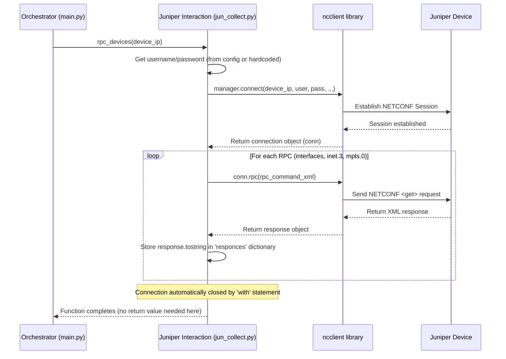

# Chapter 3: Juniper Device Interaction

In the [previous chapter](02_data_collection_orchestrator_.md), we saw how the Data Collection Orchestrator acts like a project manager, deciding *when* to collect data and coordinating the work. But how does the `agent` actually *talk* to the network devices? That's where the **Juniper Device Interaction** component comes in.

## What Problem Does This Solve?

Imagine you need to operate a complex piece of machinery, like a network router from Juniper Networks. You can't just shout commands at it! You need a specific way to communicate, a special language, and the right credentials to be allowed to operate it.

The Juniper Device Interaction component is like a **specialized remote control operator** trained specifically for Juniper devices. Its job is to:

1.  Log in securely using the correct username and password.
2.  Speak the device's language (a protocol called NETCONF).
3.  Ask specific, pre-defined questions (called RPCs - Remote Procedure Calls).
4.  Receive the device's answers (in a raw format called XML).
5.  Handle basic problems if the connection fails.

Without this specialized operator, the orchestrator wouldn't know how to get the necessary information directly from the network gear.

## Our Specialist Operator: `jun_collect.py`

The code for this component lives primarily in the `jun_collect.py` file. Let's look at the key parts of its job.

### 1. The Language: NETCONF

Juniper devices often use a standard protocol called **NETCONF** for management. Think of it like a structured language for network devices, much better than trying to type commands manually over SSH. Our operator uses a Python library called `ncclient` which knows how to speak NETCONF.

### 2. The Questions: RPCs (Remote Procedure Calls)

We don't want *everything* from the device, just specific pieces of information. We define these questions ahead of time as **RPCs**. An RPC is just a structured request for data. In `jun_collect.py`, we have predefined RPCs to ask for:

*   Interface information (Is the port up? What's its description?)
*   Routing table details (`inet.3` - used for MPLS paths)
*   MPLS label information (`mpls.0` - used for label switching)

Here's what one of those questions looks like (formatted in XML, which NETCONF uses):

```xml
<!-- File: jun_collect.py (Snippet) -->
rpc_interface = """
  <get-interface-information xmlns="http://yang.juniper.net/junos/rpc/interfaces"/>
"""
```

This snippet, stored in the `rpc_interface` variable, is the precise way to ask a Juniper device: "Tell me about your network interfaces."

### 3. Logging In: Credentials

To ask these questions, our operator needs to log in. Where does it get the username and password? From our central settings file, as discussed in [Chapter 1: Configuration Management](01_configuration_management_.md)! The operator automatically picks up the `config.username` and `config.password`.

*(Note: The code has a small exception – for specific test IP addresses like "10.27.193.80", it uses hardcoded "lab" credentials. For all other devices, it uses the defaults from `config.py`.)*

### 4. Receiving Answers: Raw XML

When the Juniper device answers an RPC, it sends back the information formatted in **XML**. XML is a text-based format that uses tags (like `<tag>data</tag>`) to structure data. Our operator receives this raw XML data.

**Example Raw XML (Simplified):**

```xml
<interface-information>
  <physical-interface>
    <name>ge-0/0/0</name>
    <oper-status>up</oper-status>
    <logical-interface>
      <name>ge-0/0/0.0</name>
      <address-family>
        <address-family-name>inet</address-family-name>
        <interface-address>
          <ifa-local>192.168.1.1/24</ifa-local>
        </interface-address>
      </address-family>
    </logical-interface>
  </physical-interface>
  <!-- ... more interfaces ... -->
</interface-information>
```

This raw XML is just stored temporarily in memory (in a Python dictionary called `responces` within `jun_collect.py`). Making sense of this XML is the job of the *next* component, the [Juniper Data Parsing](04_juniper_data_parsing_.md).

## How the Orchestrator Uses the Operator

Remember the `process_exporter` function in `main.py` from the [Data Collection Orchestrator](02_data_collection_orchestrator_.md)? That's where the operator gets called into action.

```python
# File: main.py (Simplified Snippet showing the call)
import jun_collect # Our Juniper interaction/parsing helper

def process_exporter(exporter_ip, connections, exporters):
    try:
        print(f"[DEBUG] Worker processing: {exporter_ip}")
        # >> Use the Juniper Operator! <<
        jun_collect.rpc_devices(exporter_ip)

        # (Later steps in this function use other jun_collect helpers
        #  like get_interface_info, get_nexthops etc. which retrieve
        #  the already-collected raw data and parse it)
        # ... parsing steps ...

        return exporter_ip, { # ... parsed data ... }
    except Exception as e:
        # ... error handling ...
        raise
```

**Explanation:**

*   The orchestrator (via the `process_exporter` function running in a worker thread) calls `jun_collect.rpc_devices(exporter_ip)`.
*   **Input:** It just needs the IP address (`exporter_ip`) of the Juniper device to talk to.
*   **Action:** The `rpc_devices` function then performs the login, sends the pre-defined RPCs (for interfaces, inet.3, mpls.0), and stores the raw XML responses it gets back. It doesn't *return* the raw data directly, but stores it internally.
*   **Output:** If successful, the function completes, and the raw data is ready for the next step (parsing). If it fails to connect or run the commands, it prints an error.

## Under the Hood: Connecting and Asking

Let's trace what happens inside `jun_collect.py` when `rpc_devices` is called.

**Step-by-Step:**

1.  **Get Credentials:** The function checks if the IP address is a special test IP. If yes, it uses "lab" credentials. Otherwise, it reads `config.username` and `config.password` from our [Configuration Management](01_configuration_management_.md).
2.  **Connect (NETCONF):** It uses the `ncclient` library's `manager.connect()` function to establish a secure NETCONF session with the Juniper device at the given IP address, using the retrieved credentials. It also sets some connection parameters (like port 830, disabling host key checks for simplicity in this project).
3.  **Send RPCs:** Once connected, it sends the pre-defined RPC strings (`rpc_interface`, `rpc_inet_3`, `rpc_mpls_0`) one by one using the connection's `rpc()` method.
4.  **Store Raw XML:** The `rpc()` method returns the device's response as an object. We convert this response to a plain text XML string using `.tostring` and store it in a dictionary named `responces`, keyed by the device's IP address and the type of data (e.g., `responces[ip_host]["interfaces"]`).
5.  **Handle Errors:** If anything goes wrong during connection or sending RPCs (e.g., wrong password, device unreachable), an exception occurs. The `try...except` block catches this, prints an error message, and makes sure any previously stored (potentially incomplete) data for that IP is cleared.
6.  **Close Connection:** The `with manager.connect(...) as conn:` structure automatically ensures the connection is closed properly when done, even if errors occurred.

**Sequence Diagram:**



**Code Dive (`jun_collect.py`):**

Let's look at the key function, simplified:

```python
# File: jun_collect.py (Simplified rpc_devices function)

from ncclient import manager
import config # For default credentials

# Dictionary to temporarily store raw XML responses
responces = {}

# Pre-defined RPCs (XML strings asking for specific data)
rpc_interface = "<get-interface-information/>" # Simplified for brevity
rpc_inet_3 = "<get-route-information><table>inet.3</table></get-route-information>"
rpc_mpls_0 = "<get-route-information><table>mpls.0</table></get-route-information>"

def rpc_devices(ip_host):
    # Step 1: Get Credentials
    if ip_host == "10.27.193.80": # Special case for test device
        username = "lab"
        password = "lab123"
    else: # Default case
        username = config.username
        password = config.password

    try:
        # Step 2: Connect using ncclient (auto-closes connection)
        print(f"[DEBUG] Connecting to {ip_host} via NETCONF...")
        with manager.connect(
            host=ip_host,
            port=830,
            username=username,
            password=password,
            hostkey_verify=False, # Simplification for lab/testing
            # ... other parameters ...
            timeout=30 # Wait max 30 seconds
        ) as conn:
            print(f"[DEBUG] Connected to {ip_host}. Sending RPCs...")
            # Step 3 & 4: Send RPCs and Store Raw XML Responses
            if ip_host not in responces:
                responces[ip_host] = {} # Create entry if first time

            responces[ip_host]["interfaces"] = conn.rpc(rpc_interface).tostring
            responces[ip_host]["nhs"] = conn.rpc(rpc_inet_3).tostring
            responces[ip_host]["mpls_labels"] = conn.rpc(rpc_mpls_0).tostring
            print(f"[DEBUG] Received responses from {ip_host}")

    # Step 5: Handle Errors
    except Exception as e:
        print(f"[ERROR] Failed getting data from {ip_host}: {e}")
        # Clear any potentially incomplete data for this host on error
        if ip_host in responces:
            responces[ip_host] = {}
```

**Explanation:**

*   We import `manager` from `ncclient` and our `config`.
*   The `responces` dictionary acts as our temporary storage for the raw XML strings we get back.
*   The `rpc_devices` function takes the device IP.
*   It determines the correct `username` and `password`.
*   The `try...except` block handles potential errors during the process.
*   `with manager.connect(...)` is the core of the connection logic. It handles opening and closing the NETCONF session. We provide the host IP, port, credentials, and other options.
*   Inside the `with` block (meaning we are successfully connected), we call `conn.rpc()` for each of our pre-defined RPC XML strings.
*   The result of `conn.rpc()` is converted to a string (`.tostring`) and stored in the `responces` dictionary, organized by IP address and data type (e.g., `responces["10.1.1.1"]["interfaces"]`).
*   If any exception occurs (like a login failure, timeout, or the device sending back an error), the `except` block catches it, prints a helpful message, and clears out any data for that device in `responces` to avoid using partial results.

## Conclusion

In this chapter, we met the "Juniper remote control operator" – the Juniper Device Interaction component (`jun_collect.py`). We learned that:

*   It specializes in talking to Juniper devices using the **NETCONF** protocol.
*   It uses credentials from [Configuration Management](01_configuration_management_.md) to log in securely.
*   It asks pre-defined questions (**RPCs**) to request specific data like interface status, `inet.3` routes, and `mpls.0` labels.
*   It receives the answers as **raw XML** data and stores them temporarily in memory.
*   It handles basic connection errors.
*   The [Data Collection Orchestrator](02_data_collection_orchestrator_.md) uses this component by calling `jun_collect.rpc_devices(ip)`.

This component successfully gets the raw information from the devices. But raw XML isn't very easy for our application to use directly. How do we make sense of it?

Next up, we'll explore [Chapter 4: Juniper Data Parsing](04_juniper_data_parsing_.md), which takes the raw XML collected here and turns it into structured, usable Python data.

---

Generated by [AI Codebase Knowledge Builder](https://github.com/The-Pocket/Tutorial-Codebase-Knowledge)