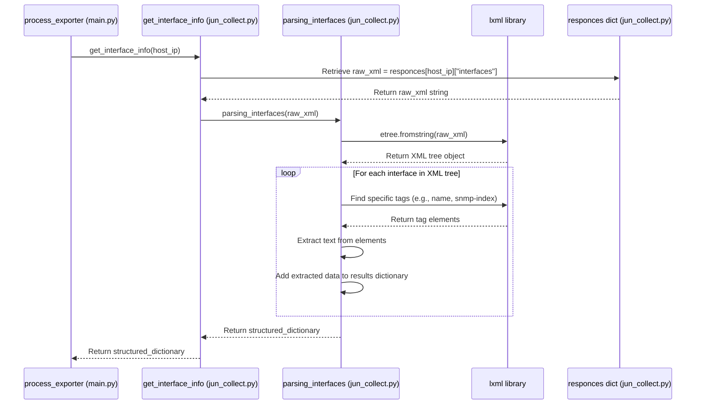

# Chapter 4: Juniper Data Parsing

In the [previous chapter](03_juniper_device_interaction_.md), we saw how our `agent` acts like a remote control operator, connecting to Juniper devices and retrieving information as raw XML data. Think of that XML like receiving a technical manual full of jargon – it has the information, but it's dense and hard to quickly find what you need.

This is where **Juniper Data Parsing** comes in. It acts like a **translator and organizer**, taking that raw, complex XML data and transforming it into clean, well-structured Python dictionaries. It's like turning that dense manual into a neat spreadsheet or a set of easy-to-read index cards.

## What Problem Does This Solve?

Imagine you have this chunk of XML received from a Juniper device describing a network interface:

```xml
<physical-interface>
  <name>ge-0/0/1</name>
  <speed>1000mbps</speed>
  <logical-interface>
    <name>ge-0/0/1.0</name>
    <snmp-index>515</snmp-index>
    <description>Link to Core Router</description>
    <!-- ... other details ... -->
  </logical-interface>
</physical-interface>
```

While a human can read it, how does our Python code easily grab *just* the description ("Link to Core Router") or the SNMP index (515) for the logical interface `ge-0/0/1.0`? Searching through the raw text is inefficient and prone to errors.

The Juniper Data Parsing component solves this by:

1.  **Understanding XML Structure:** Knowing how to navigate the tags (like `<name>`, `<description>`).
2.  **Extracting Specific Data:** Pulling out only the pieces of information we care about (like logical interface name, speed, description, SNMP index, next-hop details, MPLS labels).
3.  **Structuring the Data:** Organizing the extracted information into Python dictionaries, which are much easier for other parts of our program to use.

Without parsing, the raw data collected in the previous step would be almost useless to the rest of the `agent`.

## Our Translator: Parsing Functions in `jun_collect.py`

Interestingly, the code responsible for parsing the Juniper data lives in the *same file* as the code that interacts with the device: `jun_collect.py`. This keeps related logic together.

Within `jun_collect.py`, there are specific functions designed to parse the different types of XML responses we received:

*   `parsing_interfaces(xml_content)`: Takes the raw XML for interface information and extracts details about logical interfaces.
*   `parsing_inet3(xml_content)`: Takes the raw XML from the `inet.3` routing table and extracts next-hop information.
*   `parsing_mpls0(xml_content)`: Takes the raw XML from the `mpls.0` routing table and extracts MPLS label actions (like Push, Swap, Pop).

There are also "getter" functions that first retrieve the stored raw XML (from the `responces` dictionary we saw in Chapter 3) and then call the appropriate parsing function:

*   `get_interface_info(host)`: Gets interface XML for the host, calls `parsing_interfaces`.
*   `get_nexthops(host)`: Gets `inet.3` XML for the host, calls `parsing_inet3`.
*   `get_mpls_labels(host)`: Gets `mpls.0` XML for the host, calls `parsing_mpls0`.

Let's focus on how the interface parsing works.

## Example: Parsing Interface Data

Remember the raw XML data stored in the `responces` dictionary from [Chapter 3: Juniper Device Interaction](03_juniper_device_interaction_.md)? Let's say `responces[host]["interfaces"]` contains XML similar to our earlier example.

The goal of `parsing_interfaces` is to turn that XML into a Python dictionary like this:

```python
# Desired Output (Python Dictionary)
{
  "515": { # Key is the SNMP Index
    "name": "ge-0/0/1.0",
    "speed": "1000mbps",
    "description": "Link to Core Router"
  },
  # ... entry for SNMP index of ge-0/0/2.0 ...
  # ... etc. ...
}
```

This dictionary is much easier to work with! If we want the description for the interface with SNMP index "515", we can just access `parsed_data["515"]["description"]`.

Here's a simplified look at the `parsing_interfaces` function in `jun_collect.py` that achieves this:

```python
# File: jun_collect.py (Simplified parsing_interfaces)
from lxml import etree # A library to help read XML

def parsing_interfaces(xml_content):
    if xml_content is None: # Handle cases where data wasn't collected
        return {}
    # Load the XML string into an object 'lxml' can work with
    tree = etree.fromstring(xml_content)

    logical_interfaces = {} # Create an empty dictionary for results

    # Find all <physical-interface> tags in the XML
    for physical in tree.findall(".//physical-interface"):
        # Find the <speed> tag within this physical interface
        speed_elem = physical.find("speed")
        speed = speed_elem.text.strip() if speed_elem is not None else ""

        # Find all <logical-interface> tags within this physical one
        for logical in physical.findall("logical-interface"):
            # Extract text from specific tags inside logical-interface
            name = logical.findtext("name", default="").strip()
            snmp_index = logical.findtext("snmp-index", default="").strip()
            description = logical.findtext("description", default="").strip()

            # Store the extracted data in our dictionary, keyed by SNMP index
            if snmp_index: # Only add if we have an SNMP index
                logical_interfaces[snmp_index] = {
                    "name": name,
                    "speed": speed, # Use speed from the parent physical interface
                    "description": description
                }

    return logical_interfaces # Return the structured dictionary
```

**Explanation:**

1.  **Import `lxml.etree`:** This is a powerful Python library specifically designed for processing XML.
2.  **Load XML:** `etree.fromstring(xml_content)` takes the raw XML text and turns it into a structured tree that `lxml` can understand.
3.  **Find Elements:** The code uses methods like `tree.findall(".//physical-interface")` to locate all occurrences of a specific XML tag (here, `<physical-interface>`). The `.` means "start from the current element", and `//` means "look anywhere underneath". `physical.find("speed")` looks for a direct child tag named `<speed>`.
4.  **Extract Text:** `.findtext("tag_name", default="")` is a handy way to get the text content inside a tag. If the tag isn't found, it returns the default value (an empty string here). `.strip()` removes extra whitespace.
5.  **Build Dictionary:** As the code loops through the interfaces found in the XML, it pulls out the `name`, `snmp_index`, `description`, and the parent `speed`. It then adds a new entry to the `logical_interfaces` dictionary, using the `snmp_index` as the key.
6.  **Return Result:** Finally, the function returns the populated `logical_interfaces` dictionary.

The functions `parsing_inet3` and `parsing_mpls0` work very similarly: they load the respective XML, find the relevant tags (like `<rt>` for routes, `<nh>` for next-hops, `<mpls-label>`), extract the text, and build structured dictionaries containing next-hop and MPLS label information.

## How the Orchestrator Gets Parsed Data

The [Data Collection Orchestrator](02_data_collection_orchestrator_.md) (specifically, the `process_exporter` function in `main.py`) doesn't call the `parsing_...` functions directly. Instead, it uses the helper "getter" functions:

```python
# File: main.py (Simplified snippet from process_exporter)
import jun_collect # Our Juniper interaction/parsing helper

def process_exporter(exporter_ip, connections, exporters):
    try:
        # Step 1: Collect raw data (Chapter 3)
        jun_collect.rpc_devices(exporter_ip)

        # Step 2: Get *parsed* data using the getter functions
        if_data = jun_collect.get_interface_info(exporter_ip) # Calls parsing_interfaces inside
        if_nhs = jun_collect.get_nexthops(exporter_ip)       # Calls parsing_inet3 inside
        mpls_labels = jun_collect.get_mpls_labels(exporter_ip) # Calls parsing_mpls0 inside

        # Step 3: Return the structured Python dictionaries
        return exporter_ip, {
            "interfaces": if_data,
            "nexthops": if_nhs,
            "mpls_labels": mpls_labels
        }
    except Exception as e:
        # ... error handling ...
        raise
```

When `process_exporter` calls `jun_collect.get_interface_info(exporter_ip)`, the following happens *inside* `jun_collect.py`:

1.  `get_interface_info` retrieves the raw interface XML stored in `responces[exporter_ip]["interfaces"]`.
2.  It passes this raw XML to the `parsing_interfaces` function.
3.  `parsing_interfaces` does its magic (as shown above) and returns the structured Python dictionary.
4.  `get_interface_info` returns this structured dictionary back to `process_exporter`.

The same process occurs for `get_nexthops` (using `parsing_inet3`) and `get_mpls_labels` (using `parsing_mpls0`).

## Under the Hood: The Parsing Flow

Let's visualize the journey from raw XML to a usable Python dictionary when `get_interface_info` is called:



**Step-by-Step:**

1.  The orchestrator's worker (`process_exporter`) calls `get_interface_info` with the device IP.
2.  `get_interface_info` looks up the corresponding raw interface XML in the `responces` dictionary (which was populated in Chapter 3).
3.  It passes this raw XML string to the `parsing_interfaces` function.
4.  `parsing_interfaces` uses the `lxml` library to load the XML string into a navigable tree structure.
5.  It then uses `lxml`'s functions (`findall`, `findtext`) to locate the desired XML elements (like `<logical-interface>`, `<name>`, `<snmp-index>`) within the tree.
6.  It extracts the text content from these elements.
7.  It builds a new Python dictionary, organizing the extracted data logically (e.g., using the SNMP index as the key).
8.  The finished dictionary is returned by `parsing_interfaces` to `get_interface_info`.
9.  `get_interface_info` returns the dictionary to the original caller (`process_exporter`).

## Code Dive (`jun_collect.py` - Getters and Parsers)

Let's look at how the getter function connects to the parser function:

```python
# File: jun_collect.py (Getter function)

# (responces dictionary and parsing_interfaces function are defined elsewhere)

def get_interface_info(host):
    # 1. Retrieve the raw XML from storage
    response = responces.get(host, {}).get("interfaces")
    # '.get(host, {})' safely gets the entry for the host, or an empty dict if host not found
    # '.get("interfaces")' safely gets the interface XML, or None if not found

    # 2. Call the parsing function with the raw XML
    lg_interfaces = parsing_interfaces(response)

    # 3. Return the result (the structured dictionary)
    return lg_interfaces
```

This getter function is quite simple: it fetches the previously stored raw data and passes it to the dedicated parsing function. This separation keeps the code organized – one function fetches, the other parses.

And here's a slightly more detailed (but still simplified) look at the XML navigation part within `parsing_interfaces`:

```python
# File: jun_collect.py (Simplified parsing_interfaces - focus on XML navigation)
from lxml import etree

def parsing_interfaces(xml_content):
    if xml_content is None: return {}
    tree = etree.fromstring(xml_content)
    logical_interfaces = {}

    # Find all <physical-interface> tags anywhere under the root
    for physical in tree.findall(".//physical-interface"):
        speed = physical.findtext("speed", default="") # Find <speed> directly under physical

        # Find <logical-interface> tags directly under this physical interface
        for logical in physical.findall("logical-interface"):
            # Find tags directly under this logical interface
            snmp_index = logical.findtext("snmp-index", default="")
            name = logical.findtext("name", default="")
            description = logical.findtext("description", default="")

            if snmp_index:
                logical_interfaces[snmp_index] = {
                    "name": name, "speed": speed, "description": description
                }
    return logical_interfaces
```

The key is using `lxml` methods like `findall` and `findtext` to precisely target and extract the data associated with specific XML tags.

## Conclusion

In this chapter, we learned about the crucial role of **Juniper Data Parsing**. We saw that:

*   It solves the problem of working with complex, raw XML data received from devices.
*   It acts like a **translator**, converting XML into easy-to-use Python dictionaries.
*   Specialized functions (`parsing_interfaces`, `parsing_inet3`, `parsing_mpls0`) exist within `jun_collect.py` to handle different types of data (interfaces, next-hops, MPLS labels).
*   Libraries like `lxml` are used to efficiently navigate the XML structure and extract the needed information.
*   Getter functions (`get_interface_info`, etc.) provide a clean way for the rest of the application (like the [Data Collection Orchestrator](02_data_collection_orchestrator_.md)) to obtain the parsed, structured data.

Now our `agent` can not only talk to Juniper devices and get data, but also understand and structure that data. However, the Juniper devices are only *one* source of information. We also need data from our "source of truth" database, NetBox.

Next up, we'll explore the [Chapter 5: NetBox API Client](05_netbox_api_client_.md), which is responsible for fetching information from NetBox.

---

Generated by [AI Codebase Knowledge Builder](https://github.com/The-Pocket/Tutorial-Codebase-Knowledge)