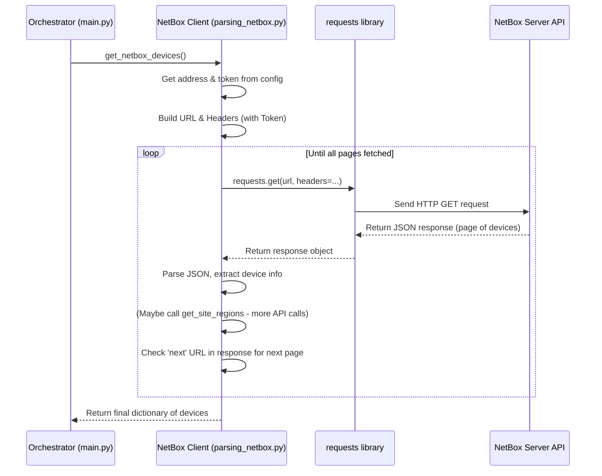

# Chapter 5: NetBox API Client

In the [previous chapter](04_juniper_data_parsing_.md), we learned how our `agent` takes the raw, technical XML data from Juniper devices and translates it into useful Python dictionaries. That's great for understanding what the *device itself* knows. But where do we get the official information about our network, like which devices are *supposed* to exist, where they are located, and how they are physically connected?

For that, we need to consult our network's "source of truth". In many networks, this is a tool called **NetBox**. This chapter introduces the **NetBox API Client**, the part of our `agent` responsible for talking to NetBox.

## What Problem Does This Solve?

Imagine you have a library full of books (your network devices). You need a way to know exactly which books the library owns, where they are located on the shelves, and maybe even how they relate to each other (like volumes in a series). Just looking at one book doesn't tell you about the whole collection.

**NetBox** is like that library's catalog system. It's a popular tool used by network engineers to document everything about their infrastructure: devices, IP addresses, sites, regions, cable connections, and more.

Our `agent` needs information *from* this central catalog. For example, before collecting data, the [Data Collection Orchestrator](02_data_collection_orchestrator_.md) needs the **official list of Juniper devices** it should contact. It also needs details about their **physical location** (site, region) and how their **ports are cabled together**.

The **NetBox API Client** acts like a helpful librarian for our `agent`. It knows how to:

1.  Go to the NetBox "library".
2.  Use a special library card (API Token) to prove its identity.
3.  Ask specific questions using NetBox's language (its web API).
4.  Retrieve the requested records (like device lists or cable details).
5.  Handle cases where there are too many records to fetch at once (pagination).
6.  Bring back the information neatly organized for the `agent` to use.

Without this client, our `agent` would be flying blind, not knowing which devices are part of the managed network or how they fit into the bigger picture.

## Our Librarian: Functions in `parsing_netbox.py`

The code that acts as our NetBox librarian lives in the file `parsing_netbox.py`. It uses standard web communication techniques (HTTP requests) to interact with the NetBox application's **API** (Application Programming Interface). An API is like a set of rules and URLs that allow programs to talk to each other.

This client fetches specific pieces of information:

*   **Device List:** Gets all devices documented in NetBox, focusing on their name, primary IP address (the one our agent will use to connect), site location, and the region hierarchy (e.g., a site might be in a specific city, which is in a state, which is in a country).
*   **Cable Connections:** Gets details about physical cables plugged between device interfaces, showing which local port connects to which remote device and port.

## How the Orchestrator Uses the Client

Remember our project manager, the [Data Collection Orchestrator](02_data_collection_orchestrator_.md)? At the beginning of each data collection cycle, it uses the NetBox API Client to get the necessary context.

```python
# File: main.py (Simplified Snippet from collect_and_write_data)

import parsing_netbox # Our NetBox API client helper

def collect_and_write_data():
    print("[INFO] Starting data collection cycle...")

    # >> Ask the NetBox client (our librarian) for info <<
    # 1. Get the list of physical cable connections
    connections = parsing_netbox.get_netbox_cables()
    # 2. Get the list of devices (exporters) with their details
    exporters = parsing_netbox.get_netbox_devices()

    # Prepare a dictionary to hold all results, starting with NetBox info
    data = {"exporters": exporters} # Store device list

    # ... (rest of the orchestration uses 'exporters' and 'connections') ...

    print("[INFO] Data collection cycle complete.")

# (Other parts of main.py handle scheduling and processing)
```

**Explanation:**

*   The orchestrator calls `parsing_netbox.get_netbox_cables()`.
    *   **Input:** None (it knows where NetBox is from `config.py`).
    *   **Action:** The client connects to NetBox, asks for cable data, and processes the response.
    *   **Output:** Returns a Python dictionary detailing the connections, like `{'device-A': {'interface-1': {'device': 'device-B', 'interface': 'interface-5'}}}`.
*   The orchestrator calls `parsing_netbox.get_netbox_devices()`.
    *   **Input:** None.
    *   **Action:** The client connects to NetBox, asks for the device list, gets site/region details for each, and processes the response.
    *   **Output:** Returns a Python dictionary where keys are device IP addresses and values contain details like name, site, and regions. Example: `{'10.1.1.1': {'name': 'core-router-1', 'site': 'DataCenter-A', 'regions': ['CityX', 'StateY']}}`.

The orchestrator then uses this information: the `exporters` dictionary tells it *which* IPs to contact, and the `connections` dictionary might be used later for enriching the collected data.

## Under the Hood: Talking to the NetBox API

How does `parsing_netbox.py` actually fetch this information? It uses the `requests` library in Python to make **HTTP GET requests** to specific URLs provided by the NetBox API.

**Step-by-Step (Fetching Devices):**

1.  **Get Configuration:** Read the NetBox server address (`config.netbox_address`) and the API token (`config.netbox_token`) from our [Configuration Management](01_configuration_management_.md).
2.  **Prepare the Request:** Construct the specific URL for the NetBox API endpoint that lists devices (e.g., `http://<netbox_address>/api/dcim/devices/`). Also, prepare special "headers" for the request, including the API token for authentication (like showing the library card).
3.  **Send the Request:** Use the `requests.get()` function to send the request to the NetBox server.
4.  **Receive the Response:** NetBox replies with data formatted in **JSON** (JavaScript Object Notation), which is easy for Python to understand. This response might only contain the *first page* of results if there are many devices.
5.  **Extract Data:** Pull the device details (name, primary IP) from the `results` part of the JSON response.
6.  **Get Location Details:** For each device, make *additional* API calls (using the device name or site URL found in the first response) to fetch its site name and the hierarchy of regions it belongs to (using the `get_site_regions` helper function).
7.  **Handle Pagination:** Check if the JSON response includes a `next` URL. If it does, it means there are more pages of devices. Repeat steps 3-7 using the `next` URL until `next` is `null` (meaning all pages have been fetched).
8.  **Structure and Return:** Organize all the collected information into the final Python dictionary (IP address as key) and return it.

Fetching cables (`get_netbox_cables`) follows a similar process but uses a different API URL (`/api/dcim/cables/`) and extracts different fields (termination points A and B).

**Sequence Diagram:**



## Code Dive (`parsing_netbox.py`)

Let's look at simplified versions of the functions.

**1. Configuration and Setup:**

At the top of the file, we import necessary libraries and grab settings from `config.py`.

```python
# File: parsing_netbox.py (Setup Snippet)
import config      # To get NetBox address and token
import requests    # To make HTTP requests

# Read settings from config.py
netbox_address = config.netbox_address
nb_token = 'Token ' + config.netbox_token # Format token for header

# Prepare headers to send with every request
headers = {
    'Accept': 'application/json', # We want JSON responses
    'Authorization': nb_token,   # Include our API token
}
payload = {} # Empty payload for GET requests
```

**2. Fetching Devices (`get_netbox_devices`):**

This function gets the list of devices and their locations.

```python
# File: parsing_netbox.py (Simplified get_netbox_devices)

def get_netbox_devices():
    # Start with the base API endpoint for devices
    url = f'http://{netbox_address}/api/dcim/devices/'
    ips = dict() # Dictionary to store results {ip: {details}}

    # Loop while there's a 'next' page URL from NetBox
    while url is not None:
        print(f"[DEBUG] Fetching NetBox devices from: {url}")
        response = requests.get(url, headers=headers, data=payload)
        response.raise_for_status() # Check for HTTP errors
        json_data = response.json()

        # Process devices found on this page
        for device in json_data['results']:
            ip4 = name = None
            if device.get('name'):
                name = device['name']
            # Safely access primary IP address
            primary_ip_info = device.get('primary_ip4')
            if primary_ip_info and primary_ip_info.get('address'):
                ip4 = primary_ip_info['address'].split('/')[0] # Get IP, remove mask

            if ip4 and name: # Only process if we have IP and name
                # Get site/region info using another helper function
                site, regions = get_site_regions(name)
                ips[ip4] = {
                    "name": name,
                    "site": site,
                    "regions": regions
                }

        # Get the URL for the next page, if it exists
        url = json_data.get('next')

    return ips # Return the complete dictionary
```

**Explanation:**

*   It builds the initial API `url`.
*   The `while url is not None:` loop handles pagination, continuing as long as NetBox provides a URL for the next page of results.
*   `requests.get()` sends the actual request with the URL and prepared `headers`.
*   It loops through the `results` list in the JSON response.
*   For each `device`, it carefully extracts the `name` and `primary_ip4` address (using `.get()` to avoid errors if fields are missing).
*   It calls `get_site_regions(name)` (another function in the same file, not shown in detail here) which makes *more* API calls to find the site and follow the parent region links in NetBox until the top is reached.
*   It stores the collected details in the `ips` dictionary, keyed by the IP address.
*   It updates the `url` variable with the `next` URL from the response for the next iteration of the loop.

**3. Fetching Cables (`get_netbox_cables`):**

This function retrieves physical connection information.

```python
# File: parsing_netbox.py (Simplified get_netbox_cables)

def get_netbox_cables():
    url = f'http://{netbox_address}/api/dcim/cables/'
    connections = dict() # Stores {device: {interface: {remote_details}}}

    while url is not None:
        print(f"[DEBUG] Fetching NetBox cables from: {url}")
        response = requests.get(url, headers=headers, data=payload)
        response.raise_for_status()
        json_data = response.json()

        for cable in json_data['results']:
            # Safely get termination details for side A and B
            a_term = cable.get("a_terminations", [{}])[0].get("object", {})
            b_term = cable.get("b_terminations", [{}])[0].get("object", {})

            # Extract device and interface names for both ends
            a_device = a_term.get("device", {}).get("name")
            a_interface = a_term.get("name")
            b_device = b_term.get("device", {}).get("name")
            b_interface = b_term.get("name")

            # Add connection info (if valid) in both directions
            if a_device and a_interface and b_device and b_interface:
                connections.setdefault(a_device, {})[a_interface] = \
                    {"device": b_device, "interface": b_interface}
                connections.setdefault(b_device, {})[b_interface] = \
                    {"device": a_device, "interface": a_interface}

        url = json_data.get('next') # Pagination

    return connections
```

**Explanation:**

*   Similar structure with pagination loop.
*   Uses the `/api/dcim/cables/` endpoint.
*   Extracts details about `a_terminations` and `b_terminations` from each `cable` record.
*   It carefully navigates the nested structure using `.get()` to avoid errors if data is incomplete.
*   It adds the connection information to the `connections` dictionary. `setdefault` is used to easily create nested dictionaries if the device key doesn't exist yet. It records the connection in *both* directions (from A to B, and from B to A).

## Conclusion

In this chapter, we met the **NetBox API Client**, our `agent`'s librarian. We learned that:

*   It connects to NetBox, the network's "source of truth", using its web API.
*   It uses settings from [Configuration Management](01_configuration_management_.md) (address, token).
*   It fetches specific data: the list of devices (with location) and physical cable connections.
*   It handles technical details like API authentication (tokens) and pagination (multi-page results).
*   It uses the `requests` library to make HTTP calls and processes the JSON responses.
*   The [Data Collection Orchestrator](02_data_collection_orchestrator_.md) uses this client (`parsing_netbox.py`) to get essential context before contacting devices.

Now, our `agent` has two streams of information:
1.  Live data parsed from Juniper devices ([Chapter 4: Juniper Data Parsing](04_juniper_data_parsing_.md)).
2.  Documentation data from NetBox (this chapter).

How do we combine these two sources to create a richer, more complete picture of the network?

Next up, we'll explore [Chapter 6: Data Enrichment & Consolidation](06_data_enrichment___consolidation_.md), where these different pieces of information come together.

---

Generated by [AI Codebase Knowledge Builder](https://github.com/The-Pocket/Tutorial-Codebase-Knowledge)