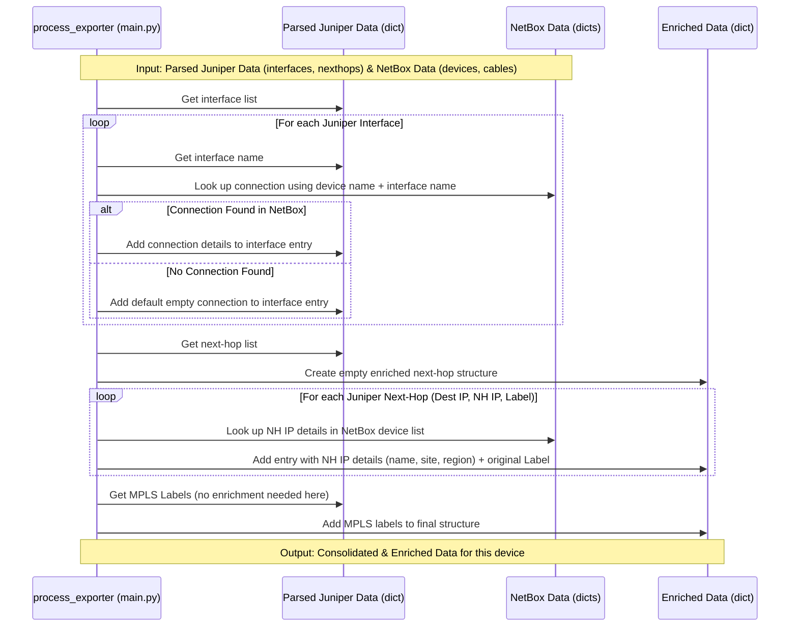

# Chapter 6: Data Enrichment & Consolidation

Welcome to Chapter 6! In [Chapter 4: Juniper Data Parsing](04_juniper_data_parsing_.md), we saw how our `agent` translated the raw technical data from Juniper devices into easy-to-use Python dictionaries. Then, in [Chapter 5: NetBox API Client](05_netbox_api_client_.md), we learned how the `agent` fetches official documentation data (like device locations and cable connections) from NetBox.

Now we have two distinct sets of information:
1.  **Live Data:** What the Juniper device *currently* sees (interfaces, routes, next-hops).
2.  **Documentation Data:** How the network is *supposed* to be configured according to NetBox (device names, sites, regions, cable connections).

But what if we want to combine them? Imagine you have field notes from observing a bird (Juniper data), and separate library records about that bird species (NetBox data). Wouldn't it be more useful to merge them, adding the library facts directly onto your field notes? That's exactly what **Data Enrichment & Consolidation** does for our network data.

## What Problem Does This Solve?

Let's say our Juniper device tells us its `ge-0/0/1.0` interface is up. That's useful, but what's plugged into the *other* end of that cable? Or, the Juniper device tells us the next hop for a specific destination is IP address `10.2.2.2`. Where is that device located? What's its official name?

Just looking at the Juniper data alone doesn't answer these questions. We need to combine it with the information stored in NetBox. Data Enrichment & Consolidation solves this by:

1.  **Enriching Juniper Interfaces:** Adding information about the connected remote device and interface (from NetBox cables) to the interface data collected from Juniper.
2.  **Enriching Juniper Next-Hops:** Adding metadata like the device name, site, and region (from NetBox devices) to the next-hop information collected from Juniper.
3.  **Consolidating:** Bringing all this enhanced data together into a single, final structure ready for use or export.

This gives us a much richer, more complete picture of the network state.

## Where Does Enrichment Happen?

The magic of merging and enhancing data happens primarily within the `process_exporter` function in the `main.py` file. Remember this function from the [Data Collection Orchestrator](02_data_collection_orchestrator_.md)? It's the function that runs for each individual Juniper device.

Here's the sequence within `process_exporter` for a single device:
1.  **Collect:** Use [Juniper Device Interaction](03_juniper_device_interaction_.md) to get raw data. (`jun_collect.rpc_devices`)
2.  **Parse:** Use [Juniper Data Parsing](04_juniper_data_parsing_.md) to turn raw XML into Python dictionaries. (`jun_collect.get_interface_info`, `get_nexthops`, `get_mpls_labels`)
3.  **Enrich & Consolidate:** **This is where the current chapter fits in!** Combine the parsed Juniper data with the NetBox data (which was already fetched by the orchestrator).
4.  **Return:** Send the final enriched data back to the main orchestrator loop.

Let's look at how the enrichment works.

## Enriching Interface Data

After parsing, we have a dictionary of interface information from Juniper, let's call it `if_data`. It might look like this (simplified):

```python
# Parsed Juniper Interface Data (if_data)
{
  "515": { # Key is SNMP Index
    "name": "ge-0/0/1.0",
    "speed": "1000mbps",
    "description": "Link to Core Router"
  },
  # ... other interfaces ...
}
```

We also have the cable connection data fetched from NetBox by the [NetBox API Client](05_netbox_api_client_.md), let's call it `connections`. And we have the list of devices from NetBox, `exporters`, which includes the current device's official name.

```python
# NetBox Connection Data (connections) - Simplified
# connections = {'this-device-name': {'ge-0/0/1.0': {'device': 'remote-device-name', 'interface': 'xe-0/0/5.0'}}}

# NetBox Device Data (exporters) - Simplified
# exporters = {'this-device-ip': {'name': 'this-device-name', ...}, ...}
```

The `process_exporter` function in `main.py` then loops through our `if_data` and adds the connection information from NetBox:

```python
# File: main.py (Simplified snippet inside process_exporter)

# Assume 'if_data' is the parsed Juniper interfaces
# Assume 'connections' is the NetBox cable data
# Assume 'exporters' is the NetBox device data
# Assume 'exporter' is the current device's IP address

device_name = exporters[exporter]["name"] # Get this device's name from NetBox data

# Loop through each interface found on the Juniper device
for interface_snmp_index in if_data:
    # Get the Juniper interface name (e.g., "ge-0/0/1.0")
    if_name = if_data[interface_snmp_index]["name"]

    # Look up this interface in the NetBox connections data
    # connections.get(device_name, {}) safely gets connections for this device
    # .get(if_name) then tries to find the specific interface
    connection_info = connections.get(device_name, {}).get(if_name)

    # Add the connection info (or default empty values) to the Juniper data
    if connection_info is not None:
        if_data[interface_snmp_index]["connection"] = connection_info
    else:
        # If no connection found in NetBox, add default empty info
        if_data[interface_snmp_index]["connection"] = {
            "device": "",
            "interface": ""
        }

# Now 'if_data' contains the original Juniper info PLUS the NetBox connection details!
```

**Explanation:**

1.  We get the official `device_name` of the current device from the `exporters` dictionary (which came from NetBox).
2.  We loop through each interface (`interface_snmp_index`) in the `if_data` dictionary (parsed from Juniper).
3.  Inside the loop, we grab the `if_name` (like "ge-0/0/1.0") from the Juniper data.
4.  We use `device_name` and `if_name` to look up the connection details in the `connections` dictionary (from NetBox). We use `.get(..., {})` and `.get(...)` to avoid errors if the device or interface isn't found in the NetBox cable data.
5.  We add a new key, `"connection"`, to the Juniper interface's dictionary. Its value is either the connection details found in NetBox or a default dictionary with empty strings if no connection was documented.

After this loop, our `if_data` dictionary is *enriched*!

**Enriched Interface Data Example:**

```python
# Enriched Interface Data (if_data after processing)
{
  "515": {
    "name": "ge-0/0/1.0",
    "speed": "1000mbps",
    "description": "Link to Core Router",
    "connection": { # <-- Added from NetBox!
        "device": "remote-device-name",
        "interface": "xe-0/0/5.0"
    }
  },
  # ... other interfaces, possibly with empty connection info ...
}
```

## Enriching Next-Hop Data

Similarly, we enrich the next-hop information. After parsing, we have a dictionary of next-hops from the Juniper `inet.3` table, let's call it `if_nhs` (interface next-hops). It maps a destination IP to the next-hop IP and the MPLS label operation.

```python
# Parsed Juniper Next-Hop Data (if_nhs) - Simplified
{
  "10.100.1.1": { # Destination IP
    "10.2.2.2": "Push 12345" # Key: Next-Hop IP, Value: Label Info
  },
  # ... other destinations ...
}
```

We also have the `exporters` dictionary from NetBox, which contains details about *all* devices in our network, keyed by their IP address.

```python
# NetBox Device Data (exporters) - Simplified
# exporters = {
#   '10.1.1.1': {'name': 'this-device-name', 'site': 'SiteA', 'regions': ['RegionX']},
#   '10.2.2.2': {'name': 'next-hop-device-name', 'site': 'SiteB', 'regions': ['RegionY']},
#   ... other devices ...
# }
```

The `process_exporter` function loops through `if_nhs` and creates a new, enriched dictionary:

```python
# File: main.py (Simplified snippet inside process_exporter)

# Assume 'if_nhs' is the parsed Juniper next-hops {dest: {nexthop_ip: label}}
# Assume 'exporters' is the NetBox device data {ip: {details}}

# Create a new dictionary to hold the enriched next-hop info
nhs = {}

# Loop through each destination IP found in Juniper's next-hop data
for destination_ip in if_nhs.keys():
    # For each destination, loop through its potential next-hop IPs
    for nexthop_ip in if_nhs[destination_ip].keys():
        # If this destination isn't in our new 'nhs' dict yet, add it
        if destination_ip not in nhs:
            nhs[destination_ip] = {}

        # Look up the details of the next-hop device using its IP
        # exporters.get(nexthop_ip, {}) safely gets details or empty dict
        nexthop_device_details = exporters.get(nexthop_ip, {})

        # Create the enriched entry for this specific next-hop
        nhs[destination_ip][nexthop_ip] = {
            # Get details from the NetBox data for this next-hop IP
            "name": nexthop_device_details.get("name", ""),
            "site": nexthop_device_details.get("site", ""),
            "regions": nexthop_device_details.get("regions", []),
            # Include the original label info from Juniper
            "labels": if_nhs[destination_ip][nexthop_ip]
        }

# Now 'nhs' contains enriched next-hop information!
```

**Explanation:**

1.  We create an empty dictionary `nhs` to store the enriched results.
2.  We loop through the destinations (`destination_ip`) and then the next-hops (`nexthop_ip`) from the parsed Juniper data (`if_nhs`).
3.  Using the `nexthop_ip`, we look up the corresponding device details in the `exporters` dictionary (from NetBox). `exporters.get(nexthop_ip, {})` safely retrieves the dictionary for that IP, or an empty dictionary if the next-hop IP wasn't found in NetBox.
4.  We build a new dictionary for this specific `destination_ip` -> `nexthop_ip` combination. This dictionary includes:
    *   `name`, `site`, `regions`: Pulled from the `nexthop_device_details` we looked up from NetBox. We use `.get()` again for safety.
    *   `labels`: The original MPLS label information directly from the Juniper data (`if_nhs`).
5.  This enriched dictionary is stored in our `nhs` result dictionary.

*(Note: The actual code structure in `main.py` is slightly different but achieves the same goal: associating NetBox metadata with the Juniper next-hop IP.)*

**Enriched Next-Hop Data Example:**

```python
# Enriched Next-Hop Data (nhs after processing) - Simplified
{
  "10.100.1.1": { # Destination IP
    "10.2.2.2": { # Next-Hop IP
        # --- Added from NetBox! ---
        "name": "next-hop-device-name",
        "site": "SiteB",
        "regions": ["RegionY"],
        # --- Original from Juniper ---
        "labels": "Push 12345"
    }
  },
  # ... other destinations ...
}
```

## Consolidation: Bringing It All Together

After `process_exporter` finishes enriching the interfaces and next-hops for *one* device, it returns a dictionary containing these enhanced structures, along with the original parsed MPLS data (`mpls_labels`).

```python
# File: main.py (Simplified return from process_exporter)

# Inside process_exporter, after enrichment...
enriched_interfaces = if_data # The interface data, now with connection info
enriched_nexthops = nhs       # The next-hop data, now with NetBox details
mpls_labels = jun_collect.get_mpls_labels(exporter) # Original MPLS data

# Return the consolidated data for this device
return exporter, { # exporter is the IP address
    "interfaces": enriched_interfaces,
    "nexthops": enriched_nexthops,
    "mpls_labels": mpls_labels
}
```

Back in the main `collect_and_write_data` function, the [Data Collection Orchestrator](02_data_collection_orchestrator_.md) receives this result for each device as the worker threads complete. It then takes this result and updates the main `data["exporters"]` dictionary, placing the enriched `interfaces`, `nexthops`, and `mpls_labels` under the correct device IP key.

```python
# File: main.py (Simplified consolidation in collect_and_write_data)

# ... inside the 'as_completed' loop ...
for future in as_completed(futures):
    try:
        # Get the result: ('device_ip', {'interfaces': ..., 'nexthops': ..., 'mpls_labels': ...})
        exporter_key, result = future.result()

        # Add the enriched data to the main dictionary under the device's IP
        data["exporters"][exporter_key]["interfaces"] = result["interfaces"]
        data["exporters"][exporter_key]["nexthops"] = result["nexthops"]
        data["exporters"][exporter_key]["mpls_labels"] = result["mpls_labels"]
        print(f"[DEBUG] Consolidated enriched data for: {exporter_key}")
    except Exception as exc:
        # ... error handling ...

# After loop finishes, data["exporters"] contains ALL devices with their enriched data
# Finally, write the 'data' dictionary to a JSON file
# with open(EXPORT_FILE, "w", ...) as file: json.dump(data, file, ...)
```

The final `data` dictionary (which gets written to `result/tmp.json`) now contains the initial NetBox device list, but each device entry is *augmented* with the live, parsed, and enriched information collected directly from the Juniper device.

## Under the Hood: The Enrichment Flow

Let's visualize the enrichment steps happening inside the `process_exporter` function for a single device, after the Juniper data has been parsed.



This diagram shows `process_exporter` taking the separate parsed Juniper data and NetBox data, performing lookups, and combining them into the final, enriched data structure for that single device.

## Conclusion

In this chapter, we learned how the `agent` performs **Data Enrichment and Consolidation**:

*   It merges **live data** collected and parsed from Juniper devices with **documentation data** fetched from NetBox.
*   This **enriches** the Juniper data, adding context like:
    *   Remote connection details to interfaces.
    *   Device name, site, and region information to next-hops.
*   The process happens within the `process_exporter` function in `main.py` for each device.
*   The main `collect_and_write_data` function **consolidates** these enriched results from all devices into a single final data structure.
*   The result is a more complete and useful dataset that combines the "what is" (Juniper) with the "what should be" or "where it is" (NetBox).

We now have a comprehensive, enriched dataset representing the state of our monitored network devices. But how do we make this data available to other tools or people?

Next up, we'll look at the final step: [Chapter 7: Result Exporter & Server](07_result_exporter___server_.md), which explains how this consolidated data is saved to a file and made accessible via a simple web server.

---

Generated by [AI Codebase Knowledge Builder](https://github.com/The-Pocket/Tutorial-Codebase-Knowledge)