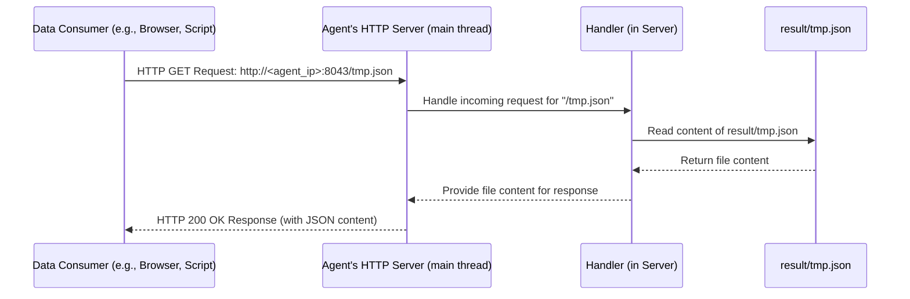

# Chapter 7: Result Exporter & Server

Welcome to the final chapter of our `agent` tutorial! In [Chapter 6: Data Enrichment & Consolidation](06_data_enrichment___consolidation_.md), we saw how the `agent` masterfully combined the live data gathered from Juniper devices with the documentation details from NetBox, creating a single, rich, and consolidated dataset. Think of this dataset as the final, comprehensive research report on our network's current state.

But what good is a research report if it just sits on your desk? We need a way to share it! This chapter focuses on the **Result Exporter & Server**, the component responsible for publishing this report and making it easily accessible.

## What Problem Does This Solve?

Imagine you've just finished writing a groundbreaking research paper (our consolidated network data). Now you need to:

1.  **Publish it:** Save the paper in a standard format that others can easily read (like a PDF, but in our case, a JSON file).
2.  **Distribute it:** Set up a way for people (or other computer programs) to easily get a copy of your paper whenever they need it.

This is exactly what the Result Exporter & Server does.

*   **Exporter:** Takes the final Python dictionary containing all the enriched and consolidated data and saves it as a file named `tmp.json`. This is like printing and binding the final research paper.
*   **Server:** Runs a very simple web server. Think of this as setting up a small kiosk or a dedicated web page where anyone (with the right address) can come and download the latest version of the research paper (`tmp.json`).

This allows other tools, dashboards, or even curious network engineers to easily fetch the `agent`'s findings using a simple web request (HTTP).

## Publishing the Paper: Saving to JSON

After the [Data Collection Orchestrator](02_data_collection_orchestrator_.md) has gathered all the enriched data from every device in the `collect_and_write_data` function (as seen in [Chapter 6: Data Enrichment & Consolidation](06_data_enrichment___consolidation_.md)), the final step within that function is to save the complete `data` dictionary.

This happens in `main.py` using Python's built-in `json` library:

```python
# File: main.py (Snippet inside collect_and_write_data)

# Assume 'data' is the final Python dictionary holding all consolidated info
# Assume EXPORT_FILE = "result/tmp.json"

# ... (data collection and consolidation logic happens before this) ...

# Write the 'data' dictionary to the JSON file
print(f"[INFO] Writing final data to {EXPORT_FILE}...")
with open(EXPORT_FILE, "w", encoding="utf-8") as file:
    json.dump(data, file, ensure_ascii=False, indent=4)

print("[INFO] Data collection cycle complete, file updated.")
```

**Explanation:**

1.  **`EXPORT_FILE = "result/tmp.json"`:** This variable (defined near the top of `main.py`) tells the program *where* to save the file (in the `result` folder, named `tmp.json`).
2.  **`with open(...) as file:`:** This is the standard Python way to safely open a file for writing (`"w"`). It ensures the file is automatically closed afterward, even if errors occur. `encoding="utf-8"` is important for handling various characters correctly.
3.  **`json.dump(data, file, ...)`:** This is the key function call!
    *   `data`: The Python dictionary containing our consolidated network information.
    *   `file`: The opened file object where the JSON should be written.
    *   `ensure_ascii=False`: Allows non-ASCII characters (like different languages) to be written directly.
    *   `indent=4`: Makes the resulting JSON file nicely formatted and human-readable with 4 spaces for indentation.

Every time the `collect_and_write_data` function runs (based on the schedule in `config.update_time`), it overwrites the `result/tmp.json` file with the latest collected and processed data.

## Setting Up the Kiosk: The Simple Web Server

Now that we have our "research paper" (`tmp.json`) regularly updated, how do we make it available? `main.py` also starts a simple web server that runs continuously.

This server uses Python's built-in `http.server` and `socketserver` modules. Here's the relevant code from the bottom of `main.py`:

```python
# File: main.py (Server Setup Snippets)

import http.server
import socketserver
import threading # Used to run collection in background

# --- Configuration ---
PORT = 8043          # The 'door number' for our kiosk
DIRECTORY = "result" # The folder our kiosk serves files from
ADDRESS = "0.0.0.0"  # Listen on all available network interfaces
EXPORT_FILE = "result/tmp.json" # The file we generate

# --- The Handler: Knows *how* to serve files ---
class Handler(http.server.SimpleHTTPRequestHandler):
    def __init__(self, *args, **kwargs):
        # Tell the handler to serve files from our 'result' directory
        super().__init__(*args, directory=DIRECTORY, **kwargs)

# --- Main execution block ---
if __name__ == "__main__":
    # 1. Start the data collection scheduler in a background thread
    #    (Covered in Chapter 2)
    threading.Thread(target=run_scheduler, daemon=True).start()

    # 2. Run initial collection to create the file if it doesn't exist
    try:
        collect_and_write_data()
    except Exception as e:
        print(f"[ERROR] Initial data collection failed: {e}")

    # 3. Start the HTTP server (the kiosk)
    with socketserver.TCPServer((ADDRESS, PORT), Handler) as httpd:
        print(f"Serving http://{ADDRESS}:{PORT}/{EXPORT_FILE.split('/')[-1]}")
        # Keep the server running indefinitely
        httpd.serve_forever()
```

**Explanation:**

1.  **`PORT = 8043`:** This is the network port the server will listen on. Think of it like the door number for our kiosk. Other programs will connect to this port.
2.  **`DIRECTORY = "result"`:** This tells the server which folder on the computer contains the files it's allowed to share. In our case, it's the `result` folder where `tmp.json` is saved.
3.  **`ADDRESS = "0.0.0.0"`:** This means the server will accept connections coming to *any* IP address the machine has. If the machine's IP is `192.168.1.100`, you could access the server using `http://192.168.1.100:8043`.
4.  **`Handler` Class:** This class inherits from `SimpleHTTPRequestHandler`, which already knows how to serve files. We just slightly customize it by telling its `__init__` method to use our specific `DIRECTORY`. When a request comes in (e.g., for `/tmp.json`), this handler looks for `tmp.json` inside the `result` directory and sends it back.
5.  **`if __name__ == "__main__":`:** This standard Python construct ensures the code inside only runs when the script is executed directly (not when imported as a module).
6.  **`threading.Thread(...)`:** As discussed in the [Data Collection Orchestrator](02_data_collection_orchestrator_.md) chapter, the periodic data collection runs in a separate background thread so it doesn't block the web server.
7.  **`collect_and_write_data()`:** We run the collection once right at the start to make sure the `tmp.json` file exists before the server starts trying to serve it.
8.  **`socketserver.TCPServer((ADDRESS, PORT), Handler)`:** This creates the actual server instance, telling it which address and port to listen on (`(ADDRESS, PORT)`) and which handler (`Handler`) to use for incoming requests.
9.  **`with ... as httpd:`:** Similar to `with open()`, this ensures the server resources are properly managed.
10. **`httpd.serve_forever()`:** This command starts the server and keeps it running, listening for and responding to requests, until you manually stop the script (e.g., by pressing Ctrl+C).

## How It All Fits Together

We have two main activities running concurrently:

1.  **Background Task (Scheduler Thread):** The `run_scheduler` function periodically triggers `collect_and_write_data`. This function fetches data, processes it, enriches it, consolidates it, and finally **overwrites** the `result/tmp.json` file. This happens every `config.update_time` minutes.
2.  **Foreground Task (Main Thread):** The `socketserver.TCPServer` runs continuously, listening on port `8043`. When it receives an HTTP request for `/tmp.json`, the `Handler` reads the **current content** of the `result/tmp.json` file and sends it back to the requester.

Think of it like a newsstand:
*   A reporter (scheduler thread) goes out, gathers news (`collect_and_write_data`), and updates the headline board (`result/tmp.json`) every hour.
*   The newsstand owner (web server thread) is always there. Whenever a customer asks for the news (`GET /tmp.json`), the owner shows them the current headline board.

This ensures that anyone querying the server always gets the latest version of the data that the `agent` has successfully collected and processed.

## Under the Hood: A Client Request

Let's visualize what happens when another tool (a "Client") requests the data:



**Step-by-Step:**

1.  A client sends a standard HTTP GET request to the `agent` server's address and port, asking for the resource `/tmp.json`.
2.  The `TCPServer` running in `main.py` receives the request.
3.  It passes the request to an instance of our `Handler` class.
4.  The `Handler`, because it's based on `SimpleHTTPRequestHandler` and configured with `directory="result"`, knows to look for a file named `tmp.json` inside the `result` folder.
5.  It reads the current contents of that file from the disk (FileSystem).
6.  It prepares an HTTP success response (like `200 OK`) and includes the file's contents (our JSON data) in the response body.
7.  The `TCPServer` sends this response back to the Client.

Simultaneously, in the background, the scheduler thread might be busy collecting new data, and when it finishes, it will simply update the `result/tmp.json` file on the FileSystem, ready for the *next* request the Handler receives.

## Conclusion

In this final chapter, we explored the **Result Exporter & Server**. We learned that:

*   It provides the final step: **publishing** the consolidated network data.
*   The **Exporter** part uses `json.dump()` to save the final Python dictionary into a human-readable `result/tmp.json` file. This file is overwritten with fresh data after each collection cycle.
*   The **Server** part runs a simple, built-in Python web server (`http.server`, `socketserver`) that listens on a specific port (`8043`).
*   This server uses a `Handler` to serve files directly from the `result` directory.
*   This makes the latest `result/tmp.json` file easily accessible to other tools or users via a standard HTTP GET request (e.g., `http://<agent_ip>:8043/tmp.json`).
*   The data collection/saving and the web serving run concurrently using Python's threading.

---

**Tutorial Complete!**

Congratulations on completing the `agent` project tutorial! We've journeyed through all the core components:

1.  [Configuration Management](01_configuration_management_.md): How settings are stored.
2.  [Data Collection Orchestrator](02_data_collection_orchestrator_.md): How the main work is managed and scheduled.
3.  [Juniper Device Interaction](03_juniper_device_interaction_.md): How data is fetched from Juniper devices using NETCONF.
4.  [Juniper Data Parsing](04_juniper_data_parsing_.md): How raw Juniper XML is translated into Python data.
5.  [NetBox API Client](05_netbox_api_client_.md): How documentation data is fetched from NetBox.
6.  [Data Enrichment & Consolidation](06_data_enrichment___consolidation_.md): How Juniper and NetBox data are combined for a richer picture.
7.  [Result Exporter & Server](07_result_exporter___server_.md): How the final data is saved and shared.

You now have a solid understanding of how this `agent` collects, processes, and serves valuable network information. Feel free to explore the code further and perhaps even think about how you could extend or modify it for your own needs!

---

Generated by [AI Codebase Knowledge Builder](https://github.com/The-Pocket/Tutorial-Codebase-Knowledge)