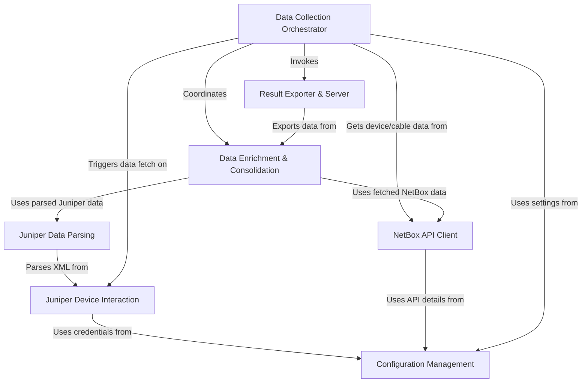

# Tutorial: agent

This project acts like a **network detective**. It connects to *Juniper network devices* to gather live operational data (like interface status and routing information) using the NETCONF protocol.
Simultaneously, it consults a *NetBox database* (a network inventory tool) to get details about devices, their locations, and how they are physically cabled together.
Finally, it **combines** all this information, enriching the live data with inventory context, saves the consolidated result to a *JSON file*, and runs a simple **web server** to easily share this file.

**Source Repository:** [None](None)

## Chapters

1. [Configuration Management
](01_configuration_management_.md)
2. [Data Collection Orchestrator
](02_data_collection_orchestrator_.md)
3. [Juniper Device Interaction
](03_juniper_device_interaction_.md)
4. [Juniper Data Parsing
](04_juniper_data_parsing_.md)
5. [NetBox API Client
](05_netbox_api_client_.md)
6. [Data Enrichment & Consolidation
](06_data_enrichment___consolidation_.md)
7. [Result Exporter & Server
](07_result_exporter___server_.md)

---

Generated by [AI Codebase Knowledge Builder](https://github.com/The-Pocket/Tutorial-Codebase-Knowledge)