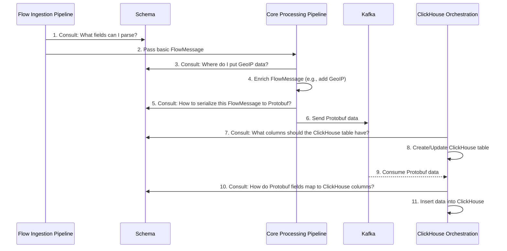

# Chapter 1: Data Schema

Welcome to the Akvorado tutorial! We're excited to guide you through its core concepts. Let's start with the very foundation: how Akvorado understands and structures the network flow data it receives.

Imagine you're building something complex with LEGO® bricks. Before you start, you need a plan, right? You need to know what kinds of bricks you have (2x2 red, 4x1 blue, etc.) and how they fit together. Without this plan, building anything consistent would be impossible.

In Akvorado, network flow data is like those LEGO® bricks. A single flow record contains many pieces of information: source IP address, destination port, number of bytes transferred, the network device (exporter) that sent the data, and much more. To handle this data effectively, Akvorado needs a clear plan – a blueprint. This blueprint is called the **Data Schema**.

## What is the Data Schema?

The Data Schema in Akvorado defines the **structure** and **types** for all the network flow data. Think of it as the official dictionary and rulebook for flow information within the system.

Specifically, the Schema defines:

1.  **All Possible Fields:** It lists every single piece of information Akvorado *could* potentially understand from a flow record. This includes things like `SrcAddr` (Source IP Address), `DstPort` (Destination Port), `Bytes`, `Packets`, `InIfName` (Incoming Interface Name), `SrcAS` (Source Autonomous System number), etc.
2.  **Data Types:** For each field, it specifies what kind of data it holds (e.g., `SrcAddr` is an IP address, `Bytes` is a number, `InIfName` is text).
3.  **Enabled/Disabled Fields:** You might not need *every* possible field. The Schema system, using your configuration, manages which fields are actually active and processed.
4.  **Serialization Format (Protobuf):** When data needs to be sent between different Akvorado components (like sending processed flows to Kafka), it needs a standardized format. The Schema dictates how the flow data (`FlowMessage`) is packed into Protobuf messages.
5.  **Database Mapping (ClickHouse):** Ultimately, the flow data is stored in a ClickHouse database for analysis and reporting. The Schema defines how the fields in the `FlowMessage` correspond to columns in the ClickHouse tables. It also defines special "calculated" or "aliased" fields (e.g., calculating average packet size).

In simple terms, the Data Schema is the **single source of truth** for what flow data looks like inside Akvorado. It ensures every part of the system speaks the same "data language".

## The `FlowMessage` Container

The actual data container that holds the information for a single flow record, structured according to the Schema, is often represented internally as a `FlowMessage`. You can think of a `FlowMessage` as a box, and the Schema tells you exactly what compartments are inside the box and what kind of items (data) can go into each compartment.

## Defining the Fields

Akvorado comes with a predefined set of potential flow fields. These are internally represented by constants (`ColumnKey`) and mapped to human-readable names.

```go
// File: common/schema/definition_gen.go (Simplified)

var columnNameMap = bimap.New(map[ColumnKey]string{
	ColumnBytes:         "Bytes",         // Total bytes in the flow
	ColumnPackets:       "Packets",       // Total packets in the flow
	ColumnSrcAddr:       "SrcAddr",       // Source IP address
	ColumnDstAddr:       "DstAddr",       // Destination IP address
	ColumnSrcPort:       "SrcPort",       // Source Port (TCP/UDP)
	ColumnDstPort:       "DstPort",       // Destination Port (TCP/UDP)
	ColumnProto:         "Proto",         // IP Protocol number (e.g., 6 for TCP)
	ColumnExporterAddress: "ExporterAddress", // IP of the device sending flow data
	ColumnInIfName:      "InIfName",      // Name of the input interface
	ColumnOutIfName:     "OutIfName",     // Name of the output interface
	// ... many more fields
})
```

This snippet shows how internal identifiers (like `ColumnBytes`) are linked to the names (`"Bytes"`) used in configuration and reporting. The Schema component manages this complete list.

## Configuring Your Schema: Enabling and Disabling Fields

You don't always need every field Akvorado supports. Enabling unused fields can consume unnecessary resources (CPU, memory, disk space). The Schema allows you to tailor the active fields via configuration.

```go
// File: common/schema/config.go (Conceptual Example)

// Configuration describes the schema settings.
type Configuration struct {
	// Disabled lists columns to turn OFF.
	Disabled []ColumnKey
	// Enabled lists extra columns to turn ON.
	Enabled []ColumnKey
	// MainTableOnly lists columns stored only in the main table,
	// not smaller aggregated tables.
	MainTableOnly []ColumnKey
	// Materialize calculates some fields at ingest time instead of query time.
	Materialize []ColumnKey
    // ... custom dictionary config
}
```

In your Akvorado configuration file, you can specify which fields (using their names like `"SrcMAC"`, `"TCPFlags"`) you want to explicitly `Enable` (if they are disabled by default) or `Disable` (if they are enabled by default but you don't need them). This helps optimize performance and storage. For example, if you don't work with MAC addresses, you could disable `SrcMAC` and `DstMAC`.

## Packing the Data: Protobuf Serialization

When Akvorado needs to send flow data between its internal parts, especially to a message queue like Kafka, it needs an efficient and standard way to package the data. Akvorado uses Protocol Buffers (Protobuf).

The Data Schema defines exactly how a `FlowMessage` (our data container) is converted into a compact binary Protobuf message. It knows which fields are active (based on configuration) and what Protobuf data type and field number corresponds to each Akvorado field.

```go
// File: common/schema/protobuf.go (Simplified Concept)

// ProtobufAppendIP adds an IP address to the Protobuf message.
func (schema *Schema) ProtobufAppendIP(bf *FlowMessage, columnKey ColumnKey, value netip.Addr) {
	if value.IsValid() { // Only add if the IP is valid
		column, _ := schema.LookupColumnByKey(columnKey) // Get schema info for this field
		if column.protobufCanAppend(bf) { // Check if field is enabled & not already set
			// Get the IP as bytes
			ipBytes := value.As16()
			// Append Protobuf tag (field number + wire type)
			bf.protobuf = protowire.AppendTag(bf.protobuf, column.ProtobufIndex, protowire.BytesType)
			// Append the actual IP bytes
			bf.protobuf = protowire.AppendBytes(bf.protobuf, ipBytes[:])
			// Mark this field as set in the message
			bf.protobufSet.Set(uint(column.ProtobufIndex))
		}
	}
}
```

This snippet shows the idea: based on the `columnKey` (like `ColumnSrcAddr`), the code looks up the Schema details (`column.ProtobufIndex`), checks if the field should be included, and then uses `protowire` functions to append the data in the correct Protobuf format to the `FlowMessage`'s byte buffer (`bf.protobuf`).

## Storing the Data: ClickHouse Mapping

The ultimate destination for processed flow data in Akvorado is usually a ClickHouse database. The Data Schema plays a crucial role here too. It defines how the fields in the `FlowMessage` map to columns in your ClickHouse tables.

```go
// File: common/schema/definition.go (Simplified Column Definition)

Column{
    Key:            ColumnPacketSize, // Internal ID
    Name:           "PacketSize",     // Human-readable name
    Depends:        []ColumnKey{ColumnBytes, ColumnPackets}, // Needs Bytes & Packets
    ClickHouseType: "UInt64",         // Data type in ClickHouse
    // Calculated 'on-the-fly' when querying ClickHouse:
    ClickHouseAlias: "intDiv(Bytes, Packets)",
    ConsoleNotDimension: true, // Not typically used for grouping
},
```

This definition for a `PacketSize` field shows:
*   It depends on `Bytes` and `Packets` being available.
*   In ClickHouse, it will be stored or calculated as a `UInt64` (unsigned 64-bit integer).
*   Crucially, `ClickHouseAlias: "intDiv(Bytes, Packets)"` means this field isn't stored directly. Instead, whenever you query `PacketSize`, ClickHouse will automatically calculate it by dividing the `Bytes` column by the `Packets` column for that row. This saves storage space.

The Schema provides functions like `ClickHouseCreateTable()` which generate the necessary SQL `CREATE TABLE` statements based on the active fields and their ClickHouse definitions.

## Extending the Schema: Custom Dictionaries

Sometimes, the built-in fields aren't enough. You might have your own business logic or metadata you want to associate with flows (e.g., mapping IPs to specific customer IDs, application names, or threat intelligence categories). Akvorado allows this through **Custom Dictionaries**, configured in the schema section. The Schema component integrates these custom fields just like the built-in ones, making them available for processing, storage, and reporting. We won't dive deep into custom dictionaries here, but know that the Schema is the mechanism that makes them work seamlessly.

## How the Schema is Used: An Internal Flow

Let's trace how the Schema guides the journey of a flow record:



1.  The [Flow Ingestion Pipeline (Inlet)](02_flow_ingestion_pipeline__inlet__.md) receives raw flow data (like NetFlow or sFlow). It asks the **Schema** which fields it should try to extract.
2.  The Inlet creates a basic `FlowMessage` containing the extracted data.
3.  The [Core Processing Pipeline (Inlet)](03_core_processing_pipeline__inlet__.md) might enrich the flow, for example, by adding GeoIP information using [Metadata Providers (Inlet)](04_metadata_providers__inlet__.md). It consults the **Schema** to know the correct field (e.g., `SrcCountry`) to store this information.
4.  The `FlowMessage` is updated.
5.  Before sending the data onwards (e.g., to Kafka), the Core Pipeline asks the **Schema** for the rules to convert the `FlowMessage` into a Protobuf message.
6.  The Protobuf message is sent.
7.  The [ClickHouse Orchestration](06_clickhouse_orchestration_.md) component, responsible for managing the database tables, consults the **Schema** to know the correct table structure (columns, types, calculated fields) based on the current configuration.
8.  It ensures the ClickHouse table exists and matches the Schema.
9.  Data is consumed from Kafka.
10. When inserting data, the orchestrator again uses the **Schema** to understand how to map the fields from the incoming Protobuf messages to the appropriate ClickHouse columns.
11. Data is written to ClickHouse.

Throughout this entire process, the Schema acts as the central reference point, ensuring consistency and defining the structure of the data.

## Conclusion

The Data Schema is the bedrock upon which Akvorado builds its understanding of network flows. It's the blueprint that defines:

*   What information (`FlowMessage` fields) Akvorado can handle.
*   Which fields are currently active (based on your configuration).
*   How data is efficiently packaged for transport (Protobuf).
*   How data is structured for storage and querying in ClickHouse, including calculated fields.

By providing this consistent structure, the Schema enables all the different parts of Akvorado to work together seamlessly.

Now that you understand how Akvorado defines and structures its data, let's move on to see how that data actually gets into the system in the first place.

Next up: [Chapter 2: Flow Ingestion Pipeline (Inlet)](02_flow_ingestion_pipeline__inlet__.md)

---

Generated by [AI Codebase Knowledge Builder](https://github.com/The-Pocket/Tutorial-Codebase-Knowledge)