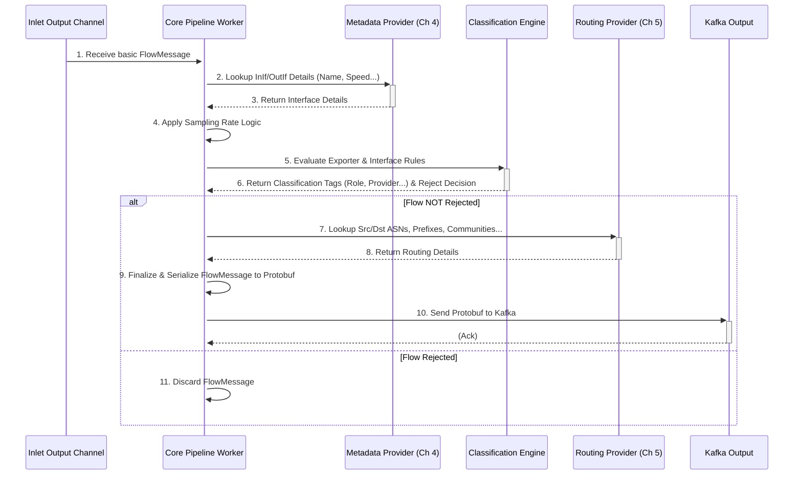

# Chapter 3: Core Processing Pipeline (Inlet)

In the [previous chapter](02_flow_ingestion_pipeline__inlet__.md), we saw how the Flow Ingestion Pipeline (Inlet) acts like a loading dock, receiving raw network flow data, decoding it, and structuring it into a basic `FlowMessage`. But this basic `FlowMessage` often lacks context. It might tell you data went from IP A to IP B via interface number 10 on router "edge-router-1", but it doesn't tell you the *name* of interface 10, or the *owner* (AS Number) of IP A, or whether this traffic belongs to a specific customer.

That's where the **Core Processing Pipeline** comes in! Think of it as the main assembly line inside the Akvorado factory. The basic `FlowMessage` "parts" arrive from the loading dock (Ingestion Pipeline), and this pipeline adds more components, inspects them, and prepares them for final shipping.

## What Does the Core Processing Pipeline Do?

The Core Processing Pipeline is the central engine of the `inlet` service. Its job is to take the basic `FlowMessage` objects produced by the [Flow Ingestion Pipeline (Inlet)](02_flow_ingestion_pipeline__inlet__.md) and make them much more useful.

It performs several key tasks:

1.  **Enrichment:** It adds valuable context to the flow data.
    *   **Interface Details:** Looks up interface names (like `GigabitEthernet0/1`), descriptions, and speeds using data from [Metadata Providers (Inlet)](04_metadata_providers__inlet__.md) (like SNMP or gNMI).
    *   **Routing Information:** Finds Autonomous System (AS) numbers, network prefixes (like `192.0.2.0/24`), BGP communities, and AS paths using data from [Routing Providers (Inlet)](05_routing_providers__inlet__.md) (like BMP or BioRIS).
    *   **Sampling Rate Handling:** Ensures the `SamplingRate` field is correctly set, applying configured defaults or overrides if the original data is missing or needs correction.
2.  **Classification:** It applies custom rules (defined in your configuration) to categorize flows.
    *   You can tag flows based on the exporter they came from (e.g., `Role=Core`, `Site=DatacenterA`).
    *   You can tag flows based on the interfaces they used (e.g., `Connectivity=Transit`, `Provider=CustomerX`, `Boundary=External`).
3.  **Filtering (Rejection):** Based on the classification rules, it can decide to *discard* certain flows if they are not needed.
4.  **Serialization:** It takes the final, enriched, and classified `FlowMessage` and converts it into an efficient format (Protobuf) for sending onwards, using the rules defined by the [Data Schema](01_data_schema_.md).
5.  **Forwarding:** It sends the processed Protobuf data to the configured output, which is typically Kafka.

**Analogy:** The basic flow is like a plain wooden block. The Core Pipeline is like a workshop that:
*   Stamps the block with "Router: edge-r1, In Interface: 10" (Basic Flow).
*   Looks up "Interface 10" and adds a label "Name: ge-0/0/1, Speed: 1G" (Metadata Enrichment).
*   Looks up the source IP and adds a label "Source ASN: 64500" (Routing Enrichment).
*   Checks rules: "If interface name starts with 'cust-', label it 'Provider: Customer'". Adds the label (Classification).
*   Packages the labeled block (Serialization to Protobuf).
*   Sends it to the warehouse (Kafka).

## Key Steps in the Pipeline

Let's follow a `FlowMessage` as it travels through this pipeline:

1.  **Receive:** The pipeline worker picks up a `FlowMessage` from the output channel of the [Flow Ingestion Pipeline (Inlet)](02_flow_ingestion_pipeline__inlet__.md). This message contains basic info like IPs, ports, byte/packet counts, exporter IP, and interface *indices* (`InIf`, `OutIf`).
2.  **Metadata Lookup:** If the flow has an `InIf` (input interface index like `10`), the pipeline asks the configured [Metadata Providers (Inlet)](04_metadata_providers__inlet__.md): "For the exporter with IP `X.X.X.X`, what are the details (name, description, speed) for interface index `10`?" The results (e.g., `InIfName="ge-0/0/1"`, `InIfSpeed=1000000000`) are added to the `FlowMessage`. The same happens for `OutIf` if present.
3.  **Handle Missing Metadata:** If the metadata lookup fails (maybe the provider doesn't have info for that interface yet), the flow might be marked to be skipped, and an error counter is incremented.
4.  **Handle Sampling Rate:** The pipeline checks if the `SamplingRate` field is set. If not, it tries to apply a default rate based on the exporter's IP (configured by you). It might also override the received sampling rate if configured to do so. If no rate can be determined, the flow might be skipped.
5.  **Classification:** The pipeline evaluates the classification rules you defined in the configuration.
    *   **Exporter Rules:** Rules based on the exporter's IP, name, or metadata tags (like region, role, site). These might add fields like `ExporterRole` or `ExporterSite` to the `FlowMessage`.
    *   **Interface Rules:** Rules based on the interface details (index, name, description, speed, VLAN, metadata tags). These might add fields like `InIfProvider`, `OutIfConnectivity`, or `InIfBoundary`.
    *   **Rejection:** A classification rule can explicitly mark the flow for rejection (e.g., `Reject()`). If rejected, processing stops here for this flow.
6.  **Routing Lookup:** The pipeline asks the configured [Routing Providers (Inlet)](05_routing_providers__inlet__.md):
    *   "For the source IP `A.A.A.A`, what is the originating AS number and network prefix?" Results (e.g., `SrcAS=64500`, `SrcNetMask=24`) are added.
    *   "For the destination IP `B.B.B.B` (and maybe the `NextHop` IP), what is the destination AS number, network prefix, BGP communities, and AS Path?" Results (e.g., `DstAS=65001`, `DstCommunities=[65001:123]`) are added.
    *   It intelligently combines information from the flow itself (like `SrcAS` field in NetFlow) and the routing provider based on your configuration preferences (e.g., prefer routing provider data over flow data).
7.  **Final Touches:** Add any remaining calculated fields or derived information based on the [Data Schema](01_data_schema_.md).
8.  **Serialize:** Convert the final, enriched `FlowMessage` into a Protobuf byte buffer using the schema definition.
9.  **Send:** Pass the Protobuf buffer to the Kafka component to be sent to the appropriate Kafka topic.

## Example: Bringing a Flow to Life

Imagine this basic `FlowMessage` arrives from the Ingestion Pipeline:

*   `ExporterAddress`: `192.168.1.1`
*   `SrcAddr`: `10.0.0.5`
*   `DstAddr`: `8.8.8.8`
*   `Bytes`: 1500
*   `Packets`: 10
*   `InIf`: 5
*   `OutIf`: 12
*   `SamplingRate`: 0 (Missing!)

Here's how the Core Pipeline might process it:

1.  **Metadata Lookup (InIf=5):** Asks Metadata Provider for interface 5 on `192.168.1.1`. Gets back: `Name="eth0"`, `Description="Uplink to Core"`, `Speed=1000000000`.
    *   *FlowMessage Update:* `InIfName="eth0"`, `InIfDescription="Uplink to Core"`, `InIfSpeed=1000000000`.
2.  **Metadata Lookup (OutIf=12):** Asks for interface 12. Gets back: `Name="cust-abc"`, `Description="Customer ABC Inc."`, `Speed=100000000`.
    *   *FlowMessage Update:* `OutIfName="cust-abc"`, `OutIfDescription="Customer ABC Inc."`, `OutIfSpeed=100000000`.
3.  **Sampling Rate:** Checks config: "Default sampling for `192.168.1.1` is 100".
    *   *FlowMessage Update:* `SamplingRate=100`.
4.  **Classification:**
    *   Evaluates exporter rule: `Exporter.IP == "192.168.1.1" ? ClassifyRole("Edge") : true`
        *   *FlowMessage Update:* `ExporterRole="edge"`
    *   Evaluates interface rule: `Interface.Name matches "^cust-" ? ClassifyProvider(Interface.Name[5:]) and ClassifyConnectivity("Customer") : true` (Evaluated for *OutIf*)
        *   *FlowMessage Update:* `OutIfProvider="abc"`, `OutIfConnectivity="customer"`
    *   No rules match for InIf. No rejection rule triggered.
5.  **Routing Lookup:**
    *   Asks Routing Provider for `10.0.0.5`. Gets `AS=65500`, `NetMask=16`.
        *   *FlowMessage Update:* `SrcAS=65500`, `SrcNetMask=16`.
    *   Asks for `8.8.8.8`. Gets `AS=15169`, `NetMask=24`, `Communities=[15169:1]`.
        *   *FlowMessage Update:* `DstAS=15169`, `DstNetMask=24`, `DstCommunities=[15169:1]`.
6.  **Serialize:** The complete `FlowMessage` (with all added fields) is converted to Protobuf.
7.  **Send:** The Protobuf data is sent to Kafka.

Now, instead of just raw numbers, the flow record sent to storage contains meaningful names, classifications, and routing context!

## A Look Inside: How it Works

The Core Processing Pipeline is orchestrated within the `inlet/core` package. It runs multiple concurrent "workers" (goroutines) to handle flows in parallel.



1.  A worker receives a `FlowMessage` from the [Flow Ingestion Pipeline (Inlet)](02_flow_ingestion_pipeline__inlet__.md).
2.  It calls the [Metadata Providers (Inlet)](04_metadata_providers__inlet__.md) component to get interface details.
3.  Metadata returns the information (or indicates a miss).
4.  The worker applies sampling rate logic.
5.  It calls the classification engine, passing the flow and metadata.
6.  The classifier evaluates rules (defined in `inlet/core/classifier.go` using the `expr` language) and returns any assigned tags (like `ExporterRole`, `InterfaceProvider`) and whether the flow should be rejected.
7.  If not rejected, it calls the [Routing Providers (Inlet)](05_routing_providers__inlet__.md) component to get ASNs, etc.
8.  Routing returns the information.
9.  The worker uses the [Data Schema](01_data_schema_.md) component to serialize the now fully enriched `FlowMessage` into Protobuf.
10. The worker sends the Protobuf data to the Kafka component.
11. If the classifier rejected the flow, the worker simply discards it.

## Diving into the Code (Simplified)

The main loop for a worker looks like this:

```go
// File: inlet/core/root.go (Simplified runWorker)

func (c *Component) runWorker(workerID int) error {
	for {
		select {
		case <-c.t.Dying(): // Check for shutdown signal
			return nil
		case flow := <-c.d.Flow.Flows(): // Read a FlowMessage from the Inlet channel
			if flow == nil { // Channel closed
				return nil
			}

			exporterStr := flow.ExporterAddress.String()
			c.metrics.flowsReceived.WithLabelValues(exporterStr).Inc() // Count received

			// === Enrichment and Classification ===
			// This function does the heavy lifting:
			// - Looks up metadata (interface names/speed) via c.d.Metadata
			// - Handles sampling rate via c.config
			// - Applies classification rules (exporter & interface)
			// - Looks up routing info (ASNs, prefixes) via c.d.Routing
			// - Adds all this info to the 'flow' object
			// It returns 'true' if the flow should be skipped/rejected.
			if skip := c.enrichFlow(flow.ExporterAddress, exporterStr, flow); skip {
				continue // Go to next flow if rejected or error
			}

			// === Serialization ===
			// Convert the enriched 'flow' object to Protobuf bytes
			// using rules from the Schema component.
			protobufBytes := c.d.Schema.ProtobufMarshal(flow)

			// === Forwarding ===
			c.metrics.flowsForwarded.WithLabelValues(exporterStr).Inc() // Count forwarded
			// Send the Protobuf data to the Kafka component.
			// This might block if Kafka is busy.
			c.d.Kafka.Send(exporterStr, protobufBytes)

            // Potentially also send to live HTTP clients (for debugging)
            // ... httpFlowChannel handling ...
		}
	}
}
```

This `runWorker` function continuously reads `FlowMessage` objects, calls `enrichFlow` to add all the context and apply rules, serializes the result, and sends it to Kafka.

The `enrichFlow` function orchestrates the enrichment and classification steps:

```go
// File: inlet/core/enricher.go (Simplified enrichFlow)

func (c *Component) enrichFlow(exporterIP netip.Addr, exporterStr string, flow *schema.FlowMessage) (skip bool) {
	t := time.Now() // Get current time for cache lookups

	// --- Metadata Enrichment ---
	var expClassification exporterClassification // Will hold exporter tags
	var inIfClassification, outIfClassification interfaceClassification // Interface tags

	// Lookup Input Interface details if InIf index exists
	if flow.InIf != 0 {
		answer, ok := c.d.Metadata.Lookup(t, exporterIP, uint(flow.InIf))
		if !ok {
			// Log error, mark flow to be skipped
			c.metrics.flowsErrors.WithLabelValues(exporterStr, "SNMP cache miss").Inc()
			return true // Skip this flow
		}
		// Store results in temporary variables and classification structs
		// schema.ProtobufAppendBytes(flow, schema.ColumnInIfName, []byte(answer.Interface.Name)) // Direct append removed for simplicity
		// ... add InIfDescription, InIfSpeed etc. ...
		inIfClassification.Provider = answer.Interface.Provider // Get pre-classified tags if available
		// ... copy other metadata tags ...
	}
	// Lookup Output Interface details similarly if OutIf exists...
	if flow.OutIf != 0 {
        // ... lookup OutIf details using c.d.Metadata.Lookup ...
        // ... handle cache miss (return true) ...
        // ... store results, copy metadata tags to outIfClassification ...
    }

	// --- Sampling Rate ---
    // Ensure flow.SamplingRate is set using defaults or overrides from c.config
    // If still zero after checks, log error and return true (skip)
    // ... logic to check c.config.OverrideSamplingRate and c.config.DefaultSamplingRate ...
    if flow.SamplingRate == 0 {
        c.metrics.flowsErrors.WithLabelValues(exporterStr, "sampling rate missing").Inc()
        return true
    }

	// --- Classification ---
	// Apply exporter rules (populates expClassification)
	if !c.classifyExporter(t, exporterStr, /* exporter name from metadata */, flow, expClassification) {
		return true // Rejected by exporter rule
	}
	// Apply interface rules for Output interface (populates outIfClassification)
	if !c.classifyInterface(t, exporterStr, /* ... */, flow, flow.OutIf, /* ... */, outIfClassification, false) {
		return true // Rejected by output interface rule
	}
	// Apply interface rules for Input interface (populates inIfClassification)
	if !c.classifyInterface(t, exporterStr, /* ... */, flow, flow.InIf, /* ... */, inIfClassification, true) {
		return true // Rejected by input interface rule
	}

	// --- Routing Enrichment ---
	ctx := c.t.Context(context.Background())
	// Lookup Source IP routing info
	sourceRouting := c.d.Routing.Lookup(ctx, flow.SrcAddr, netip.Addr{}, flow.ExporterAddress)
	// Lookup Destination IP routing info
	destRouting := c.d.Routing.Lookup(ctx, flow.DstAddr, flow.NextHop, flow.ExporterAddress)

	// Add ASN, NetMask, Communities, ASPath etc. to the flow message
	// based on config (ASNProviders, NetProviders) comparing flow data vs routing data
	flow.SrcAS = c.getASNumber(flow.SrcAS, sourceRouting.ASN)
	flow.DstAS = c.getASNumber(flow.DstAS, destRouting.ASN)
    // ... set SrcNetMask, DstNetMask, DstCommunities etc. ...

	// Add final classified tags (like ExporterRole) to the flow message
	c.d.Schema.ProtobufAppendBytes(flow, schema.ColumnExporterRole, []byte(expClassification.Role))
    c.d.Schema.ProtobufAppendBytes(flow, schema.ColumnInIfProvider, []byte(inIfClassification.Provider))
    // ... add other classification tags ...

	return false // Flow was processed successfully, don't skip
}
```

This function calls out to the `Metadata` and `Routing` components (covered in the next chapters) and uses internal classification functions (`classifyExporter`, `classifyInterface`) which evaluate your configured rules against the flow's data. Finally, it uses `Schema` functions like `ProtobufAppendBytes` or `ProtobufAppendVarint` to add the enriched and classified data directly into the `FlowMessage`'s Protobuf buffer representation.

## Conclusion

The Core Processing Pipeline is the heart of the `inlet` service. It transforms basic, raw flow data into information-rich records ready for analysis. It acts as the central assembly line, performing:

*   **Enrichment:** Adding interface names, speeds, AS numbers, prefixes, and more.
*   **Classification:** Applying custom rules to tag and categorize flows.
*   **Filtering:** Rejecting unwanted flows based on rules.
*   **Serialization:** Preparing the final data for Kafka using Protobuf.

By adding crucial context, this pipeline makes the raw numbers collected from your network understandable and actionable.

Now that we've seen *how* enrichment happens, let's dive into the components that *provide* some of that enrichment data.

Next up: [Chapter 4: Metadata Providers (Inlet)](04_metadata_providers__inlet__.md)

---

Generated by [AI Codebase Knowledge Builder](https://github.com/The-Pocket/Tutorial-Codebase-Knowledge)