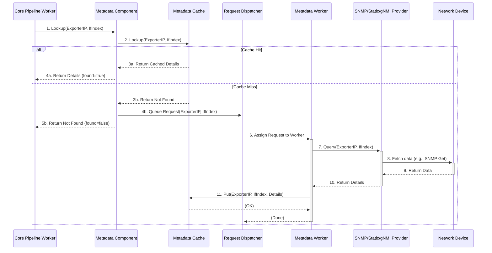

# Chapter 4: Metadata Providers (Inlet)

In the [previous chapter](03_core_processing_pipeline__inlet__.md), we saw how the Core Processing Pipeline enriches flow data. One crucial type of enrichment it performs is adding details about the network interfaces involved in the flow. But where does the Core Pipeline *get* this information, like interface names and speeds? That's the job of the **Metadata Providers**!

Imagine you receive a message saying "Package delivered through door number 5 at location 'Router-A'". That's okay, but not very helpful. What if you could ask someone who knows all about Router-A, and they tell you "Ah, door number 5 is the 'Main Entrance - North Side', and it's a big double door." Much better, right?

The Metadata Provider component in Akvorado's `inlet` service acts like that knowledgeable person (or a librarian, as suggested!). It finds out and remembers details about your network devices (exporters) and their specific interfaces (the "doors").

## What Problem Does This Solve?

Raw flow data (like NetFlow or sFlow) usually identifies network interfaces using simple numbers, called **interface indices** (often called `ifIndex`). So, your flow record might say the traffic came *in* on interface `10` and went *out* on interface `25` of `router-1.core`.

While accurate, these numbers aren't very human-friendly. When you're analyzing traffic, you want to see meaningful names like `GigabitEthernet0/0/1` or `TenGigabitEthernet1/2`, along with their configured descriptions (`Uplink to ISP`) and speeds (1 Gbps, 10 Gbps, etc.).

The Metadata Provider's main goal is to **translate these raw interface indices into human-readable names, descriptions, and speeds**.

## The Librarian Analogy

Think of the Metadata Provider component as Akvorado's dedicated librarian for network device information.

*   **The Library:** The component maintains a collection of information (a cache).
*   **Books:** The information consists of details about different locations (network devices/exporters) and specific doors within those locations (interfaces).
*   **Fetching Information:** The librarian actively goes out to fetch this information using different methods (like calling the location via SNMP or checking a pre-written manual - static files).
*   **Keeping Up-to-Date:** The librarian periodically checks if the information needs updating (cache refresh).
*   **Answering Questions:** When someone (like the [Core Processing Pipeline (Inlet)](03_core_processing_pipeline__inlet__.md)) asks "What's the name of interface 10 on router-1.core?", the librarian quickly looks it up in their cache.

## Key Concepts

### 1. Providers: How the Data is Fetched

The "librarian" can use different methods ("Providers") to get the interface details:

*   **SNMP (Simple Network Management Protocol):** This is a very common method. Akvorado can be configured to "ask" your network devices directly using SNMP queries. It asks things like "What's the name for ifIndex 10?", "What's its description?", "What's its speed?".
*   **gNMI (gRPC Network Management Interface):** A newer, more modern protocol used by some network devices to provide configuration and operational data. Akvorado can use gNMI to subscribe to interface information.
*   **Static Configuration:** Sometimes, you might just want to tell Akvorado the details directly in its configuration file. This is useful for devices that don't support SNMP/gNMI or for adding custom information. You create a list mapping exporter IPs and interface indices to their names, speeds, etc.

You configure which provider(s) Akvorado should use in the [Configuration System](07_configuration_system_.md).

```yaml
# Example Akvorado Configuration Snippet (Conceptual)
inlet:
  metadata:
    # Use SNMP for most devices
    providers:
      - type: snmp
        config:
          # SNMP community string (like a password)
          community: "public"
          # Specific devices might use different SNMP settings
          agents:
            192.168.1.1: 192.168.1.1 # Device IP : SNMP Agent IP
          ports: {} # Default port 161

    # Override/define some interfaces statically
    # (Useful if SNMP is slow or device not supported)
    providers:
      - type: static
        config:
          # Define details for router 192.168.10.1
          exporters:
            "192.168.10.1/32": # Match specific IP
              # Default details if index not listed below
              default:
                name: "Unknown Port"
                speed: 0
              # Specific interface details
              ifindexes:
                5: # ifIndex 5
                  name: "uplink-isp-a"
                  description: "Primary Transit"
                  speed: 10000000000 # 10 Gbps
                12: # ifIndex 12
                  name: "customer-xyz"
                  description: "Service to XYZ Corp"
                  speed: 1000000000 # 1 Gbps
```

This example shows configuring both an SNMP provider (to query devices) and a Static provider (to manually define details for `192.168.10.1`). Akvorado checks providers in the order they are defined.

*(See `inlet/metadata/config.go`, `inlet/metadata/provider/snmp/root.go`, `inlet/metadata/provider/static/root.go`, `inlet/metadata/provider/gnmi/root.go` for related code)*

### 2. The Cache: Remembering the Details

Querying network devices using SNMP or gNMI takes time and uses resources on both Akvorado and the network device. Asking for the name of interface `10` on `router-1.core` over and over again for every single flow would be incredibly inefficient!

To solve this, the Metadata Provider component uses a **cache**.

*   **Store Results:** When it successfully fetches details for an interface (e.g., ifIndex 10 on `router-1.core`), it stores them in memory (the cache).
*   **Fast Lookups:** The next time the [Core Processing Pipeline (Inlet)](03_core_processing_pipeline__inlet__.md) asks for the same interface, the Metadata Provider finds the answer instantly in the cache.
*   **Cache Duration:** Information stays in the cache for a configurable amount of time (e.g., 30 minutes). If nobody asks about that interface for that long, the cache entry might be removed to save memory.
*   **Cache Refresh:** Even if an entry is being used, the Metadata Provider can be configured to proactively re-query the device after a certain period (e.g., 1 hour) to make sure the information (like the description) hasn't changed.

```go
// File: inlet/metadata/cache.go (Simplified Cache Logic)

// Interface holds cached details
type Interface struct {
    Name        string
    Description string
    Speed       uint
    // ... other tags ...
}

// metadataCache stores the data
type metadataCache struct {
    // The actual cache stores Query -> Answer mappings
    cache *cache.Cache[provider.Query, provider.Answer]
    // ... metrics ...
}

// Lookup checks the cache first
func (sc *metadataCache) Lookup(t time.Time, query provider.Query) (provider.Answer, bool) {
    // Try to get the answer from the internal cache map
	result, ok := sc.cache.Get(t, query) // 'ok' is true if found
	if !ok {
		// Not found in cache
		return provider.Answer{}, false
	}
	// Found! Return the cached answer
	return result, true
}

// Put adds or updates an entry in the cache
func (sc *metadataCache) Put(t time.Time, query provider.Query, answer provider.Answer) {
	// Store the answer for this query in the cache map
    // The cache library handles expiration and refresh timing.
	sc.cache.Put(t, query, answer)
}
```

This simplified code shows the basic idea: `Lookup` tries to `Get` from the cache, and `Put` stores new information.

*(See `inlet/metadata/cache.go` for related code)*

### 3. Lookup: How it's Used

The [Core Processing Pipeline (Inlet)](03_core_processing_pipeline__inlet__.md) is the main consumer of this metadata. When it processes a `FlowMessage`, it does something like this:

1.  Get the `ExporterAddress` and `InIf` (input interface index) from the `FlowMessage`.
2.  If `InIf` is not zero, call the Metadata Provider's `Lookup` function: `metadata.Lookup(currentTime, exporterIP, inputIfIndex)`.
3.  The Metadata Provider component checks its cache.
4.  If the data is in the cache and up-to-date, it returns the `Interface` details immediately.
5.  If the data is *not* in the cache (or needs refreshing), the `Lookup` function returns "not found" *for now*, but it also triggers a background task to fetch the data using the configured providers (SNMP, Static, etc.). Once fetched, the data is stored in the cache for future lookups.
6.  The Core Pipeline adds the returned details (if any) to the `FlowMessage` (e.g., populating `InIfName`, `InIfDescription`, `InIfSpeed`).
7.  Repeat for the `OutIf` (output interface index).

## Example: From Index to Name

Let's revisit our simple example:

1.  **Input:** A `FlowMessage` arrives at the Core Pipeline:
    *   `ExporterAddress`: `192.168.1.1`
    *   `InIf`: `10`
    *   `OutIf`: `25`
2.  **Core Pipeline asks:** "Metadata, what are the details for interface `10` on `192.168.1.1`?" (`metadata.Lookup(now, 192.168.1.1, 10)`)
3.  **Metadata Provider:**
    *   Checks its cache for `(192.168.1.1, 10)`.
    *   **Cache Miss!** It hasn't seen this interface before.
    *   It returns `found=false` to the Core Pipeline *for this specific flow*.
    *   **Crucially:** It also queues a request internally: "Need to fetch details for `(192.168.1.1, 10)`".
4.  **Core Pipeline asks:** "Metadata, what are the details for interface `25` on `192.168.1.1`?" (`metadata.Lookup(now, 192.168.1.1, 25)`)
5.  **Metadata Provider:**
    *   Checks its cache for `(192.168.1.1, 25)`.
    *   **Cache Miss!**
    *   Returns `found=false` to the Core Pipeline.
    *   Queues another request: "Need to fetch details for `(192.168.1.1, 25)`".
6.  **Background Fetch:** Meanwhile, a background worker in the Metadata Provider picks up the request for `(192.168.1.1, 10)`.
    *   It looks at the configuration: "Okay, for `192.168.1.1`, I should use SNMP."
    *   It sends SNMP queries to `192.168.1.1`: "What is the name for index 10? Description? Speed?"
    *   `192.168.1.1` replies: `Name="ge-0/0/0"`, `Description="Link to Switch A"`, `Speed=1000000000`.
    *   The worker receives the reply and stores it in the cache: `metadataCache.Put(now, (192.168.1.1, 10), {Name:"ge-0/0/0", ...})`.
    *   Another worker does the same for interface `25`, maybe finding `Name="ge-0/0/1"`, `Description="Firewall Link"`.
7.  **Next Flow:** A *new* `FlowMessage` arrives later:
    *   `ExporterAddress`: `192.168.1.1`
    *   `InIf`: `10`
8.  **Core Pipeline asks:** "Metadata, what are the details for interface `10` on `192.168.1.1`?"
9.  **Metadata Provider:**
    *   Checks cache for `(192.168.1.1, 10)`.
    *   **Cache Hit!** It finds the entry added in step 6.
    *   It returns `found=true` along with the details: `{Name:"ge-0/0/0", Description:"Link to Switch A", Speed:1000000000}`.
10. **Output:** The Core Pipeline adds these details to the new `FlowMessage`:
    *   `InIfName`: `"ge-0/0/0"`
    *   `InIfDescription`: `"Link to Switch A"`
    *   `InIfSpeed`: `1000000000`

This way, after the first time an interface is seen, subsequent flows using that same interface get enriched immediately using the cache.

## Internal Implementation Walkthrough

How does Akvorado handle these lookups and background fetches efficiently?



1.  **Lookup Request:** The [Core Processing Pipeline (Inlet)](03_core_processing_pipeline__inlet__.md) calls `Lookup` on the Metadata Component.
2.  **Check Cache:** The component first asks its internal `metadataCache`.
3.  **Cache Hit/Miss:**
    *   **Hit (3a, 4a):** If the cache has the data, it's returned immediately to the Core Pipeline. Done!
    *   **Miss (3b, 4b, 5b):** If the cache doesn't have the data, it tells the Core Pipeline "not found" *for now*. Crucially, it also sends the lookup request (ExporterIP, IfIndex) to an internal queue managed by a Dispatcher.
4.  **Dispatch (6):** The Dispatcher takes requests from the queue. It might intelligently batch multiple requests for the *same* exporter together (e.g., if flows mentioned interfaces 10, 11, and 12 on the same router around the same time). It then sends the batch to one of the available background workers.
5.  **Worker Fetch (7-10):** The worker receives the request(s). It figures out which provider (SNMP, Static, etc.) to use based on the configuration and the exporter IP. It calls the provider's `Query` method, which performs the actual action (e.g., sending SNMP packets, reading a static file, calling gNMI).
6.  **Update Cache (11):** Once the provider returns the details, the worker updates the `metadataCache` using `Put`. Now the data is available for future lookups.

## Diving into the Code (Simplified)

Let's look at the main `Lookup` function again.

```go
// File: inlet/metadata/root.go (Simplified Lookup)

// Lookup for interface information.
// Returns the answer and 'true' if found in cache.
// If not found ('false'), it queues a background fetch.
func (c *Component) Lookup(t time.Time, exporterIP netip.Addr, ifIndex uint) (provider.Answer, bool) {
	query := provider.Query{ExporterIP: exporterIP, IfIndex: ifIndex}

	// 1. Check the cache first
	answer, ok := c.sc.Lookup(t, query) // sc is the metadataCache
	if !ok {
		// 2. Cache Miss: Queue request for background processing
		select {
		case c.dispatcherChannel <- query: // Send to dispatcher queue
		default:
			// Queue is full, maybe log this (provider is too busy)
			c.metrics.providerBusyCount.WithLabelValues(exporterIP.String()).Inc()
		}
		// Return 'false' because it wasn't in the cache *now*
		return provider.Answer{}, false
	}

	// 3. Cache Hit: Return the found answer and 'true'
	return answer, true
}
```

This shows the core logic: check cache (`sc.Lookup`), and if missed, send the `query` to the `dispatcherChannel` before returning `false`.

The dispatcher batches requests (if enabled) and sends them to workers via `providerChannel`.

```go
// File: inlet/metadata/root.go (Simplified dispatchIncomingRequest)

func (c *Component) dispatchIncomingRequest(request provider.Query) {
	// Try to read more requests from dispatcherChannel to batch them
    // (Simplified - actual code batches based on config.MaxBatchRequests)
	requestsMap := map[netip.Addr][]uint{
		request.ExporterIP: {request.IfIndex},
	}
	// ... logic to potentially add more requests to requestsMap ...

	// Send batched requests to the provider workers
	for exporterIP, ifIndexes := range requestsMap {
		select {
		case c.providerChannel <- provider.BatchQuery{ExporterIP: exporterIP, IfIndexes: ifIndexes}:
            // Sent successfully to a worker
		// ... handle shutdown ...
		}
	}
}
```

A worker runs a loop, processing these batches.

```go
// File: inlet/metadata/root.go (Simplified Worker Logic)

// This runs in a loop for each worker goroutine
func (c *Component) providerIncomingRequest(request provider.BatchQuery) {
	// Use a circuit breaker to avoid hammering failing devices
	providerBreaker := c.getBreakerForExporter(request.ExporterIP)

	// Run the query logic within the breaker
	err := providerBreaker.Run(func() error {
		ctx := c.t.Context(nil) // Get context for cancellation
		// Iterate through configured providers (SNMP, Static, etc.)
		for _, p := range c.providers {
			// Ask the provider to handle the query
			err := p.Query(ctx, request)
			if err == provider.ErrSkipProvider {
				continue // This provider doesn't handle this exporter
			}
			return err // Return error or nil if successful
		}
		return nil // No provider handled it, or success
	})
	// Handle errors (like breaker open, SNMP timeout...)
    // ... error logging ...
}
```

This worker logic uses a circuit breaker pattern (from `go-resiliency/breaker`) to temporarily stop querying an exporter if it consistently fails. It then iterates through the configured `c.providers` (like SNMP, Static instances) and calls their `Query` method.

The actual provider implementation (e.g., SNMP) handles talking to the device and eventually calls `c.sc.Put` (via a callback function passed during initialization) to update the cache.

```go
// File: inlet/metadata/provider/snmp/root.go (Simplified SNMP Query)

// Query asks the SNMP provider for data.
func (p *Provider) Query(ctx context.Context, query provider.BatchQuery) error {
	// Determine SNMP agent IP and port based on config
	agentIP, agentPort := p.getAgentDetails(query.ExporterIP)

	// Call internal Poll function which does the actual SNMP walks/gets
	// The 'p.put' function (passed during New) is called by Poll
	// for each successful interface result to update the cache.
	return p.Poll(ctx, query.ExporterIP, agentIP, agentPort, query.IfIndexes, p.put)
}

// File: inlet/metadata/provider/static/root.go (Simplified Static Query)

// Query checks the static configuration.
func (p *Provider) Query(_ context.Context, query provider.BatchQuery) error {
	// Look up exporter config in the loaded static map
	exporterConfig, ok := p.exporters.Load().Lookup(query.ExporterIP)
	if !ok {
		return provider.ErrSkipProvider // Static config doesn't know this exporter
	}

	// For each requested interface index...
	for _, ifIndex := range query.IfIndexes {
		// Find the specific interface details or use the default
		ifaceDetails, ok := exporterConfig.IfIndexes[ifIndex]
		if !ok {
			ifaceDetails = exporterConfig.Default
		}
		// Call the 'put' function immediately to update the cache
		p.put(provider.Update{
			Query: provider.Query{ExporterIP: query.ExporterIP, IfIndex: ifIndex},
			Answer: provider.Answer{
				Exporter:  exporterConfig.Exporter,
				Interface: ifaceDetails,
			},
		})
	}
	return nil // Static lookup always succeeds if exporter is found
}
```

These snippets show how different providers fulfill the request. SNMP calls `p.Poll` which performs network operations, while Static directly looks up data in its configuration map and calls `p.put` to update the cache.

## Conclusion

The Metadata Providers component is essential for making raw flow data understandable. It acts as Akvorado's "librarian" for network device interfaces:

*   **Fetches** interface details (name, description, speed) using configured methods (SNMP, gNMI, Static).
*   **Caches** this information efficiently to speed up lookups and reduce load on network devices.
*   **Provides** these details to the [Core Processing Pipeline (Inlet)](03_core_processing_pipeline__inlet__.md) so that flow records can be enriched with human-readable interface information.

Without this component, you'd be stuck looking at interface indices like `10` and `25`, instead of meaningful names like `ge-0/0/0`.

Now that we know how Akvorado gets interface *names* and *speeds*, what about understanding the *routing* information associated with the IP addresses in the flow, like which organization (AS Number) owns an IP? That's the job of the next component.

Next up: [Chapter 5: Routing Providers (Inlet)](05_routing_providers__inlet__.md)

---

Generated by [AI Codebase Knowledge Builder](https://github.com/The-Pocket/Tutorial-Codebase-Knowledge)