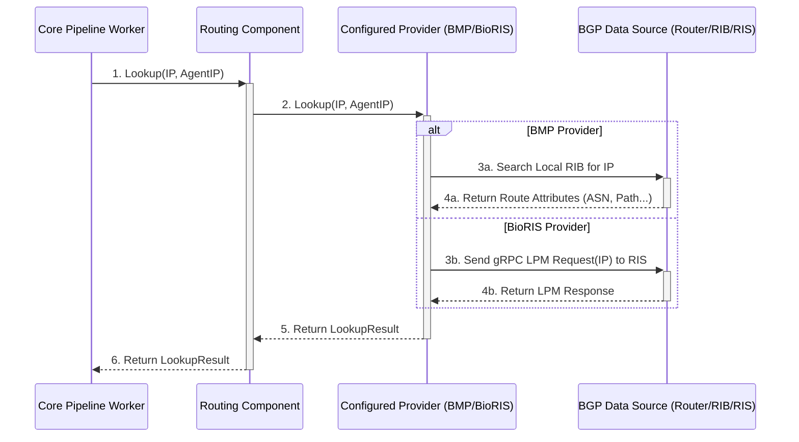

# Chapter 5: Routing Providers (Inlet)

In the [previous chapter](04_metadata_providers__inlet__.md), we learned how Akvorado's `inlet` service figures out details about network interfaces, like their names and speeds, using Metadata Providers. Now, let's look at another crucial piece of context: understanding the *routes* that network traffic takes across the internet or your internal network. This is where **Routing Providers** come in!

Imagine you have a flow record telling you that `198.51.100.10` sent data to `203.0.113.25`. Just knowing the IP addresses isn't always enough. You might want to know:

*   Which organization or network owns `198.51.100.10`? (Its Autonomous System Number or ASN)
*   What was the BGP path taken to reach `203.0.113.25`? (The AS Path)
*   Are there any special routing tags associated with the destination? (BGP Communities)

This is like having a GPS service for IP addresses. Given an IP, it can tell you about the "neighborhood" (ASN) it belongs to and the "highway route" (AS Path) used to get there. The Routing Provider component in Akvorado's `inlet` acts as this GPS service.

## What Problem Does This Solve?

Raw flow data often contains source and destination IP addresses, but lacks the broader routing context. Knowing the ASN, AS Path, and BGP Communities associated with IPs is vital for:

*   **Traffic Analysis:** Understanding *who* is sending you traffic and *who* you are sending it to (e.g., identifying traffic to specific cloud providers, transit providers, or customers).
*   **Peering Decisions:** Analyzing which networks your traffic transits through.
*   **Security:** Identifying traffic originating from or destined for potentially malicious networks.
*   **Troubleshooting:** Correlating network flows with BGP routing information.

The Routing Provider's job is to fetch this routing information and make it available to the [Core Processing Pipeline (Inlet)](03_core_processing_pipeline__inlet__.md) for enriching flow records.

## The Routing GPS Analogy

Think of the Routing Provider like a specialized GPS navigation system for network routes:

*   **Input:** You give it an IP address (like a destination street address) and maybe the router asking for directions (the `agent`).
*   **Data Source:** It consults its map data. This data comes from different sources ("providers") like:
    *   **BMP (BGP Monitoring Protocol):** Like listening directly to live traffic reports and route announcements from your own routers.
    *   **BioRIS:** Like querying a central, external map database (a Routing Information Service) that aggregates BGP information.
*   **Output:** It tells you the "neighborhood" (ASN), the specific block (Network Prefix/Mask), the best "highway route" (AS Path), and any special signs or tolls along the way (BGP Communities).

## Key Concepts

### 1. Routing Information Provided

The Routing Provider typically looks up the following details for a given IP address:

*   **ASN (Autonomous System Number):** The number identifying the organization that manages the network containing the IP (e.g., `15169` for Google, `64500` for your own network).
*   **AS Path:** The sequence of ASNs that BGP routers use to reach the destination network.
*   **Communities:** Special tags attached to BGP routes, often used for signaling routing policies (e.g., `65001:100` might mean "don't announce this route to peers").
*   **Large Communities:** An extended format for BGP communities.
*   **Network Prefix/Mask:** The specific IP range (e.g., `198.51.100.0/24`) that the IP address belongs to according to the BGP table.
*   **Next Hop:** The immediate next router IP address on the path towards the destination IP.

### 2. Providers: Where the Data Comes From

Just like the Metadata Providers, Routing Providers use different sources:

*   **BMP (`bmp`):** Akvorado listens for BMP messages sent directly from your routers. BMP allows routers to stream their BGP updates (new routes, withdrawn routes) and their full routing tables (RIB - Routing Information Base) to Akvorado. Akvorado builds its own local copy of the BGP table based on these messages. This provides very accurate, router-specific routing information.
    *   *(See `inlet/routing/provider/bmp/root.go`)*
*   **BioRIS (`bioris`):** Akvorado queries an external Routing Information Service (RIS) based on the [Bio-Routing](https://bio-routing.org/) project. This RIS aggregates BGP information from various routers. Akvorado uses gRPC (a modern communication protocol) to ask the BioRIS server, "What do you know about this IP address?" This is useful if you don't want to configure BMP on all your routers or want a more aggregated view.
    *   *(See `inlet/routing/provider/bioris/root.go`)*

You configure which provider Akvorado should use in its [Configuration System](07_configuration_system_.md).

```yaml
# Example Akvorado Configuration Snippet (Conceptual)
inlet:
  routing:
    # Choose ONE provider configuration
    provider:
      # Option 1: Use BMP
      type: bmp
      config:
        listen: 0.0.0.0:17900 # Port Akvorado listens on for BMP connections
        collect_asns: true    # Collect ASN information
        collect_as_paths: true # Collect AS Path information
        collect_communities: true # Collect BGP Communities
        # Optional: Filter which Route Distinguishers (for VRFs) to accept
        # rds: [ 100, 200 ]

      # Option 2: Use BioRIS
      # type: bioris
      # config:
      #   ris_instances:
      #     - grpc_addr: "ris.example.net:50051" # Address of the BioRIS server
      #       grpc_secure: false # Use TLS?
      #       vrf: "default"     # Which VRF to query in BioRIS
      #   timeout: 500ms         # How long to wait for a response
      #   refresh: 1m            # How often to refresh router list from RIS
```

This example shows how you might configure either the `bmp` provider (listening on port 17900) or the `bioris` provider (querying `ris.example.net:50051`).

*(See `inlet/routing/config.go` for related code)*

### 3. Lookup: How it's Used

The [Core Processing Pipeline (Inlet)](03_core_processing_pipeline__inlet__.md) uses the Routing Provider during flow enrichment. For a given `FlowMessage`:

1.  It extracts the `SrcAddr` (Source IP) and `DstAddr` (Destination IP).
2.  It calls the Routing Provider's `Lookup` function for the `SrcAddr`: `routing.Lookup(ctx, flow.SrcAddr, flow.ExporterAddress)`.
3.  It calls the `Lookup` function for the `DstAddr`: `routing.Lookup(ctx, flow.DstAddr, flow.ExporterAddress)`.
4.  The Routing Provider component uses its configured provider (BMP or BioRIS) to find the routing information for these IPs.
5.  The provider returns a `LookupResult` containing the ASN, AS Path, Communities, etc.
6.  The Core Pipeline adds this information to the `FlowMessage` (e.g., populating `SrcAS`, `DstAS`, `DstASPath`, `DstCommunities`).

*(See `inlet/routing/provider/root.go` for the `LookupResult` definition)*

## Example: Enriching a Flow with Routing Data

Let's revisit the `FlowMessage` being processed by the [Core Processing Pipeline (Inlet)](03_core_processing_pipeline__inlet__.md):

*   `ExporterAddress`: `192.168.1.1`
*   `SrcAddr`: `10.0.0.5` (Internal IP)
*   `DstAddr`: `8.8.8.8` (Google Public DNS)
*   (Other fields like `Bytes`, `Packets`, `InIfName`, `OutIfName` are already added)

The Core Pipeline calls the Routing Provider:

1.  `routing.Lookup(ctx, "10.0.0.5", "192.168.1.1")`
    *   **Routing Provider (using BMP):** Looks up `10.0.0.5` in its local BGP table learned from `192.168.1.1`. Finds a route for `10.0.0.0/16` originating from its own ASN `65500`.
    *   **Result:** `{ASN: 65500, NetMask: 16, ASPath: [65500], Communities: []}`
    *   *FlowMessage Update:* `SrcAS=65500`, `SrcNetMask=16`.
2.  `routing.Lookup(ctx, "8.8.8.8", "192.168.1.1")`
    *   **Routing Provider (using BMP):** Looks up `8.8.8.8`. Finds the best route is for `8.8.8.0/24` via ASN `15169`. Let's say the AS Path is `[64501, 15169]` (where 64501 is a transit provider) and it has community `15169:1`.
    *   **Result:** `{ASN: 15169, NetMask: 24, ASPath: [64501, 15169], Communities: [15169:1]}`
    *   *FlowMessage Update:* `DstAS=15169`, `DstNetMask=24`, `DstASPath=[64501, 15169]`, `DstCommunities=[15169:1]`.

Now the `FlowMessage` sent to Kafka and ClickHouse contains valuable routing context alongside the basic flow details and interface metadata.

## Internal Implementation Walkthrough

How does the Routing Provider component handle lookups internally?



1.  **Request:** The [Core Processing Pipeline (Inlet)](03_core_processing_pipeline__inlet__.md) calls `Lookup` on the main Routing Component (`inlet/routing/root.go`).
2.  **Delegate:** The Routing Component simply passes the `Lookup` request to the currently configured and active `provider` instance (which was created based on your YAML configuration).
3.  **Provider Action:**
    *   **BMP (3a, 4a):** The BMP provider searches its internal Routing Information Base (RIB) - essentially a copy of the BGP table learned via BMP - for the best matching route for the given IP. It uses an efficient data structure (Patricia tree) for this search. It extracts the ASN, AS Path, etc., from the found route.
    *   **BioRIS (3b, 4b):** The BioRIS provider constructs a gRPC request (LPM - Longest Prefix Match) containing the IP address and sends it to the configured BioRIS server. It waits for the response, which contains the routing details.
4.  **Return Result:** The active provider formats the information it found (or received) into a standard `LookupResult` structure.
5.  **Return to Core:** The Routing Component receives the `LookupResult` from the provider and returns it to the Core Pipeline worker.

## Diving into the Code (Simplified)

The entry point for lookups is in the main component:

```go
// File: inlet/routing/root.go (Simplified Lookup)

// Lookup uses the selected provider to get an answer.
func (c *Component) Lookup(ctx context.Context, ip netip.Addr, nh netip.Addr, agent netip.Addr) provider.LookupResult {
	c.metrics.routingLookups.Inc() // Count lookups

	// Delegate the lookup to the configured provider (c.provider)
	result, err := c.provider.Lookup(ctx, ip, nh, agent)

	if err != nil {
		// Log errors, count failures
		c.metrics.routingLookupsFailed.Inc()
		c.errLogger.Err(err).Msgf("routing: error while looking up %s at %s", ip.String(), agent.String())
		return provider.LookupResult{} // Return empty result on error
	}
	return result // Return the result from the provider
}
```

This function acts as a simple pass-through to the configured `c.provider`. Let's see how the BMP provider handles it:

```go
// File: inlet/routing/provider/bmp/lookup.go (Simplified BMP Lookup)

// Lookup lookups a route for the provided IP address in the local RIB.
// The 'agent' parameter is ignored by this provider.
func (p *Provider) Lookup(_ context.Context, ip netip.Addr, nh netip.Addr, _ netip.Addr) (LookupResult, error) {
	// Skip if not configured to collect data or if no BMP data received yet
	if !p.config.CollectASNs && !p.config.CollectASPaths && !p.config.CollectCommunities {
		return LookupResult{}, nil
	}
	if !p.active.Load() { // Has any BMP connection been active?
		return LookupResult{}, nil
	}

	// Prepare IP for tree search
	searchAddr := patricia.NewIPv6Address(ip.AsSlice(), 128) // Treat all IPs as IPv6

	p.mu.RLock() // Lock RIB for reading
	defer p.mu.RUnlock()

	// Find the best matching route in the Patricia tree (p.rib.tree)
	// (Simplified: Actual code uses FindDeepestTagsWithFilter to potentially prefer specific next hops)
	_, routes := p.rib.tree.FindDeepestTags(searchAddr)
	if len(routes) == 0 {
		return LookupResult{}, errNoRouteFound // No route found for this IP
	}

	// Get the attributes (ASN, Path, etc.) associated with the best route found
	route := routes[len(routes)-1] // Get the most specific route
	attributes := p.rib.rtas.Get(route.attributes)
	nextHopIP := netip.Addr(p.rib.nextHops.Get(route.nextHop))

	// Convert prefix length back to IPv4 if needed
	plen := attributes.plen
	if ip.Is4() {
		plen = plen - 96
	}

	// Build and return the result
	return LookupResult{
		ASN:              attributes.asn,
		ASPath:           attributes.asPath,
		Communities:      attributes.communities,
		LargeCommunities: attributes.largeCommunities,
		NetMask:          plen,
		NextHop:          nextHopIP,
	}, nil
}
```

This code performs a read-locked search (`p.rib.tree.FindDeepestTags`) on the RIB built from BMP messages. It then retrieves the associated attributes and constructs the `LookupResult`.

Now let's look at the BioRIS provider:

```go
// File: inlet/routing/provider/bioris/root.go (Simplified BioRIS Lookup)

// Lookup does an lookup on one of the specified RIS Instances.
// NextHopIP ('nh') is ignored by this provider.
func (p *Provider) Lookup(ctx context.Context, ip netip.Addr, _ netip.Addr, agent netip.Addr) (provider.LookupResult, error) {
	p.mu.RLock() // Lock needed for accessing router/instance lists
	defer p.mu.RUnlock()

	// Perform the Longest Prefix Match (LPM) query via gRPC
	lpmRes, lpmErr := p.lookupLPM(ctx, ip, agent)

	if lpmErr != nil {
		return provider.LookupResult{}, lpmErr // Return error if gRPC call failed
	}

	// Convert the gRPC response (lpmRes) into the standard LookupResult format
	r, err := p.lpmResponseToLookupResult(lpmRes)
	if err != nil {
		return provider.LookupResult{}, err // Return error if response parsing failed
	}
	return r, nil
}

// lookupLPM makes the actual gRPC call.
func (p *Provider) lookupLPM(ctx context.Context, ip netip.Addr, agent netip.Addr) (*pb.LPMResponse, error) {
	// 1. Choose which RIS instance and router context to use based on 'agent' IP
	chosenRouterID, chosenRis, err := p.chooseRouter(agent)
	if err != nil {
		return nil, err // Error finding suitable RIS instance/router
	}

	// 2. Prepare the IP address prefix for the gRPC request
	ipAddrProto, _ := bnet.IPFromBytes(ip.Unmap().AsSlice()) // Convert netip.Addr to BioRIS format
	pfxLen := uint8(32)
	if !ipAddrProto.IsIPv4() { pfxLen = 128 }
	pfxProto := bnet.NewPfx(ipAddrProto, pfxLen).ToProto()

	p.metrics.lpmRequests.WithLabelValues(/*...*/).Inc() // Count requests

	// 3. Set a deadline and make the gRPC call
	clientDeadline := time.Now().Add(p.config.Timeout)
	ctx, cancel := context.WithDeadline(ctx, clientDeadline)
	defer cancel()

	res, err := chosenRis.client.LPM(ctx, &pb.LPMRequest{
		Router: chosenRouterID.Unmap().String(),
		Vrf:    chosenRis.config.VRF, // Query specific VRF if configured
		Pfx:    pfxProto,
	})

	// 4. Handle errors (timeout, connection error, etc.)
	if err != nil {
        // Increment error/timeout metrics
        // ...
		return nil, fmt.Errorf("lpm lookup failed: %w", err)
	}

	p.metrics.lpmRequestSuccess.WithLabelValues(/*...*/).Inc()
	return res, nil // Return the gRPC response
}

// (lpmResponseToLookupResult function parses the pb.LPMResponse into provider.LookupResult)
```

The BioRIS provider first selects the appropriate RIS instance (`chooseRouter`), then prepares and sends the gRPC `LPM` request using the `chosenRis.client`. It handles timeouts and errors before parsing the response into the standard `LookupResult`.

## Conclusion

Routing Providers are Akvorado's way of understanding the "bigger picture" of network traffic flow. They act like a GPS for IP addresses, providing crucial context such as:

*   **Who owns the IP?** (ASN)
*   **Which network does it belong to?** (Prefix/Netmask)
*   **How was it reached?** (AS Path)
*   **Any special routing tags?** (BGP Communities)

This information is fetched using providers like **BMP** (listening directly to your routers) or **BioRIS** (querying an external routing database). The [Core Processing Pipeline (Inlet)](03_core_processing_pipeline__inlet__.md) uses this data to enrich flow records, making them far more valuable for analysis, monitoring, and troubleshooting.

We've now seen how Akvorado ingests flows, structures them (Schema), enriches them with interface details (Metadata Providers) and routing information (Routing Providers), and prepares them for sending (Core Pipeline). But where does this processed data ultimately go? How is it stored efficiently for reporting?

Next up: [Chapter 6: ClickHouse Orchestration](06_clickhouse_orchestration_.md)

---

Generated by [AI Codebase Knowledge Builder](https://github.com/The-Pocket/Tutorial-Codebase-Knowledge)