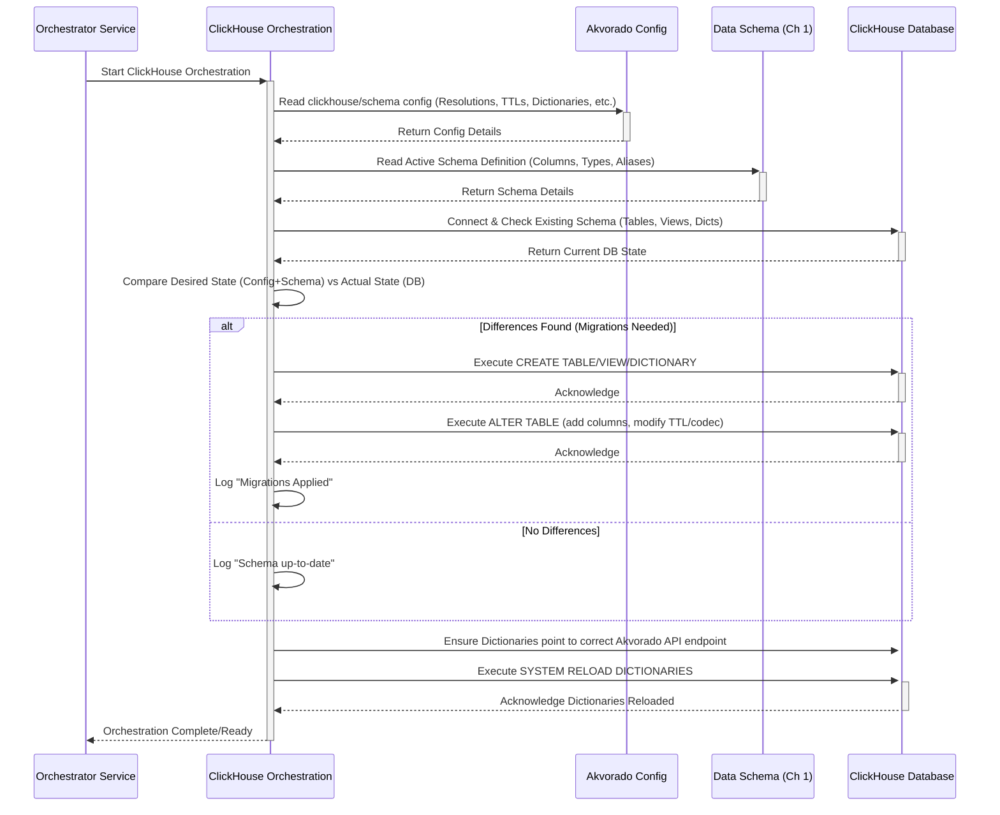

# Chapter 6: ClickHouse Orchestration

In the [previous chapter](05_routing_providers__inlet__.md), we saw how Akvorado enriches flow data with crucial routing context like AS Numbers and network prefixes. Now, we have these fully detailed `FlowMessage` objects (packaged as Protobuf messages) being sent to Kafka. But where do they go from there? How are they stored so we can actually query and analyze them?

This is where the database comes in, and specifically, the component that manages Akvorado's structure *within* that database: **ClickHouse Orchestration**.

## What Problem Does This Solve? Storing Data Smartly

Imagine you have a massive, constantly growing pile of LEGO® bricks (our enriched flow data arriving via Kafka). Just dumping them all into one giant bin isn't very useful. You wouldn't be able to find specific bricks easily, and the bin would quickly overflow.

You need a system to organize these bricks:

1.  **Dedicated Bins:** You need specific bins (database tables) designed to hold the bricks (flow records).
2.  **Summary Bins:** Maybe you need smaller bins that hold summaries, like "total number of red 2x2 bricks added each minute" (aggregated tables for faster reporting on older data).
3.  **Cleaning Out Old Bricks:** You need a rule that says "throw away any bricks older than one year" to save space (data Time-To-Live or TTL).
4.  **Reference Charts:** You need charts hanging on the wall that tell you what each special brick shape means (database dictionaries for looking up things like protocol numbers or ASNs).
5.  **Automatic Sorter:** You need a machine that takes bricks from the delivery chute (Kafka) and puts them into the correct bins (materialized views to process incoming data).

The **ClickHouse Orchestration** component is Akvorado's dedicated organizer for the ClickHouse database. It sets up and manages all these storage structures and rules specifically for Akvorado. It acts like the **database administrator (DBA) specifically for Akvorado**, making sure the database is perfectly tailored to store and serve Akvorado's data efficiently.

## Key Concepts: What the Orchestrator Manages

The ClickHouse Orchestration component, running as part of the `akvorado orchestrator` service, takes care of several critical tasks within your ClickHouse database:

### 1. Table Creation and Migration

*   **Raw Flow Table (`flows_XXX_raw`):** This is a special table that connects directly to Kafka. Its structure matches the Protobuf format defined by the [Data Schema](01_data_schema_.md). It acts as the initial entry point for data from Kafka into ClickHouse. The `XXX` part is a hash of the schema, so if the schema changes, a new table is created.
*   **Main Flow Table (`flows`):** This is the primary table where processed and enriched flow data is stored. The orchestrator creates this table with all the columns defined in the active [Data Schema](01_data_schema_.md), including calculated fields (like `PacketSize`).
*   **Aggregated Flow Tables (`flows_1m`, `flows_5m`, etc.):** To speed up reporting over long time ranges, Akvorado can store pre-aggregated data. For example, `flows_5m` might store a summary of all flows that occurred within each 5-minute interval. The orchestrator creates these tables based on the `resolutions` configured in your `akvorado.yaml` file. These tables usually have fewer columns than the main `flows` table (e.g., dropping interface names) to save space.
*   **Migrations:** As Akvorado evolves, the required database structure might change (e.g., adding a new column, changing a data type). The orchestrator automatically detects these changes and applies the necessary `ALTER TABLE` commands to update the ClickHouse tables accordingly. This ensures your database schema stays compatible with your Akvorado version.

### 2. Data Lifecycle (TTL - Time To Live)

Flow data accumulates quickly! You usually don't need to keep high-resolution data forever. The orchestrator configures ClickHouse's **TTL** feature on the flow tables.

*   Based on your configuration (e.g., keep raw `flows` data for 15 days, keep `flows_5m` data for 90 days, keep `flows_1h` data for 1 year), the orchestrator tells ClickHouse to automatically delete data older than the specified TTL.
*   This happens in the background within ClickHouse and is crucial for managing disk space.

### 3. Materialized Views (The Automatic Sorter)

How does data get from the Kafka-connected `flows_XXX_raw` table into the main `flows` table and the aggregated tables? Through **Materialized Views**.

*   **Raw-to-Main View (`flows_XXX_raw_consumer`):** The orchestrator creates a materialized view that continuously reads new data arriving in `flows_XXX_raw`. It applies any necessary transformations (like calculating derived fields defined in the schema) and inserts the results into the main `flows` table. It also handles filtering out any messages that had errors during Kafka processing.
*   **Main-to-Aggregated Views (`flows_5m_consumer`, etc.):** For each configured aggregation level (like 5 minutes), the orchestrator creates another materialized view. This view reads from the main `flows` table, groups the data by the aggregation interval (e.g., `toStartOfFiveMinutes(TimeReceived)`) and other key dimensions, sums up the `Bytes` and `Packets`, and inserts the summarized results into the corresponding aggregated table (e.g., `flows_5m`).

These views act like automated data pipelines *within* ClickHouse, processing data as it arrives from Kafka.

### 4. Dictionary Setup (The Reference Charts)

Sometimes, you want to enrich data *during* a query within ClickHouse itself. For example, mapping a protocol number like `6` to the name `TCP`. ClickHouse uses **Dictionaries** for this. The orchestrator sets up several dictionaries for Akvorado:

*   **`asns`:** Maps AS numbers to AS names (using built-in data and your custom additions).
*   **`protocols`:** Maps protocol numbers to names and descriptions.
*   **`icmp`:** Maps ICMP type/code combinations to names.
*   **`tcp_ports` / `udp_ports`:** Maps well-known TCP/UDP port numbers to service names.
*   **`networks`:** Maps IP subnets (from GeoIP databases, remote sources, or static config) to attributes like Name, Role, Site, Country, ASN, etc. This is powerful for classifying traffic based on IP addresses directly in ClickHouse queries.
*   **Custom Dictionaries:** If you define custom fields in your [Data Schema](01_data_schema_.md) that use dictionaries, the orchestrator creates those too.

These dictionaries are special tables that ClickHouse can look up very quickly during query execution using functions like `dictGetString('protocols', 'name', tuple(Proto))`. The orchestrator defines these dictionaries to load their data from Akvorado's own API, ensuring they stay up-to-date.

## How it's Used: Configuration Drives Everything

The ClickHouse Orchestration logic runs when the `akvorado orchestrator` service starts. It reads your main `akvorado.yaml` configuration file, specifically sections related to:

*   `orchestrator.clickhouse`: Contains database connection details, cluster settings, Kafka settings for ClickHouse, resolution/TTL configurations, and dictionary source definitions (like `ASNs` and `Networks`).
*   `schema`: Defines which fields are enabled, which are custom, and how they map to ClickHouse types and aliases (as discussed in [Chapter 1](01_data_schema_.md)).

Based on this configuration and the defined schema, the orchestrator connects to ClickHouse and makes sure everything matches the desired state.

```yaml
# Example akvorado.yaml snippet (Conceptual)
schema:
  # ... field enabling/disabling ...
  custom_dictionaries:
    my_customer_map:
      layout: hashed
      keys:
        - name: SrcAddr # Lookup key is source IP
          type: IPAddress
      attributes:
        - name: customer_name # Value is customer name
          type: String
          default: Unknown

orchestrator:
  clickhouse:
    # ... connection details ...
    database: akvorado
    cluster: my_cluster # Optional: if using ClickHouse cluster

    # Kafka connection for ClickHouse Kafka Engine tables
    kafka:
      brokers: ["kafka1:9092"]
      topic: akvorado-flows
      consumers: 4
      group_name: clickhouse

    # Data aggregation and retention settings
    resolutions:
      - interval: 0s         # Raw flows (no aggregation)
        ttl: 15d             # Keep for 15 days
      - interval: 1m         # Aggregate per minute
        ttl: 7d              # Keep for 7 days
      - interval: 5m         # Aggregate per 5 minutes
        ttl: 90d             # Keep for 90 days
      - interval: 1h         # Aggregate per hour
        ttl: 365d            # Keep for 1 year

    # Dictionary sources
    asns:
      64500: "My Company AS"
      64501: "Lab Network AS"

    networks: # Static network definitions
      "192.168.1.0/24": { name: "Office LAN", role: "Internal", site: "HQ" }
      "10.0.0.0/8": { name: "Private RFC1918", role: "Internal" }

    # Optional: URL for ClickHouse dictionaries to fetch data from Akvorado API
    orchestrator_url: "http://akvorado-orchestrator.internal:8080"
```

This configuration tells the orchestrator:
*   Which Kafka topic to read from (`akvorado-flows-<schema_hash>`).
*   To create tables `flows`, `flows_1m`, `flows_5m`, `flows_1h` with specified TTLs.
*   To set up the corresponding materialized views.
*   To create the standard dictionaries plus a custom one (`custom_dict_my_customer_map`).
*   To populate the `asns` and `networks` dictionaries with the provided static data (in addition to built-in/dynamic sources).

## Internal Implementation: Making it Happen

Let's trace the steps the ClickHouse Orchestration component takes at startup:



1.  **Read Config & Schema:** It loads the relevant sections from the configuration file and consults the [Data Schema](01_data_schema_.md) component to understand the desired columns, types, and dictionaries.
2.  **Connect & Check:** It connects to the ClickHouse database and queries system tables (`system.tables`, `system.columns`, `system.dictionaries`) to see what tables, views, and dictionaries already exist and what their structure is.
3.  **Compare:** It compares the desired state (from config and schema) with the actual state found in ClickHouse.
4.  **Migrate (if needed):** If differences are found, it generates and executes the necessary SQL commands (`CREATE TABLE`, `ALTER TABLE ... ADD COLUMN`, `ALTER TABLE ... MODIFY TTL`, `CREATE MATERIALIZED VIEW`, `CREATE DICTIONARY`, etc.) to bring the database structure in line with the configuration. It's careful about applying changes, especially to tables that already contain data.
5.  **Reload Dictionaries:** Finally, it ensures the dictionaries are configured correctly (especially their source URL pointing back to the Akvorado API) and tells ClickHouse to reload them (`SYSTEM RELOAD DICTIONARIES`) so they pick up any changes.

## Diving into the Code (Simplified)

The core logic for creating/updating tables and views resides in `orchestrator/clickhouse/migrations.go` and `orchestrator/clickhouse/migrations_helpers.go`.

**Creating/Updating Flow Tables:**

The `createOrUpdateFlowsTable` function handles ensuring the main `flows` table and aggregated tables (like `flows_5m`) exist and have the correct structure and TTL.

```go
// File: orchestrator/clickhouse/migrations.go (Simplified createOrUpdateFlowsTable)

func (c *Component) createOrUpdateFlowsTable(ctx context.Context, resolution ResolutionConfiguration) error {
	// Determine table name (e.g., "flows" or "flows_5m")
	tableName := getTableNameForResolution(resolution)
	localTableName := c.localTable(tableName) // Adjusts for cluster setup

	// Calculate TTL and partitioning settings from config
	ttlSeconds := uint64(resolution.TTL.Seconds())
	partitionIntervalSeconds := calculatePartitionInterval(resolution.TTL, c.config.MaxPartitions)

	// Check if table exists
	if !tableExists(ctx, c.d.ClickHouse, localTableName) {
		// --- CREATE TABLE ---
		c.r.Info().Msgf("Creating table %s", localTableName)
		createQuery := buildCreateTableQuery(
			localTableName,
			c.d.Schema,
			resolution, // Used to skip columns in aggregated tables
			c.mergeTreeEngine(localTableName, ...), // Generates correct engine (ReplicatedMergeTree if clustered)
			ttlSeconds,
			partitionIntervalSeconds,
		)
		if err := c.d.ClickHouse.ExecOnCluster(ctx, createQuery); err != nil {
			return fmt.Errorf("cannot create %s: %w", localTableName, err)
		}
		return nil // Table created
	}

	// --- ALTER TABLE (Update existing) ---
	c.r.Info().Msgf("Checking existing table %s for updates", localTableName)
	modifications := []string{}

	// 1. Check for missing/changed columns based on Schema
	existingColumns := getExistingColumns(ctx, c.d.ClickHouse, localTableName)
	wantedColumns := c.d.Schema.ColumnsForResolution(resolution) // Get expected columns
	columnChanges := compareColumns(existingColumns, wantedColumns)
	for _, change := range columnChanges {
		modifications = append(modifications, change.alterStatement) // e.g., "ADD COLUMN X String", "MODIFY COLUMN Y CODEC(ZSTD)"
	}

	// 2. Check TTL
	if !checkTTLMatches(ctx, c.d.ClickHouse, localTableName, ttlSeconds) {
		modifications = append(modifications, fmt.Sprintf("MODIFY TTL TimeReceived + toIntervalSecond(%d)", ttlSeconds))
	}

	// 3. Apply modifications if any
	if len(modifications) > 0 {
		c.r.Info().Msgf("Applying %d modifications to %s", len(modifications), localTableName)
		alterQuery := fmt.Sprintf("ALTER TABLE %s %s", localTableName, strings.Join(modifications, ", "))
		if err := c.d.ClickHouse.ExecOnCluster(ctx, alterQuery); err != nil {
			return fmt.Errorf("cannot update table %s: %w", localTableName, err)
		}
		return nil // Table updated
	}

	c.r.Debug().Msgf("Table %s is already up-to-date", localTableName)
	return errSkipStep // Indicate no changes were made
}
```

This function first checks if the target table exists. If not, it builds and executes a `CREATE TABLE` statement using the schema definition and configuration. If the table *does* exist, it compares the existing columns and TTL against the desired state and generates/executes `ALTER TABLE` statements if needed.

**Creating Dictionaries:**

The `createDictionary` helper function manages dictionary creation.

```go
// File: orchestrator/clickhouse/migrations_helpers.go (Simplified createDictionary)

func (c *Component) createDictionary(ctx context.Context, name, layout, schemaSQL, primaryKeySQL string) error {
	// Define the source: Akvorado's own HTTP API endpoint for this dictionary
	sourceURL := fmt.Sprintf("%s/api/v0/orchestrator/clickhouse/%s.csv", c.config.OrchestratorURL, name)
	source := buildDictionarySource("HTTP", sourceURL, c.config.OrchestratorBasicAuth)

	// Define lifetime (how often ClickHouse checks for updates)
	lifetime := "LIFETIME(MIN 0 MAX 3600)" // Check every hour max

	// Build the CREATE DICTIONARY query
	createQuery := fmt.Sprintf(`
CREATE DICTIONARY %s.%s (%s)
PRIMARY KEY %s
%s %s LAYOUT(%s())`,
		c.config.Database, name, schemaSQL, primaryKeySQL, source, lifetime, strings.ToUpper(layout))

	// Check if an identical dictionary already exists
	if ok, err := c.tableAlreadyExists(ctx, name, "create_table_query", createQuery); err != nil {
		return err
	} else if ok {
		c.r.Info().Msgf("Dictionary %s already exists, skipping", name)
		return errSkipStep
	}

	// Create or replace the dictionary
	c.r.Info().Msgf("Creating or replacing dictionary %s", name)
	// Use CREATE OR REPLACE to handle updates smoothly
	createOrReplaceQuery := strings.Replace(createQuery, "CREATE ", "CREATE OR REPLACE ", 1)
	if err := c.d.ClickHouse.ExecOnCluster(ctx, createOrReplaceQuery); err != nil {
		return fmt.Errorf("cannot create dictionary %s: %w", name, err)
	}
	return nil
}
```

This function constructs the `CREATE DICTIONARY` statement, specifying the structure (`schemaSQL`, `primaryKeySQL`), layout (`hashed`, `ip_trie`, etc.), and crucially, the `SOURCE(HTTP(...))` pointing back to the Akvorado API endpoint that will serve the dictionary data (e.g., `/api/v0/orchestrator/clickhouse/asns.csv`). It uses `CREATE OR REPLACE` to ensure the dictionary definition is always up-to-date.

**Creating Materialized Views:**

Functions like `createRawFlowsConsumerView` and `createFlowsConsumerView` set up the automatic data processing pipelines.

```go
// File: orchestrator/clickhouse/migrations.go (Simplified createFlowsConsumerView for aggregation)

func (c *Component) createFlowsConsumerView(ctx context.Context, resolution ResolutionConfiguration) error {
	// Skip for the base 'flows' table (interval 0)
	if resolution.Interval == 0 { return errSkipStep }

	sourceTable := c.localTable("flows") // Read from main flows table
	targetTable := c.localTable(fmt.Sprintf("flows_%s", resolution.Interval)) // Write to aggregated table
	viewName := fmt.Sprintf("%s_consumer", targetTable)
	intervalSeconds := uint64(resolution.Interval.Seconds())

	// Build the SELECT query for aggregation
	// Selects grouping keys, sums Bytes/Packets, rounds TimeReceived
	selectQuery := buildAggregationSelectQuery(
		sourceTable,
		intervalSeconds,
		c.d.Schema.ColumnsForResolution(resolution), // Columns to include in aggregation
	)

	// Check if view already exists with the exact same query
	if ok, err := c.tableAlreadyExists(ctx, viewName, "as_select", selectQuery); err != nil {
		return err
	} else if ok {
		c.r.Info().Msgf("View %s already exists, skipping", viewName)
		return errSkipStep
	}

	// Drop existing view (if any) and create the new one
	c.r.Info().Msgf("Creating materialized view %s", viewName)
	if err := c.d.ClickHouse.ExecOnCluster(ctx, fmt.Sprintf(`DROP TABLE IF EXISTS %s SYNC`, viewName)); err != nil {
		return fmt.Errorf("cannot drop existing view %s: %w", viewName, err)
	}
	createViewQuery := fmt.Sprintf("CREATE MATERIALIZED VIEW %s TO %s AS %s",
		viewName, targetTable, selectQuery)
	if err := c.d.ClickHouse.ExecOnCluster(ctx, createViewQuery); err != nil {
		return fmt.Errorf("cannot create view %s: %w", viewName, err)
	}
	return nil
}
```

This function defines a `SELECT` query that reads from the source table (`flows`), groups by the appropriate time interval and dimensions, aggregates `Bytes` and `Packets`, and selects the necessary columns. It then creates a `MATERIALIZED VIEW` using this query, directing the output (`TO targetTable`) to the correct aggregated table.

## Conclusion

The ClickHouse Orchestration component is the unsung hero that prepares and maintains Akvorado's home within the ClickHouse database. It acts as an automated, Akvorado-aware DBA, responsible for:

*   **Creating and Migrating Tables:** Setting up the `flows`, aggregated (`flows_Xm`), and Kafka engine tables according to the defined [Data Schema](01_data_schema_.md).
*   **Managing Data Lifecycle:** Applying TTLs to automatically purge old data.
*   **Building Internal Pipelines:** Creating Materialized Views to process data from Kafka into the main and aggregated tables.
*   **Setting Up Dictionaries:** Configuring ClickHouse dictionaries for efficient data enrichment within queries.

By handling all this database setup automatically, it ensures that Akvorado has a robust and efficient storage backend ready to receive, store, and serve your network flow data. The rules for this setup are largely driven by the Akvorado configuration file.

Next up: [Chapter 7: Configuration System](07_configuration_system_.md)

---

Generated by [AI Codebase Knowledge Builder](https://github.com/The-Pocket/Tutorial-Codebase-Knowledge)