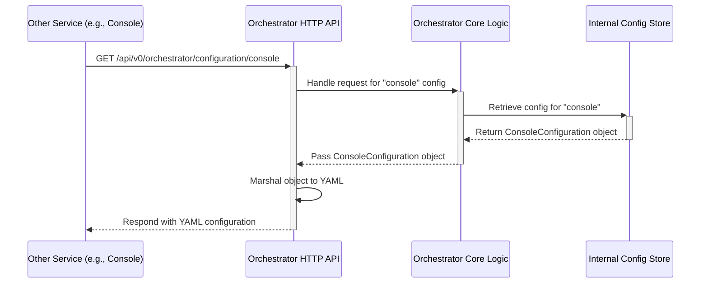

# Chapter 7: Configuration System

In the [previous chapter](06_clickhouse_orchestration_.md), we saw how the ClickHouse Orchestration component automatically sets up and manages Akvorado's database tables, views, and dictionaries. We learned that its actions are driven by settings you provide. But how does Akvorado *read* these settings, and how does it manage configuration for all its different parts? Welcome to the **Configuration System**!

## What's the Big Idea? A Central Control Panel

Imagine you have a complex machine, like a spaceship (or maybe just a fancy coffee maker!). It has lots of buttons, dials, and settings: engine power, navigation targets, coffee strength, milk frother temperature, etc. You need a central control panel to manage all these settings easily and consistently.

Akvorado is like that complex machine. It has several independent parts (called *components* or *services*), like:

*   `inlet`: Listens for flow data, enriches it.
*   `orchestrator`: Manages database setup, coordinates other components.
*   `console`: Provides the web interface for viewing data.

Each of these needs its own settings: which port should `inlet` listen on? What's the password for the ClickHouse database? How long should data be kept?

The **Configuration System** is Akvorado's central control panel. Its job is to:

1.  **Load Settings:** Read configuration instructions from various places.
2.  **Understand Settings:** Parse the instructions into a format Akvorado can use.
3.  **Fill in the Blanks:** Apply sensible default values if you haven't specified everything.
4.  **Check for Mistakes:** Validate the settings to catch common errors early.
5.  **Distribute Settings:** Make the correct settings available to each component that needs them.

Without this system, configuring Akvorado would be chaotic, requiring you to manage separate settings for each part in potentially different ways.

## Key Concepts: How Akvorado Gets Configured

Let's break down the parts of the Configuration System:

### 1. Sources: Where Do Settings Come From?

Akvorado can read settings from a few places, applying them in a specific order:

*   **Default Values:** Akvorado has built-in defaults for almost every setting. If you don't provide any configuration, it will try to use these (though you usually need to specify *some* things, like database connections).
*   **YAML Files:** This is the primary way you configure Akvorado. You write your settings in a human-readable format called YAML (often in a file named `akvorado.yaml`).
*   **YAML Includes (`!include`):** Inside your main YAML file, you can include other YAML files using the special `!include` tag. This is great for splitting large configurations into smaller, manageable parts (e.g., keeping network device details in a separate file).
*   **Environment Variables:** You can override specific settings using environment variables. This is useful for sensitive information (like passwords) or for changing settings in containerized environments (like Docker or Kubernetes) without modifying the main YAML file. Environment variables have a specific format like `AKVORADO_CFG_<COMPONENT>_<SETTING_PATH>=value`. For example, `AKVORADO_CFG_CONSOLE_CLICKHOUSE_PASSWORD=mysecret` would override the ClickHouse password specifically for the `console` component.

Akvorado applies these sources in order: Defaults < YAML Files < Includes < Environment Variables. This means an environment variable will always override a setting from a YAML file, which in turn overrides a default value.

### 2. Parsing and Defaults: Making Sense of It All

Once Akvorado reads the raw text from YAML files or environment variables, it needs to understand it.

*   **Parsing:** It uses libraries to convert the text into structured data that the Go code can work with. For YAML, it uses a standard YAML parser. For environment variables, it splits the variable name (`AKVORADO_CFG_CONSOLE_CLICKHOUSE_PASSWORD`) to figure out the setting's path (`console.clickhouse.password`).
*   **Applying Defaults:** During parsing, if a setting is missing from your configuration, Akvorado automatically fills it in with the default value. It uses clever internal mechanisms (`mapstructure` hooks like `DefaultHook`) to handle this. This means you often only need to specify the settings you want to *change* from the defaults.

```go
// File: cmd/config.go (Simplified Default Hook Logic)

// DefaultHook provides default values for configuration structs.
// It checks if the struct being filled has a Reset() method.
func DefaultHook() (mapstructure.DecodeHookFunc, func()) {
	// ... (disabled flag logic omitted) ...
	hook := func(from, to reflect.Value) (interface{}, error) {
		// Check if 'to' (the destination struct/field) can be Reset()
		method, ok := reflect.PointerTo(to.Type()).MethodByName("Reset")
		if !ok {
			// No Reset method, just continue normally
			return from.Interface(), nil
		}
		// Call the Reset() method on the destination address
		// This sets the struct to its default values *before*
		// applying values from the YAML/env var 'from'.
		method.Func.Call([]reflect.Value{to.Addr()})

		// Resume decoding, applying user-provided values over defaults
		return from.Interface(), nil
	}
	// ... (return disable function) ...
	return hook, func() { /* disable logic */ }
}
```
This code snippet shows the concept: before decoding the user's configuration (`from`) into the program's structure (`to`), it calls a `Reset()` method on the structure. This `Reset()` method sets all fields to their default values. Then, `mapstructure` proceeds to overwrite these defaults with any values found in the user's configuration.

### 3. Validation: Catching Errors Early

Nobody's perfect! You might make a typo in a setting name, provide an invalid IP address, or forget a required field. Akvorado includes a validation step *after* parsing and applying defaults.

*   It checks if all required settings are present.
*   It verifies if values are of the correct type (e.g., a number where a number is expected).
*   It applies specific rules (e.g., is this a valid network address? Is this number within a valid range?).

If validation fails, Akvorado will usually refuse to start and print helpful error messages pointing out the problems in your configuration. This saves you from discovering errors later when things mysteriously don't work. You can often run Akvorado components with a `--check` flag (e.g., `akvorado inlet --check config.yaml`) to *only* perform configuration loading and validation without actually starting the service.

### 4. Distribution: Getting Settings to the Right Place

Akvorado isn't just one program; it's often multiple running services (`inlet`, `orchestrator`, `console`). How do the settings get to the correct service?

*   **Direct Loading:** When you start a specific service (like `akvorado inlet config.yaml`), that service directly loads, parses, validates, and uses the configuration from the specified file and environment variables.
*   **Orchestrator Hub:** The `orchestrator` service acts as a central configuration hub. It loads the *entire* configuration, including sections for other services (like `inlet` and `console`). It then provides an HTTP API endpoint where other services can fetch *their specific* part of the configuration.
    *   For example, when you start `akvorado console http://orchestrator:8080`, the `console` service connects to the `orchestrator` at that address, asks for its configuration via an HTTP request (e.g., `GET /api/v0/orchestrator/configuration/console`), receives it in YAML format, and then parses/validates it locally.

This Orchestrator-based distribution is common in containerized deployments (like Docker/Kubernetes) where you might only mount the full configuration onto the orchestrator container, and other containers fetch their needed parts dynamically.

## How It Works: Configuring the Inlet

Let's walk through a simplified scenario of configuring the `inlet` service.

**1. The Configuration File (`akvorado.yaml`)**

You create a basic configuration file:

```yaml
# akvorado.yaml

# Settings for the 'inlet' component
inlet:
  # Listen for NetFlow on UDP port 2055
  flow:
    inputs:
      - decoder: netflow
        config:
          type: udp
          listen: 0.0.0.0:2055

  # Where to send processed flows
  kafka:
    brokers: ["kafka.internal:9092"]
    topic: akvorado-flows

  # How to get interface names (Metadata)
  metadata:
    providers:
      - type: snmp
        config:
          community: "myCommunityString" # Use SNMP community string

# Defaults will be used for http, reporting, routing, core, schema etc.
```

**2. Starting the Inlet (Direct Loading)**

You run the `inlet` service directly, pointing it to the config file:
`akvorado inlet akvorado.yaml`

*   **Load:** The `inlet` process reads `akvorado.yaml`. It checks for `!include` tags (none here).
*   **Defaults:** It starts with the default `InletConfiguration` struct, which has many fields pre-filled.
*   **Parse:** It parses the YAML using `mapstructure`. It sees the `inlet:` block and matches keys like `flow`, `kafka`, `metadata`. It overwrites the default values for these sections with the values from the file (e.g., setting the Kafka broker list, the UDP listen address, the SNMP community). Settings not mentioned in the file (like `inlet.http`, `inlet.routing`) keep their default values.
*   **Environment Overrides:** It checks environment variables. If you had set `AKVORADO_CFG_INLET_KAFKA_TOPIC=other-topic`, it would override the `topic` read from the YAML file.
*   **Validate:** It runs validation rules. Does `kafka.brokers` contain valid addresses? Is `metadata.providers.config.community` non-empty? If everything looks okay, it proceeds.
*   **Run:** The `inlet` service starts, using the final, merged configuration object to initialize its internal components ([Flow Ingestion Pipeline (Inlet)](02_flow_ingestion_pipeline__inlet__.md), [Metadata Providers (Inlet)](04_metadata_providers__inlet__.md), etc.).

**3. Using the Orchestrator (Indirect Loading)**

Alternatively, you might run the `orchestrator` with the full config and have `inlet` fetch it.

*   **Start Orchestrator:** `akvorado orchestrator akvorado.yaml`
    *   The orchestrator loads the *entire* file, including the `inlet:` section.
    *   It stores the configuration internally, ready to serve it via HTTP.
*   **Start Inlet:** `akvorado inlet http://orchestrator.internal:8080`
    *   The `inlet` process starts but sees the configuration path is an HTTP URL.
    *   **Fetch:** It sends an HTTP GET request to `http://orchestrator.internal:8080/api/v0/orchestrator/configuration/inlet`.
    *   **Orchestrator Responds:** The orchestrator finds the `inlet` section of its loaded config and sends it back as YAML.
    *   **Load:** The `inlet` receives the YAML response.
    *   **Parse, Defaults, Env Vars, Validate:** The process continues as in step 2, but starting from the YAML received from the orchestrator.
    *   **Run:** The `inlet` starts using the fetched and processed configuration.

## Inside the Code: Loading and Distributing

Let's look at simplified snippets showing key parts.

**Loading YAML and Env Vars (`cmd/config.go`)**

The `Parse` method in `cmd/config.go` handles the core loading logic.

```go
// File: cmd/config.go (Simplified Parse method)

func (c ConfigRelatedOptions) Parse(out io.Writer, component string, config interface{}) error {
	var rawConfig gin.H // Use a flexible map to hold raw YAML data

	// --- 1. Load from File/URL ---
	cfgFile := c.Path
	if cfgFile != "" {
		if strings.HasPrefix(cfgFile, "http") {
			// Fetch config from Orchestrator URL
			inputBytes, err := fetchConfigFromURL(cfgFile, component)
			// ... error handling ...
			if err := yaml.Unmarshal(inputBytes, &rawConfig); err != nil {
				return fmt.Errorf("unable to parse YAML from URL: %w", err)
			}
		} else {
			// Load from local file, handling !include
			// (Uses common/helpers/yaml/unmarshal.go)
			if err := yaml.UnmarshalWithInclude(os.DirFS("."), cfgFile, &rawConfig); err != nil {
				return fmt.Errorf("unable to parse local YAML file: %w", err)
			}
		}
	}

	// --- 2. Decode into Go Struct (applying defaults via hooks) ---
	// Get a mapstructure decoder configured with hooks (DefaultHook, etc.)
	decoder, err := mapstructure.NewDecoder(helpers.GetMapStructureDecoderConfig(&config))
	// ... error handling ...
	if err := decoder.Decode(rawConfig); err != nil {
		// This applies defaults AND values from the file
		return fmt.Errorf("unable to decode base config: %w", err)
	}

	// --- 3. Override with Environment Variables ---
	for _, keyval := range os.Environ() {
		kv := strings.SplitN(keyval, "=", 2)
		// Check if variable matches AKVORADO_CFG_<COMPONENT>_... format
		if isAkvoradoEnvVar(kv[0], component) {
			// Convert env var path (e.g., KAFKA_BROKERS) into nested map
			envOverrideMap := buildMapFromEnvVar(kv[0], kv[1])
			// Decode the override map onto the existing config struct
			if err := decoder.Decode(envOverrideMap); err != nil {
				return fmt.Errorf("unable to parse env override %q: %w", kv[0], err)
			}
		}
	}

	// --- 4. Validate ---
	if err := helpers.Validate.Struct(config); err != nil {
		// Handle validation errors (print helpful messages)
		return fmt.Errorf("invalid configuration: %w", err)
	}

	// --- 5. Dump (Optional) ---
	if c.Dump { dumpConfigAsYaml(out, config) }

	return nil // Config loaded successfully!
}
```
This function orchestrates the loading process: fetch/read YAML, decode into the target Go struct (applying defaults via hooks), loop through environment variables to decode overrides, and finally validate the resulting `config` object.

**Handling Includes (`common/helpers/yaml/unmarshal.go`)**

The `UnmarshalWithInclude` function recursively handles the `!include` tag.

```go
// File: common/helpers/yaml/unmarshal.go (Simplified UnmarshalWithInclude)

func UnmarshalWithInclude(fsys fs.FS, inputPath string, out interface{}) error {
	// 1. Read the main file content
	inBytes, err := fs.ReadFile(fsys, inputPath)
	// ... error handling ...

	// 2. Unmarshal into a generic YAML node structure
	var rootNode yaml.Node
	if err := yaml.Unmarshal(inBytes, &rootNode); err != nil {
		return fmt.Errorf("in %s: %w", inputPath, err)
	}
	// Adjust if it's a document node
	if rootNode.Kind == yaml.DocumentNode { rootNode = *rootNode.Content[0] }

	// 3. Walk the node tree to find and process !include tags
	nodesToProcess := []*yaml.Node{&rootNode}
	for len(nodesToProcess) > 0 {
		currentNode := nodesToProcess[0]
		nodesToProcess = nodesToProcess[1:]

		if currentNode.Tag == "!include" {
			// Found an include!
			includePath := currentNode.Value
			var includedNode yaml.Node
			// Recursively call UnmarshalWithInclude for the included file
			if err := UnmarshalWithInclude(fsys, includePath, &includedNode); err != nil {
				return fmt.Errorf("error in included file %s (from %s): %w", includePath, inputPath, err)
			}
			// Replace the !include node with the content of the included file
			*currentNode = includedNode
		} else {
			// Not an include tag, add its children to the processing list
			nodesToProcess = append(nodesToProcess, currentNode.Content...)
		}
	}

	// 4. Decode the final, processed node tree into the target Go struct
	return rootNode.Decode(out)
}
```
This function reads the YAML file, parses it into an intermediate node structure, walks through this structure, and whenever it finds a node tagged `!include`, it recursively calls itself to load the included file and replaces the tag with the loaded content. Finally, it decodes the fully resolved structure into the output variable.

**Serving Configuration (Orchestrator)**

The `orchestrator` service registers the configurations it loads and makes them available via HTTP.



```go
// File: orchestrator/root.go (Simplified RegisterConfiguration)

// serviceConfigurations holds the loaded config for each service type
var serviceConfigurations map[ServiceType][]interface{}
var serviceLock sync.Mutex // Protects access to the map

// RegisterConfiguration stores the configuration for a service type.
// Called by the orchestrator startup logic after loading the main YAML.
func (c *Component) RegisterConfiguration(service ServiceType, configuration interface{}) {
	c.serviceLock.Lock()
	defer c.serviceLock.Unlock()
	// Ensure the list for this service type exists
	if _, ok := c.serviceConfigurations[service]; !ok {
		c.serviceConfigurations[service] = []interface{}{}
	}
	// Append the configuration (multiple instances might be supported)
	c.serviceConfigurations[service] = append(c.serviceConfigurations[service], configuration)
}

// --- Later, when an HTTP request arrives ---

// File: orchestrator/http.go (Simplified configurationHandlerFunc)

func (c *Component) configurationHandlerFunc(gc *gin.Context) {
	service := ServiceType(gc.Param("service")) // e.g., "console"
	// ... (handle optional index parameter omitted) ...

	c.serviceLock.Lock()
	var configToServe interface{}
	// Look up the configuration registered for this service
	configs, ok := c.serviceConfigurations[service]
	if ok && len(configs) > 0 {
		configToServe = configs[0] // Serve the first registered config
	}
	c.serviceLock.Unlock()

	if configToServe == nil {
		gc.JSON(http.StatusNotFound, gin.H{"message": "Configuration not found."})
		return
	}

	// Respond with the configuration formatted as YAML
	gc.YAML(http.StatusOK, configToServe)
}
```
The `RegisterConfiguration` function simply stores the loaded configuration sections in a map keyed by the service type. The `configurationHandlerFunc` (triggered by an HTTP request) looks up the configuration in this map based on the requested service name and sends it back as YAML.

## Conclusion

The Akvorado Configuration System provides a flexible and robust way to manage settings across all components. It acts as the central control panel, ensuring consistency and ease of use. Key takeaways include:

*   **Multiple Sources:** Settings come from defaults, YAML files (with `!include`), and environment variables.
*   **Clear Precedence:** Environment variables override YAML files, which override defaults.
*   **Automation:** Defaults are applied automatically, reducing the amount of configuration you need to write.
*   **Validation:** Early checks catch errors before they cause problems.
*   **Distribution:** The `orchestrator` can act as a central hub to serve configuration to other services via HTTP.

Understanding how configuration is loaded, parsed, and distributed is key to effectively setting up and managing your Akvorado deployment.

With configuration handled, let's look at how Akvorado generates reports and visualizations from the data stored in ClickHouse.

Next up: [Chapter 8: Reporting System](08_reporting_system_.md)

---

Generated by [AI Codebase Knowledge Builder](https://github.com/The-Pocket/Tutorial-Codebase-Knowledge)