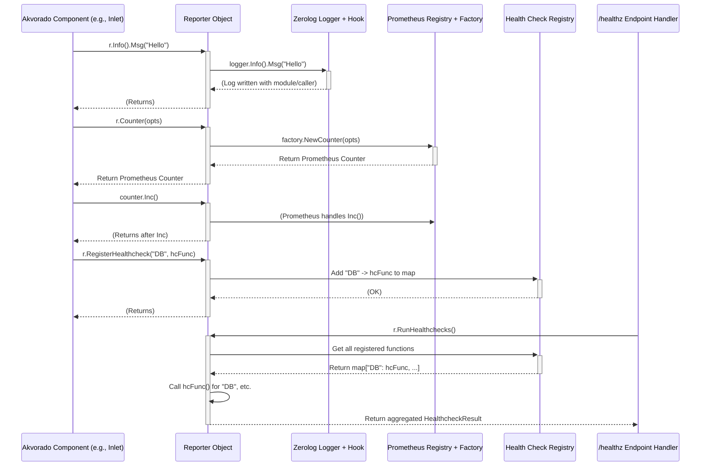

# Chapter 8: Reporting System

In the [previous chapter](07_configuration_system_.md), we learned how Akvorado reads and manages its settings using the Configuration System. These settings often include details about *how* Akvorado should report what it's doing. But how do the different parts of Akvorado actually *do* this reporting? How do they log messages, track performance, and tell us if they are healthy?

That's the job of the **Reporting System**!

## What's the Problem? A Unified Voice

Imagine you're the captain of a spaceship (Akvorado!). Your ship has many different sections: the engine room (`inlet`), the navigation bridge (`console`), the life support system (`orchestrator`), etc. Each section needs to communicate its status back to you.

*   The engine room needs to report its fuel consumption (metrics) and log any unusual noises (logging).
*   Life support needs to report oxygen levels (metrics) and signal if there's a critical issue (health check).
*   Navigation needs to log its course changes (logging).

You wouldn't want each section to use a different radio frequency or signal format! That would be confusing. You need a standard communication system that everyone uses.

The **Reporting System** in Akvorado is that standard communication system. It provides a single, unified way for all components to:

1.  **Log Events:** Record messages about what's happening (e.g., "Started listening on port 2055", "Received flow data", "Configuration loaded").
2.  **Collect Metrics:** Track numerical data about performance (e.g., "Flows processed per second", "Memory usage", "Cache hits").
3.  **Perform Health Checks:** Report their operational status (e.g., "Everything OK", "Warning: Cache is full", "Error: Cannot connect to database").

It acts as the central communication hub, ensuring all status updates, event logs, and performance indicators are handled consistently across the entire Akvorado system.

## Key Concepts: The Reporting Toolkit

The Reporting System provides a toolkit, primarily through a central object called the `Reporter`, which bundles together several capabilities.

### 1. The `Reporter` Object: The Standard Comms Device

Think of the `Reporter` object as the standard-issue communicator given to the crew in each section of our spaceship. Every major component in Akvorado receives its own instance of a `Reporter` when it starts up. This object provides all the methods needed for reporting.

```go
// File: common/reporter/root.go (Conceptual)

// Reporter contains the state for a reporter.
// It embeds the logger, providing logging methods directly.
type Reporter struct {
	logger.Logger // Provides Info(), Warn(), Error() etc.
	metrics *metrics.Metrics // Handles metrics creation/access
	// ... health check registry internal state ...
}

// New creates a new reporter from a configuration.
// (Usually called once per service like 'inlet' or 'console')
func New(config Configuration) (*Reporter, error) {
    // ... setup logger based on config.Logging ...
    // ... setup metrics based on config.Metrics ...
    // ... initialize health checks ...
    return &Reporter{ /* ... */ }, nil
}
```

This simplified structure shows that the `Reporter` holds the necessary tools (logger, metrics system). Components interact with the `Reporter`, not directly with the underlying logging or metrics libraries most of the time.

### 2. Logging: Recording What Happened

When a component needs to write a message (like "Starting up", "Error processing file", "Received configuration"), it uses the logging methods provided by the `Reporter`.

Akvorado uses a powerful library called `zerolog` for logging. The Reporting System wraps `zerolog` to add some useful features automatically:

*   **Structured Logging:** Logs are typically written in JSON format, making them easy for machines (and log analysis tools) to parse.
*   **Contextual Information:** Every log message automatically includes:
    *   `level`: The severity (e.g., `info`, `warn`, `error`).
    *   `time`: When the message was logged.
    *   `module`: The Akvorado component/package that generated the log (e.g., `inlet/flow`, `orchestrator/clickhouse`). This is added automatically!
    *   `caller`: The specific file and line number where the log message was generated. Also added automatically!
    *   `message`: The actual log message.
    *   Any extra fields the component added (e.g., `port=2055`, `fileName="data.log"`).

**Example Usage:**

Imagine the [Flow Ingestion Pipeline (Inlet)](02_flow_ingestion_pipeline__inlet__.md) wants to log that it started listening on a UDP port.

```go
// Inside the inlet component...
// 'r' is the Reporter object passed during initialization

port := 2055
listenAddress := "0.0.0.0"

r.Info(). // Start an INFO level message
    Str("address", listenAddress). // Add a string field 'address'
    Int("port", port). // Add an integer field 'port'
    Msgf("Started UDP listener") // Set the main message

// Output (Conceptual JSON log entry):
// {
//   "level": "info",
//   "time": "2023-10-27T10:00:00Z",
//   "module": "inlet/flow/input/udp", // Added automatically
//   "caller": "input/udp/root.go:123", // Added automatically
//   "address": "0.0.0.0",
//   "port": 2055,
//   "message": "Started UDP listener"
// }
```

This shows how easy it is to log structured data. The `Reporter` (via `zerolog`) handles formatting it correctly and adding the helpful `module` and `caller` context automatically.

*(See `common/reporter/logger.go` and `common/reporter/logger/root.go`)*

### 3. Metrics: Tracking Performance Numbers

To understand how well Akvorado is performing, components need to track numbers. How many flows are being processed per second? How much memory is being used? How many cache hits or misses are occurring? This is done using **metrics**.

Akvorado uses the standard Go library for Prometheus metrics (`prometheus/client_golang`). Prometheus is a popular system for collecting and monitoring time-series data. The Reporting System wraps the Prometheus library to make it easier to use:

*   **Simplified Registration:** Creating new metrics (like counters or gauges) is simplified. The `Reporter` handles registering them with Prometheus.
*   **Automatic Prefixes:** Metric names are automatically prefixed with the `module` name (e.g., a metric named `flows_processed` created by the `inlet/core` module might become `akvorado_inlet_core_flows_processed_total`). This avoids naming conflicts between different parts of Akvorado.
*   **Standard Types:** Provides easy access to common Prometheus metric types:
    *   **Counter:** A number that only goes up (e.g., total flows processed, total errors encountered).
    *   **Gauge:** A number that can go up or down (e.g., current memory usage, number of active connections).
    *   **Histogram/Summary:** More complex types for tracking distributions (e.g., request latencies).

**Example Usage:**

Let's say the [Core Processing Pipeline (Inlet)](03_core_processing_pipeline__inlet__.md) wants to count the number of flows it receives and forwards.

```go
// Inside the inlet/core component, during initialization...
// 'r' is the Reporter object

// Define a counter metric. The Reporter automatically adds the module prefix.
// The actual name might become 'akvorado_inlet_core_flows_received_total'
flowsReceivedCounter := r.CounterVec(prometheus.CounterOpts{
	Name: "flows_received_total",
	Help: "Total number of flow messages received.",
}, []string{"exporter_ip"}) // Labels allow tracking per exporter

// Define another counter for forwarded flows
flowsForwardedCounter := r.CounterVec( /* ... same setup ... */ )

// --- Later, when processing a flow ---
exporterIP := "192.168.1.1"
flowsReceivedCounter.WithLabelValues(exporterIP).Inc() // Increment for this exporter

// ... processing happens ...

if !rejected {
    flowsForwardedCounter.WithLabelValues(exporterIP).Inc() // Increment if forwarded
}
```

This creates counters to track flows per exporter. The `Reporter` handles the details of creating and registering these metrics with Prometheus. Akvorado components typically expose an HTTP endpoint (often `/metrics`) where Prometheus can scrape (collect) the current values of all registered metrics.

*(See `common/reporter/metrics.go` and `common/reporter/metrics/root.go`)*

### 4. Health Checks: Is Everything Okay?

Sometimes, you need a simple way to know if a component is working correctly. Is the database connection alive? Can the component reach a required external service? This is done via **Health Checks**.

The Reporting System provides a way for components to register their own health check functions.

*   **Registration:** A component provides a function that, when called, checks its internal state and returns a status (`OK`, `Warning`, or `Error`) and a brief message. It registers this function with the `Reporter` under a specific name (e.g., "DatabaseConnection", "KafkaProducer").
*   **Execution:** Akvorado typically exposes an HTTP endpoint (e.g., `/healthz`) that, when requested, calls *all* registered health check functions.
*   **Overall Status:** It aggregates the results. If all checks return `OK`, the overall status is `OK`. If any return `Warning` (and none `Error`), the overall status is `Warning`. If any return `Error`, the overall status is `Error`.

**Example Usage:**

Imagine the [ClickHouse Orchestration](06_clickhouse_orchestration_.md) component wants to provide a health check for its database connection.

```go
// Inside the orchestrator component, during initialization...
// 'r' is the Reporter object
// 'db' is the database connection object

// Define the health check function
dbHealthCheck := func(ctx context.Context) reporter.HealthcheckResult {
    // Ping the database connection
    if err := db.PingContext(ctx); err != nil {
        // Error pinging!
        return reporter.HealthcheckResult{
            Status: reporter.HealthcheckError,
            Reason: "Cannot ping ClickHouse: " + err.Error(),
        }
    }
    // All good!
    return reporter.HealthcheckResult{Status: reporter.HealthcheckOK}
}

// Register the function with the Reporter
r.RegisterHealthcheck("ClickHouseConnection", dbHealthCheck)

// --- Later ---
// A request to the /healthz endpoint triggers RunHealthchecks()
// which calls dbHealthCheck() and others.
// The aggregated result is returned as JSON.
```

This allows monitoring systems to quickly check the overall health of Akvorado by simply querying the `/healthz` endpoint.

*(See `common/reporter/healthcheck.go`)*

## Internal Implementation: How the Reporter Works

The `Reporter` object itself is mostly a facade or a wrapper around the underlying libraries (`zerolog`, `prometheus/client_golang`) and internal registries (for health checks).



1.  **Logging:** When a component calls `r.Info()`, it's directly calling the embedded `zerolog.Logger`. A custom "hook" (`contextHook`) intercepts the log event just before it's written, inspects the call stack to find the calling function and file, and adds the `module` and `caller` fields to the event. *(See `common/reporter/logger/root.go`)*
2.  **Metrics:** When a component calls `r.Counter(opts)`, the `Reporter` uses its `metrics.Factory` helper. This factory determines the calling module (using the call stack, similar to logging) and automatically prefixes the metric name in `opts` (e.g., adding `akvorado_inlet_core_`). It then uses the underlying Prometheus library to create and register the metric. A cache stores these factories per module to avoid repeated stack lookups. *(See `common/reporter/metrics/root.go`)*
3.  **Health Checks:** When `r.RegisterHealthcheck("DB", hcFunc)` is called, the `Reporter` simply stores the function (`hcFunc`) in an internal map, keyed by the name (`"DB"`). When the `/healthz` endpoint handler calls `r.RunHealthchecks()`, the `Reporter` iterates through this map, calls each registered function concurrently, collects the results, determines the overall status, and returns the aggregated details. *(See `common/reporter/healthcheck.go`)*

## Conclusion

The Reporting System is Akvorado's unified mechanism for components to communicate their status, performance, and health. It provides a consistent interface (`Reporter`) for:

*   **Logging:** Recording structured event messages with automatic context (module, caller).
*   **Metrics:** Tracking performance indicators using Prometheus-compatible counters, gauges, etc., with automatic module prefixes.
*   **Health Checks:** Registering and executing status checks for easy monitoring.

By centralizing these functions, the Reporting System makes it easier to observe, monitor, and troubleshoot Akvorado's various moving parts.

This concludes our journey through the core concepts of Akvorado! We've covered how data is structured ([Data Schema](01_data_schema_.md)), ingested ([Flow Ingestion Pipeline (Inlet)](02_flow_ingestion_pipeline__inlet__.md)), processed and enriched ([Core Processing Pipeline (Inlet)](03_core_processing_pipeline__inlet__.md), [Metadata Providers (Inlet)](04_metadata_providers__inlet__.md), [Routing Providers (Inlet)](05_routing_providers__inlet__.md)), stored ([ClickHouse Orchestration](06_clickhouse_orchestration_.md)), configured ([Configuration System](07_configuration_system_.md)), and finally, how the system reports on itself ([Reporting System](08_reporting_system_.md)). We hope this gives you a solid foundation for understanding and working with Akvorado!

---

Generated by [AI Codebase Knowledge Builder](https://github.com/The-Pocket/Tutorial-Codebase-Knowledge)