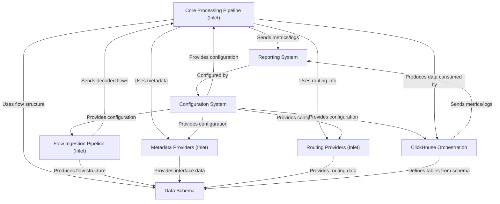

# Tutorial: akvorado

Akvorado collects and analyzes network flow data (*NetFlow*, *IPFIX*, *sFlow*).
The **Inlet** service includes a *Flow Ingestion Pipeline* (`1`) to receive and decode raw data, sending structured flows to the *Core Processing Pipeline* (`0`).
The Core Pipeline enriches flows using *Metadata* (`3`) and *Routing Providers* (`4`), classifies them, and forwards them (often to Kafka) according to the *Data Schema* (`2`).
The *ClickHouse Orchestration* (`5`) component manages the database setup, creating tables based on the schema and consuming the processed data.
A central *Configuration System* (`6`) provides settings, and a *Reporting System* (`7`) handles logs and metrics across the application.

**Source Repository:** [None](None)

## Chapters

1. [Data Schema
](01_data_schema_.md)
2. [Flow Ingestion Pipeline (Inlet)
](02_flow_ingestion_pipeline__inlet__.md)
3. [Core Processing Pipeline (Inlet)
](03_core_processing_pipeline__inlet__.md)
4. [Metadata Providers (Inlet)
](04_metadata_providers__inlet__.md)
5. [Routing Providers (Inlet)
](05_routing_providers__inlet__.md)
6. [ClickHouse Orchestration
](06_clickhouse_orchestration_.md)
7. [Configuration System
](07_configuration_system_.md)
8. [Reporting System
](08_reporting_system_.md)

---

Generated by [AI Codebase Knowledge Builder](https://github.com/The-Pocket/Tutorial-Codebase-Knowledge)