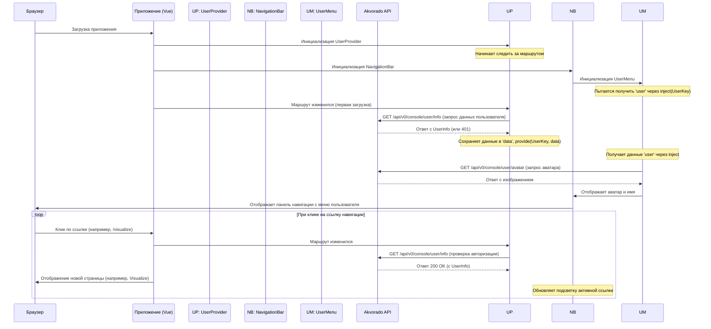

# Chapter 2: Навигация и информация о пользователе


В [предыдущей главе](01_домашняя_страница_и_виджеты_.md) мы познакомились с [Домашней страницей и виджетами](01_домашняя_страница_и_виджеты_.md), которые дают нам общий обзор состояния сети. Но как перемещаться по другим разделам приложения? И как узнать, под каким пользователем мы вошли в систему?

Представьте, что Akvorado — это большое здание. Домашняя страница — это вестибюль с информационными табло. Но чтобы попасть в другие комнаты (например, в зал визуализации данных или в архив документации), нам нужны указатели и, возможно, пропуск с нашим именем. Именно для этого и служат компоненты навигации и информации о пользователе.

В этой главе мы рассмотрим два основных элемента, которые всегда видны в верхней части экрана:

1.  **`NavigationBar` (Панель навигации):** Главное меню приложения, позволяющее переключаться между основными разделами.
2.  **`UserMenu` (Меню пользователя):** Небольшой элемент, показывающий, кто вы, и дающий доступ к действиям, связанным с вашим аккаунтом (например, выход).

## Зачем нужна навигация?

Как и в любом веб-приложении или на веб-сайте, нам нужен способ легко переходить из одного раздела в другой. Панель навигации `NavigationBar` решает эту задачу. Она содержит:

*   **Логотип и название:** Обычно ведут на главную страницу.
*   **Ссылки на разделы:** "Домой", "Визуализация", "Документация".
*   **Дополнительные элементы:** Кнопку переключения темной/светлой темы и меню пользователя.

## Кто я? Меню пользователя

Важно знать, под каким аккаунтом вы работаете, особенно если в системе есть разные роли или если доступ к ней имеют несколько человек. `UserMenu` показывает ваше имя или логин и предоставляет стандартные действия, такие как "Выход".

## Давайте посмотрим на код!

### `NavigationBar.vue`: Главные указатели

Этот компонент отвечает за всю верхнюю панель.

```vue
<!-- console/frontend/src/components/NavigationBar.vue -->
<template>
  <Disclosure
    as="nav"
    class="z-40 w-full border-gray-200 bg-gradient-to-r ... px-2 py-2.5 shadow ..."
  >
    <div class="container mx-auto flex flex-wrap items-center justify-between">
      <!-- Логотип и ссылка на главную -->
      <router-link to="/" class="flex items-center">
        
        <!-- ... Название и версия ... -->
      </router-link>

      <!-- Справа: Переключатель темы, Меню пользователя, Кнопка "гамбургер" -->
      <div class="flex md:order-2">
        <DarkModeSwitcher />
        <UserMenu />
        <DisclosureButton class="ml-3 inline-flex items-center ... md:hidden">
          <!-- Иконки для мобильного меню -->
        </DisclosureButton>
      </div>

      <!-- Основные ссылки навигации -->
      <DisclosurePanel
        static
        class="w-full items-center justify-between ui-open:block ... md:order-1 md:block ..."
      >
        <ul class="mt-4 flex flex-col md:mt-0 md:flex-row ...">
          <!-- Генерируем ссылки из списка navigation -->
          <li v-for="item in navigation" :key="item.name">
            <router-link
              class="block rounded py-2 pl-3 pr-4 ..."
              :class="item.current ? ['bg-blue-700 text-white ...'] : ['text-gray-700 hover:bg-gray-50 ...']"
              :to="item.link"
              :aria-current="item.current && 'page'"
            >
              <component :is="item.icon" class="inline h-5 w-5"></component>
              {{ item.name }} <!-- Отображаем имя ссылки -->
            </router-link>
          </li>
        </ul>
      </DisclosurePanel>
    </div>
  </Disclosure>
</template>

<script lang="ts" setup>
import { computed, inject } from "vue";
import { useRoute } from "vue-router";
import { Disclosure, DisclosureButton, DisclosurePanel } from "@headlessui/vue";
import { HomeIcon, BookOpenIcon, PresentationChartLineIcon, ... } from "@heroicons/vue/solid";
import DarkModeSwitcher from "@/components/DarkModeSwitcher.vue"; // Переключатель темы
import UserMenu from "@/components/UserMenu.vue"; // Меню пользователя
import { ServerConfigKey } from "@/components/ServerConfigProvider.vue"; // Для версии сервера

const serverConfiguration = inject(ServerConfigKey);
const route = useRoute(); // Получаем информацию о текущем маршруте

// Создаем список навигационных ссылок
const navigation = computed(() => [
  { name: "Home", icon: HomeIcon, link: "/", current: route.path == "/" },
  { name: "Visualize", icon: PresentationChartLineIcon, link: "/visualize", current: route.path.startsWith("/visualize") },
  { name: "Documentation", icon: BookOpenIcon, link: "/docs", current: route.path.startsWith("/docs") },
]);
</script>
```

**Объяснение:**

*   **`<template>`:** Определяет структуру панели. Используются компоненты `Disclosure` для адаптивного меню (которое сворачивается в "гамбургер" на маленьких экранах).
*   **`<router-link>`:** Это специальные ссылки Vue Router. Вместо `<a>` они используются для навигации внутри приложения без перезагрузки страницы. Атрибут `to` указывает путь назначения (например, `/` для главной, `/visualize` для визуализации).
*   **`<DarkModeSwitcher />` и `<UserMenu />`:** Это встраиваемые компоненты, которые мы рассмотрим ниже. Они отвечают за переключение темы и отображение информации о пользователе.
*   **`<script setup>`:**
    *   Импортируются необходимые компоненты и иконки (`HomeIcon`, `BookOpenIcon` и т.д.).
    *   `useRoute()`: Функция из Vue Router, которая дает доступ к информации о текущем URL-адресе (пути).
    *   `computed navigation`: Это "вычисляемое свойство". Оно создает массив объектов, представляющих пункты меню. Для каждого пункта определяется имя (`name`), иконка (`icon`), путь (`link`) и флаг `current`, который проверяет, совпадает ли текущий путь (`route.path`) с путем ссылки. Этот флаг используется в `<template>` для подсветки активного пункта меню.

### `UserMenu.vue`: Ваше имя и кнопка "Выход"

Этот маленький компонент отвечает за круглую иконку пользователя и выпадающее меню.

```vue
<!-- console/frontend/src/components/UserMenu.vue -->
<template>
  <Popover class="relative px-2" as="div">
    <!-- Кнопка с аватаром пользователя -->
    <PopoverButton class="flex rounded-full bg-gray-200 focus:ring-2 ...">
      <span class="sr-only">Открыть меню пользователя</span>
      
    </PopoverButton>
    <!-- Выпадающее меню (панель) -->
    <transition ...>
      <PopoverPanel class="absolute right-0 z-50 my-4 ... bg-white ... shadow ...">
        <div class="px-4 py-3">
          <!-- Отображение имени или email или логина -->
          <span class="block ... text-gray-900 dark:text-white">
            {{ user?.name || user?.email || user?.login || "Гость" }}
          </span>
          <!-- Отображение email, если есть имя -->
          <span v-if="user?.name && user?.email" class="block ... text-gray-500 ...">
            {{ user.email }}
          </span>
        </div>
        <!-- Ссылка для выхода, если она есть -->
        <ul v-if="user?.['logout-url']" class="py-1">
          <li>
            <a :href="user['logout-url']" class="block px-4 py-2 ... hover:bg-gray-100 ...">
              Выход <!-- Logout -->
            </a>
          </li>
        </ul>
      </PopoverPanel>
    </transition>
  </Popover>
</template>

<script lang="ts" setup>
import { inject } from "vue";
import { Popover, PopoverButton, PopoverPanel } from "@headlessui/vue";
import { UserKey, type UserInfo } from "@/components/UserProvider.vue"; // Импорт ключа и типа

// Получаем данные пользователя через inject
const { user } = inject(UserKey)!;
// URL для получения аватара пользователя с сервера
const avatarURL = "/api/v0/console/user/avatar";
</script>
```

**Объяснение:**

*   **`<template>`:** Использует компоненты `Popover` из библиотеки Headless UI для создания доступного выпадающего меню.
    *   `PopoverButton`: Это кнопка (с изображением аватара), при нажатии на которую открывается `PopoverPanel`.
    *   ``: Отображает аватар пользователя. URL для аватара (`avatarURL`) указывает на специальный эндпоинт API (`/api/v0/console/user/avatar`).
    *   `PopoverPanel`: Содержимое выпадающего меню. Оно отображает имя пользователя (`user?.name`), email (`user?.email`) или логин (`user?.login`). Оператор `?.` (optional chaining) используется на случай, если какие-то данные отсутствуют. Если ничего нет, отображается "Гость".
    *   Ссылка "Выход" (`<a>`): Появляется только если в данных пользователя (`user`) есть поле `logout-url`. Это обычная ссылка, ведущая на URL, предоставленный сервером для выхода из системы.
*   **`<script setup>`:**
    *   `inject(UserKey)!`: Это ключевой момент! Компонент "внедряет" (injects) данные пользователя, которые были предоставлены (`provided`) где-то выше по дереву компонентов (мы скоро увидим, где). `UserKey` — это специальный символ-ключ для идентификации этих данных. Восклицательный знак `!` говорит TypeScript, что мы уверены, что эти данные будут доступны.
    *   `avatarURL`: Просто строка с путем к API для получения изображения аватара.

### `DarkModeSwitcher.vue`: Переключатель света

Этот компонент очень прост – он просто показывает иконку солнца или луны и по клику переключает тему.

```vue
<!-- console/frontend/src/components/DarkModeSwitcher.vue -->
<template>
  <button type="button" class="cursor-pointer rounded-lg p-2.5 ... " @click="toggleDark()">
    <MoonIcon v-if="!isDark" class="h-5 w-5" /> <!-- Иконка луны, если светлая тема -->
    <SunIcon v-if="isDark" class="h-5 w-5" /> <!-- Иконка солнца, если темная тема -->
  </button>
</template>

<script lang="ts" setup>
import { inject } from "vue";
import { SunIcon, MoonIcon } from "@heroicons/vue/solid";
import { ThemeKey } from "@/components/ThemeProvider.vue"; // Ключ для темы

// Получаем состояние темы и функцию переключения через inject
const { isDark, toggleDark } = inject(ThemeKey)!;
</script>
```

**Объяснение:**

*   По аналогии с `UserMenu`, этот компонент использует `inject(ThemeKey)` для получения текущего состояния темы (`isDark` - булево значение) и функции для ее переключения (`toggleDark`), которые предоставляются [компонентом-провайдером](07_поставщики_глобального_состояния__провайдеры_.md) (`ThemeProvider.vue`).
*   В шаблоне `<template>` отображается соответствующая иконка (луна или солнце) в зависимости от `isDark`, а по клику (`@click`) вызывается функция `toggleDark()`.

## Как это работает под капотом? Откуда берутся данные о пользователе?

Мы видели, что `UserMenu` использует `inject(UserKey)` для получения данных пользователя. Но кто их туда "кладет"? За это отвечает компонент-провайдер, который обычно находится выше в иерархии компонентов, например, в главном файле приложения.

### `UserProvider.vue`: Источник информации о пользователе

Этот компонент невидимый, его задача — получить информацию о пользователе с сервера и сделать ее доступной для всех дочерних компонентов (таких как `UserMenu`).

```vue
<!-- console/frontend/src/components/UserProvider.vue -->
<template>
  <slot></slot> <!-- Просто отображает вложенное содержимое -->
</template>

<script lang="ts" setup>
import { provide, shallowReadonly, watch } from "vue";
import { useRoute, useRouter } from "vue-router";
import { useFetch } from "@vueuse/core";

// Настраиваем запрос к API для получения информации о пользователе
const { data, execute } = useFetch("/api/v0/console/user/info", {
  immediate: false, // Не выполнять запрос сразу при загрузке
  onFetchError(ctx) { // Обработка ошибок
    if (ctx.response?.status === 401) { // Если ошибка 401 (Не авторизован)
      // Перенаправляем на страницу логина (или ошибки 401)
      router.replace({ name: "401", query: { redirect: route.path } });
    }
    return ctx;
  },
})
  .get()
  .json<UserInfo>(); // Ожидаем JSON типа UserInfo

const route = useRoute();
const router = useRouter();

// Следим за изменением маршрута
watch(
  route,
  (to) => {
    // Если новая страница не помечена как "доступна без аутентификации"
    if (!to.meta.notAuthenticated) {
      execute(false); // Выполняем запрос на получение информации о пользователе
    }
  },
  { immediate: true }, // Выполнить проверку сразу при загрузке
);

// Предоставляем данные пользователя дочерним компонентам
provide(UserKey, {
  user: shallowReadonly(data), // Делаем данные 'data' доступными по ключу UserKey
});
</script>

<script lang="ts">
import type { InjectionKey, Ref } from "vue";

// Определяем тип данных пользователя
export type UserInfo = {
  login: string;
  name?: string;
  email?: string;
  "logout-url"?: string;
};
// Определяем ключ для provide/inject
export const UserKey: InjectionKey<{ user: Readonly<Ref<UserInfo | null>> }> = Symbol();
</script>
```

**Объяснение:**

1.  **Запрос Данных (`useFetch`):** Компонент использует `useFetch` для запроса информации о текущем пользователе по адресу `/api/v0/console/user/info`.
2.  **Обработка 401:** Если сервер отвечает ошибкой 401 (Unauthorized), это значит, что пользователь не вошел в систему. В этом случае компонент использует `useRouter` для перенаправления пользователя на страницу входа (или страницу ошибки 401).
3.  **Запрос при Навигации (`watch`):** Запрос информации о пользователе не выполняется немедленно (`immediate: false`). Вместо этого, с помощью `watch`, компонент следит за изменениями маршрута (`route`). Когда пользователь переходит на новую страницу, которая требует аутентификации (`!to.meta.notAuthenticated`), вызывается функция `execute()`, которая инициирует запрос к API. Это гарантирует, что пользователь все еще авторизован при переходе между страницами.
4.  **Предоставление Данных (`provide`):** Самое главное — функция `provide(UserKey, { user: shallowReadonly(data) })`. Она делает данные пользователя (`data`), полученные от API, доступными для всех дочерних компонентов по ключу `UserKey`. `shallowReadonly` оборачивает данные, чтобы дочерние компоненты не могли их случайно изменить.
5.  **`<slot></slot>`:** Этот компонент просто отображает все, что в него вложено. Его главная задача — выполнить логику в `<script setup>` и предоставить данные.

### Общая картина

Давайте представим последовательность событий при загрузке приложения и переходе между страницами:



Этот механизм с `provide` и `inject` позволяет компоненту `UserMenu` (и любому другому компоненту, которому это нужно) легко получить доступ к актуальной информации о пользователе, не зная точно, как и откуда она была получена. Это хороший пример разделения ответственности в приложении. Подробнее о провайдерах мы поговорим в главе [Поставщики глобального состояния (Провайдеры)](07_поставщики_глобального_состояния__провайдеры_.md).

## Заключение

В этой главе мы разобрались, как устроена навигация в Akvorado. Мы увидели, что компонент `NavigationBar` предоставляет основные ссылки для перемещения между разделами (`Home`, `Visualize`, `Documentation`), а также содержит переключатель темы (`DarkModeSwitcher`) и меню пользователя (`UserMenu`).

Мы также узнали, как `UserMenu` отображает информацию о текущем пользователе и кнопку выхода, получая эти данные с помощью механизма `inject` от невидимого компонента `UserProvider`, который, в свою очередь, запрашивает их у API сервера и обрабатывает возможные ошибки аутентификации.

Теперь, когда мы знаем, как перемещаться по приложению, мы готовы погрузиться в один из его ключевых разделов.

**Далее:** В следующей главе, [Страница визуализации данных](03_страница_визуализации_данных_.md), мы подробно рассмотрим интерфейс для анализа и визуализации сетевого трафика.

---

Generated by [AI Codebase Knowledge Builder](https://github.com/The-Pocket/Tutorial-Codebase-Knowledge)