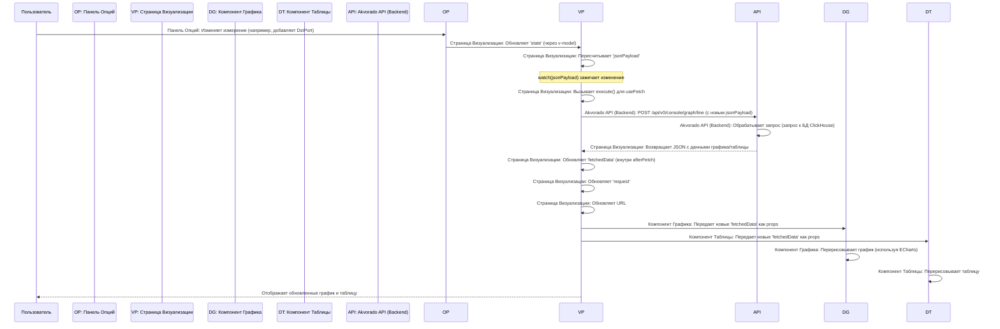

# Chapter 3: Страница визуализации данных


В [предыдущей главе](02_навигация_и_информация_о_пользователе_.md) мы узнали, как перемещаться по Akvorado с помощью [Навигации и информации о пользователе](02_навигация_и_информация_о_пользователе_.md). Теперь мы готовы погрузиться в сердце приложения — раздел, где происходит вся магия анализа сетевых данных.

Представьте, что данные о сетевых потоках — это огромный океан информации. Чтобы найти в нем что-то конкретное, нужен мощный инструмент. Страница визуализации данных в Akvorado — это ваш исследовательский батискаф, позволяющий погружаться в данные, настраивать приборы и видеть результаты на экране.

## Что такое Страница визуализации данных?

Это главный инструмент для интерактивного исследования данных о сетевых потоках. Здесь вы можете:

*   **Выбрать временной интервал:** Посмотреть данные за последний час, день, неделю или любой другой период.
*   **Определить, что измерять (Измерения):** Сгруппировать трафик по IP-адресам, портам, странам, протоколам и т.д.
*   **Применить фильтры:** Отобрать только интересующий трафик (например, только HTTP-трафик или трафик к определенному серверу).
*   **Выбрать тип визуализации:** Показать данные в виде линейного графика, графика с областями, диаграммы Sankey или таблицы.
*   **Настроить другие параметры:** Указать единицы измерения (биты/с, пакеты/с), количество отображаемых элементов и т.д.

После настройки всех параметров Akvorado запрашивает соответствующие данные с сервера и отображает их в виде графика и подробной таблицы.

## Пример использования: Анализ топ-приложений

Давайте представим, что мы хотим узнать, какие приложения (определяемые по портам назначения) генерировали больше всего трафика в нашей сети за последние 6 часов.

1.  **Открываем страницу:** Переходим в раздел "Visualize" через [Панель навигации](02_навигация_и_информация_о_пользователе_.md).
2.  **Настраиваем параметры:**
    *   **Временной диапазон:** Выбираем "Last 6 hours".
    *   **Измерения (Dimensions):** Добавляем "Destination Port".
    *   **Тип графика:** Оставляем "Stacked Area Chart" (График с областями).
    *   **Единицы (Units):** Выбираем "L3ᵇ⁄ₛ" (биты L3 в секунду).
    *   **Лимит:** Устанавливаем, например, 10 (чтобы видеть топ-10 портов).
3.  **Нажимаем "Apply" (Применить).**
4.  **Результат:** Akvorado покажет:
    *   **График:** График с областями, где каждая цветная область представляет трафик к одному из топ-10 портов назначения, показывая, как их объем менялся за последние 6 часов. Область "Other" будет представлять суммарный трафик ко всем остальным портам.
    *   **Таблицу:** Список топ-10 портов назначения с указанием минимального, максимального, среднего и 95-го перцентиля трафика для каждого порта за выбранный период.


*(Примечание: Внешний вид может немного отличаться)*

## Обзор интерфейса и компонентов

Страница визуализации состоит из нескольких ключевых частей:

1.  **`OptionsPanel` (Панель опций):** Левая панель (или верхняя на мобильных устройствах), где находятся все элементы управления для настройки запроса. Мы подробно разберем ее компоненты в главе [Компоненты ввода данных](04_компоненты_ввода_данных_.md).
2.  **`RequestSummary` (Сводка запроса):** Небольшая полоса над графиком, отображающая текущие параметры запроса (время, измерения, фильтр и т.д.).
3.  **`DataGraph` (Область графика):** Основная область, где отображается выбранный тип графика (линейный, Sankey и т.д.).
4.  **`DataTable` (Таблица данных):** Таблица под графиком, показывающая детальную статистику по сгруппированным данным.
5.  **`ResizeRow` (Разделитель):** Позволяет изменять высоту области графика, как описано в [Изменение размера и перетаскивание панелей](05_изменение_размера_и_перетаскивание_панелей_.md).

## Заглянем в код: Как это работает?

### `VisualizePage.vue`: Дирижер оркестра

Этот компонент является главным контейнером для всей страницы. Он управляет состоянием запроса, инициирует получение данных и передает их дочерним компонентам для отображения.

```vue
<!-- console/frontend/src/views/VisualizePage.vue -->
<template>
  <div class="flex h-full w-full flex-col lg:flex-row">
    <!-- 1. Панель опций -->
    <OptionsPanel
      v-model="state" <!-- Связываем состояние панели с нашим состоянием -->
      :loading="isFetching" <!-- Показываем индикатор загрузки -->
      class="print:hidden"
      @cancel="canAbort && abort()" <!-- Позволяем отменить запрос -->
    />
    <!-- 2. Основная область -->
    <div class="grow overflow-y-auto">
      <LoadingOverlay :loading="isFetching"> <!-- Оверлей загрузки -->
        <!-- 3. Сводка запроса -->
        <RequestSummary :request="request" />
        <div class="mx-4 my-2">
          <!-- Сообщение об ошибке, если есть -->
          <InfoBox v-if="errorMessage" kind="error">
            <strong>Не удалось загрузить данные!&nbsp;</strong>{{ errorMessage }}
          </InfoBox>
          <!-- 4. Разделитель и График -->
          <ResizeRow :height="graphHeight" ...>
            <DataGraph
              :data="fetchedData" <!-- Передаем полученные данные -->
              @update:time-range="updateTimeRange" <!-- Обрабатываем выбор времени на графике -->
            />
          </ResizeRow>
          <!-- 5. Таблица данных -->
          <DataTable
            :data="fetchedData" <!-- Передаем те же данные -->
            class="my-2 ..."
            @highlighted="(n) => (highlightedSerie = n)" <!-- Обрабатываем подсветку -->
          />
        </div>
      </LoadingOverlay>
    </div>
  </div>
</template>

<script lang="ts" setup>
import { ref, watch, computed } from "vue";
import { useFetch, type AfterFetchContext } from "@vueuse/core";
import { useRouter, useRoute } from "vue-router";
import LZString from "lz-string"; // Для сжатия состояния в URL
// Импорт дочерних компонентов
import OptionsPanel, { type ModelType } from "./VisualizePage/OptionsPanel.vue";
import RequestSummary from "./VisualizePage/RequestSummary.vue";
import DataGraph from "./VisualizePage/DataGraph.vue";
import DataTable from "./VisualizePage/DataTable.vue";
// ... другие импорты ...

// --- Управление состоянием ---
const state = ref<ModelType>(null); // Текущие настройки из OptionsPanel
const request = ref<ModelType>(null); // Настройки, для которых данные были успешно загружены
const fetchedData = ref<GraphLineHandlerResult | GraphSankeyHandlerResult | null>(null); // Полученные данные
const errorMessage = ref<string | null>(null); // Сообщение об ошибке

// --- Загрузка состояния из URL ---
// (Код для чтения и записи состояния в URL с использованием LZString)
// ... decodeState, encodeState, watch(routeState) ...

// --- Формирование JSON-запроса для API ---
const jsonPayload = computed(
  (): GraphSankeyHandlerInput | GraphLineHandlerInput | null => {
    if (state.value === null) return null;
    // Формируем объект запроса на основе state.value,
    // убирая ненужные поля (humanStart, humanEnd) и добавляя
    // специфичные для типа графика (points, previous-period)
    // ... код формирования input ...
    return orderedJSONPayload(input); // Сортируем ключи для консистентности
  },
);

// --- Получение данных с сервера ---
const { data, execute, isFetching, abort, canAbort, error } = useFetch("", {
    // Настраиваем URL перед запросом в зависимости от типа графика
    beforeFetch(ctx) {
      // ... определение URL (/api/v0/console/graph/line или /sankey) ...
      return { ...ctx, url: `/api/v0/console/graph/${url}` };
    },
    // Обрабатываем ответ после запроса
    async afterFetch(ctx) {
      // ... проверка ошибок ...
      // Сохраняем полученные данные в fetchedData
      fetchedData.value = { /* ... форматирование данных ... */ };
      // Сохраняем текущие настройки в request
      request.value = state.value;
      // Обновляем URL с новым сжатым состоянием
      // ... router.replace/push ...
      errorMessage.value = null; // Сбрасываем ошибку
      return ctx;
    },
    // Обрабатываем ошибку получения данных
    onError(ctx) {
        errorMessage.value = /* ... формирование сообщения об ошибке ... */;
        fetchedData.value = null; // Очищаем старые данные
        return ctx;
    },
    immediate: false, // Не запускать запрос сразу
  })
  .post(jsonPayload, "json") // Отправляем POST-запрос с jsonPayload
  .json<...>(); // Ожидаем JSON в ответе

// --- Запуск запроса при изменении настроек ---
watch(jsonPayload, () => execute(), { immediate: true }); // Следим за jsonPayload и вызываем execute()

// --- Обработка изменения времени на графике ---
const updateTimeRange = ([start, end]: [Date, Date]) => {
  // Обновляем state, что вызовет новый запрос через watch(jsonPayload)
  if (state.value === null) return;
  state.value = {
    ...state.value,
    start: start.toISOString(),
    end: end.toISOString(),
    humanStart: start.toISOString(), // Также обновляем 'человеческое' время
    humanEnd: end.toISOString(),
  };
};

// ... остальной код (высота графика, подсветка) ...
</script>
```

**Объяснение:**

1.  **`<template>`:** Структура страницы, включающая `OptionsPanel`, `RequestSummary`, `DataGraph` и `DataTable`.
2.  **`state`:** Реактивная переменная (`ref`), которая хранит *текущие* настройки, выбранные пользователем в `OptionsPanel`. Она связана с `OptionsPanel` через `v-model`.
3.  **`request`:** Хранит настройки, для которых данные были *успешно* загружены. Используется для `RequestSummary`.
4.  **`fetchedData`:** Хранит данные, полученные от сервера. Передается в `DataGraph` и `DataTable`.
5.  **`jsonPayload`:** Вычисляемое свойство (`computed`). Оно преобразует `state` в формат JSON, который ожидает API Akvorado. Ключи сортируются для консистентности.
6.  **`useFetch`:** Мощная функция из `@vueuse/core` для выполнения HTTP-запросов.
    *   Она настроена на отправку POST-запроса (`.post(jsonPayload, 'json')`).
    *   URL запроса определяется динамически в `beforeFetch` на основе типа графика в `state`.
    *   `afterFetch` обрабатывает успешный ответ: форматирует данные, сохраняет их в `fetchedData`, обновляет `request` и URL страницы.
    *   `onError` обрабатывает ошибки сети или сервера.
    *   `immediate: false` означает, что запрос не будет выполнен при инициализации компонента.
7.  **`watch(jsonPayload, ...)`:** Это ключевой механизм. Как только пользователь меняет что-то в `OptionsPanel`, `state` обновляется, что приводит к пересчету `jsonPayload`. `watch` замечает это изменение и вызывает `execute()`, которая запускает новый запрос `useFetch` с обновленным `jsonPayload`.
8.  **`updateTimeRange`:** Функция, вызываемая, когда пользователь выбирает временной диапазон прямо на графике (`DataGraph` генерирует событие `@update:time-range`). Она обновляет `state`, что снова запускает процесс запроса данных.

### `OptionsPanel.vue`: Пульт управления

Этот компонент содержит все элементы управления: выбор времени, измерений, фильтров, типа графика и т.д. Мы не будем углубляться в его код здесь, так как он использует множество [Компонентов ввода данных](04_компоненты_ввода_данных_.md), которые мы рассмотрим в следующей главе. Главное, что он делает:

*   Отображает элементы управления.
*   Собирает выбранные пользователем значения.
*   Передает эти значения родительскому компоненту (`VisualizePage`) через `v-model` (стандартный механизм Vue для двусторонней привязки данных).
*   Показывает кнопку "Apply" / "Refresh" / "Cancel".

### `DataGraph.vue`: Холст для художника

Этот компонент отвечает за отображение самого графика. Он получает данные (`fetchedData`) от `VisualizePage` и решает, какой конкретный компонент графика использовать (`DataGraphLine.vue` или `DataGraphSankey.vue`) в зависимости от типа графика, указанного в данных.

```vue
<!-- console/frontend/src/views/VisualizePage/DataGraph.vue -->
<template>
  <!-- Динамически выбираем компонент графика -->
  <component
    :is="component" <!-- 'is' определяет, какой компонент рендерить -->
    :theme="isDark ? 'dark' : undefined" <!-- Передаем тему оформления -->
    :data="data" <!-- Передаем данные для графика -->
    autoresize <!-- Автоматическое изменение размера -->
  />
</template>

<script lang="ts" setup>
import { computed, inject } from "vue";
// Импортируем компоненты для конкретных типов графиков
import DataGraphLine from "./DataGraphLine.vue";
import DataGraphSankey from "./DataGraphSankey.vue";
import type { GraphLineHandlerResult, GraphSankeyHandlerResult } from ".";
import { ThemeKey } from "@/components/ThemeProvider.vue"; // Для определения темы

const { isDark } = inject(ThemeKey)!; // Получаем текущую тему

const props = defineProps<{
  data: GraphLineHandlerResult | GraphSankeyHandlerResult | null; // Принимаем данные
}>();

// Вычисляем, какой компонент использовать, на основе props.data.graphType
const component = computed(() => {
  switch (props.data?.graphType) {
    case "stacked": // График с областями
    case "stacked100": // График с областями (100%)
    case "lines": // Линейный график
    case "grid": // Сетка графиков
      return DataGraphLine; // Используем компонент для линейных графиков
    case "sankey": // Диаграмма Sankey
      return DataGraphSankey; // Используем компонент для Sankey
  }
  // Если данных нет или тип неизвестен, возвращаем пустой div
  return "div";
});
</script>
```

**Объяснение:**

*   **`<component :is="component" ...>`:** Это динамический компонент Vue. Атрибут `:is` принимает имя или объект компонента, который нужно отрендерить.
*   **`computed component`:** Вычисляемое свойство определяет, какой компонент (`DataGraphLine` или `DataGraphSankey`) нужно использовать, проверяя поле `graphType` в полученных данных (`props.data`).
*   **Передача данных:** Компонент просто передает полученные `props.data` дальше выбранному дочернему компоненту графика.

Компоненты `DataGraphLine.vue` и `DataGraphSankey.vue` используют библиотеку `ECharts` (через обертку `vue-echarts`) для рендеринга сложных интерактивных графиков на основе полученных данных. Они преобразуют данные из формата Akvorado API в формат, понятный ECharts.

### `DataTable.vue`: Подробный отчет

Этот компонент получает те же `fetchedData`, что и `DataGraph`, и отображает их в виде таблицы. Он также форматирует значения (например, добавляя K/M/G к числам) и может подсвечивать строки при наведении мыши, синхронизируя подсветку с графиком.

```vue
<!-- console/frontend/src/views/VisualizePage/DataTable.vue -->
<template>
  <div>
    <!-- (Опционально) Выбор оси для двунаправленных данных -->
    <!-- ... v-if="axes && axes.length > 1" ... -->

    <!-- Сама таблица -->
    <div class="relative overflow-x-auto ...">
      <table v-if="table" class="w-full ...">
        <!-- Заголовок таблицы -->
        <thead class="...">
          <tr>
            <th ...></th> <!-- Колонка для цвета -->
            <th v-for="column in table.columns" :key="column.name" ...>
              {{ column.name }} <!-- Имена колонок (измерения, Min, Max, ...) -->
            </th>
          </tr>
        </thead>
        <!-- Тело таблицы -->
        <tbody>
          <tr
            v-for="(row, index) in table.rows" :key="index"
            class="..."
            @pointerenter="highlight(index)" <!-- Вызываем highlight при наведении -->
            @pointerleave="highlight(null)" <!-- Снимаем подсветку -->
          >
            <!-- Цветная метка -->
            <th scope="row">
              <div v-if="row.color" class="w-5 ..." :style="{ backgroundColor: row.color }">
                &nbsp;
              </div>
            </th>
            <!-- Значения ячеек -->
            <td v-for="(value, idx) in row.values" :key="idx" class="...">
              {{ value.value }} <!-- Отформатированное значение -->
            </td>
          </tr>
        </tbody>
      </table>
    </div>
  </div>
</template>

<script lang="ts" setup>
import { computed, inject, ref } from "vue";
import { formatXps, dataColor, dataColorGrey } from "@/utils"; // Утилиты форматирования
// ... другие импорты ...
import type { GraphLineHandlerResult, GraphSankeyHandlerResult } from ".";

const props = defineProps<{ data: ... }>();
const emit = defineEmits<{ highlighted: [index: number | null] }>();

// --- Логика подсветки ---
const highlight = (index: number | null) => {
  // ... (код для определения оригинального индекса и вызова emit) ...
  emit("highlighted", originalIndex); // Отправляем событие родителю
};

// --- Формирование структуры таблицы ---
const table = computed((): { columns: ..., rows: ... } | null => {
  const data = props.data;
  if (data === null) return null;
  // ... (много логики для преобразования data из API в структуру columns/rows) ...
  // - Определяет колонки (измерения + Min, Max, Avg, ...)
  // - Итерирует по данным (data.rows, data.min, data.max, ...)
  // - Форматирует значения с помощью formatXps
  // - Назначает цвета строкам (dataColor, dataColorGrey)
  // - Фильтрует строки по выбранной оси (если применимо)
  return { columns: [...], rows: [...] };
});

// ... (логика выбора оси, если data.bidirectional) ...
</script>
```

**Объяснение:**

*   **Прием данных:** Компонент получает `props.data`.
*   **`computed table`:** Основная логика находится здесь. Это вычисляемое свойство преобразует сырые данные из `props.data` в структуру, удобную для рендеринга таблицы: массив `columns` (с именами колонок) и массив `rows` (где каждая строка содержит массив `values` и опциональный `color`). Здесь же происходит форматирование чисел с помощью `formatXps`.
*   **Рендеринг:** Шаблон `<template>` просто итерирует по `table.columns` и `table.rows` для создания HTML-таблицы.
*   **Подсветка:** Обработчики событий `@pointerenter` и `@pointerleave` вызывают функцию `highlight`, которая отправляет событие `highlighted` родительскому компоненту (`VisualizePage`), чтобы тот мог передать информацию о подсветке в `DataGraph`.

## Процесс запроса данных: Шаг за шагом

Давайте проследим, что происходит, когда пользователь меняет измерение в `OptionsPanel`:



1.  **Действие пользователя:** Пользователь взаимодействует с [Компонентом ввода данных](04_компоненты_ввода_данных_.md) внутри `OptionsPanel`.
2.  **Обновление состояния:** `OptionsPanel` обновляет свое внутреннее состояние и передает его `VisualizePage` через `v-model`, обновляя `state` в `VisualizePage`.
3.  **Пересчет Payload:** `VisualizePage` пересчитывает `jsonPayload` на основе нового `state`.
4.  **Запуск Запроса:** `watch` на `jsonPayload` срабатывает и вызывает `execute()`.
5.  **API Запрос:** `useFetch` отправляет POST-запрос на сервер с новым `jsonPayload`. Кнопка "Apply" меняется на "Cancel", `isFetching` становится `true`, появляется оверлей загрузки.
6.  **Обработка на сервере:** Backend Akvorado получает запрос, формирует SQL-запрос к базе данных ClickHouse, получает результаты и формирует JSON-ответ.
7.  **Получение Ответа:** `useFetch` получает ответ. `isFetching` становится `false`.
8.  **Обновление Данных:** В хуке `afterFetch` (если запрос успешен) `VisualizePage` обновляет `fetchedData` новыми данными. URL страницы обновляется с закодированным новым состоянием.
9.  **Передача Данных:** `VisualizePage` передает обновленные `fetchedData` компонентам `DataGraph` и `DataTable` через входные параметры (props).
10. **Перерисовка:** `DataGraph` и `DataTable` реагируют на изменение `props.data` и перерисовывают себя, отображая новые данные.

## Заключение

Мы подробно рассмотрели страницу визуализации данных — мощный инструмент для исследования сетевых потоков в Akvorado. Мы поняли ее назначение, основные компоненты (`OptionsPanel`, `DataGraph`, `DataTable`) и как они взаимодействуют друг с другом. Мы увидели, как `VisualizePage.vue` управляет состоянием запроса, использует `useFetch` для получения данных с сервера и передает их дочерним компонентам для отображения. Ключевым моментом является реактивность: изменение настроек в `OptionsPanel` автоматически запускает цепочку событий, приводящую к обновлению данных и интерфейса.

**Далее:** В следующей главе, [Компоненты ввода данных](04_компоненты_ввода_данных_.md), мы детально изучим различные элементы управления (выбор времени, измерений, фильтров и т.д.), которые используются в `OptionsPanel` для настройки запросов к данным.

---

Generated by [AI Codebase Knowledge Builder](https://github.com/The-Pocket/Tutorial-Codebase-Knowledge)