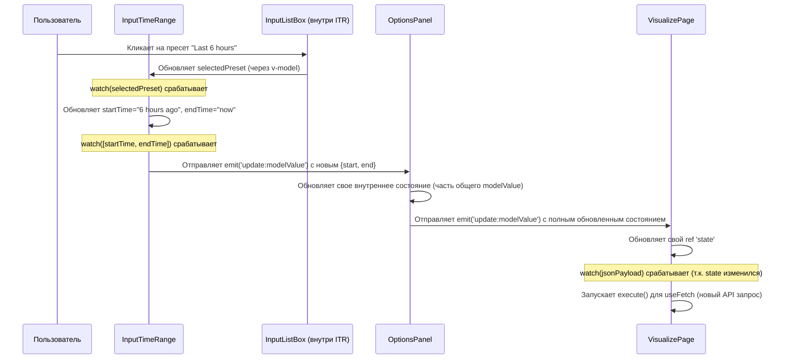

# Chapter 4: Компоненты ввода данных


В [предыдущей главе](03_страница_визуализации_данных_.md) мы исследовали [Страницу визуализации данных](03_страница_визуализации_данных_.md), основной инструмент для анализа сетевых потоков. Мы видели, что левая `OptionsPanel` (Панель опций) позволяет настраивать множество параметров запроса. Но как именно работают эти поля ввода, списки и кнопки?

Представьте, что вы собираете модель из конструктора Lego. У вас есть стандартные кубики разных форм и размеров, которые вы соединяете вместе. Компоненты ввода данных в Akvorado — это такие же стандартные «кубики» для построения форм пользовательского интерфейса. Они позволяют нам легко и единообразно создавать элементы для выбора времени, измерений, фильтров и других настроек в `OptionsPanel`.

В этой главе мы подробно рассмотрим эти переиспользуемые строительные блоки.

## Зачем нужны стандартные компоненты ввода?

Когда вы создаете веб-приложение, вам часто нужны одни и те же элементы управления: поля для ввода текста, выпадающие списки, переключатели, кнопки. Вместо того чтобы каждый раз создавать их с нуля, гораздо эффективнее иметь набор готовых, проверенных компонентов. Это гарантирует:

*   **Единообразие:** Все элементы выглядят и ведут себя одинаково во всем приложении.
*   **Переиспользование кода:** Не нужно писать один и тот же код много раз.
*   **Простоту разработки:** Легко добавлять новые поля в формы, используя готовые блоки.
*   **Меньше ошибок:** Централизованные компоненты легче тестировать и исправлять.

В Akvorado эти компоненты используются в `OptionsPanel` на [Странице визуализации данных](03_страница_визуализации_данных_.md) для настройки запроса, который вы отправляете для анализа данных.

## Основные «кубики» для форм

Давайте познакомимся с некоторыми из основных компонентов ввода, которые используются в Akvorado.

### `InputBase.vue`: Фундамент для всех

Это базовый компонент-обертка, который предоставляет общую структуру для большинства других компонентов ввода. Он отвечает за:

*   **Метку (Label):** Текст над полем ввода (например, "Start", "Limit").
*   **Отображение ошибок:** Показывает сообщение об ошибке под полем, если введенные данные некорректны.
*   **Базовые стили:** Задает общие стили для рамки, фона и поведения при фокусе.

Он использует слоты (`<slot>`) для вставки специфического элемента управления (например, текстового поля или выпадающего списка).

```vue
<!-- console/frontend/src/components/InputBase.vue -->
<template>
  <div>
    <div class="relative">
      <!-- Слот для вставки основного элемента управления -->
      <slot
        :id="id"
        :child-class="{ /* ... общие классы стилей ... */ }"
      />
      <!-- Метка (появляется над полем при вводе) -->
      <label
        v-if="label"
        :for="id"
        :class="{ /* ... классы для метки и ее анимации ... */ }"
      >
        {{ label }}
      </label>
    </div>
    <!-- Место для отображения сообщения об ошибке -->
    <p class="text-xs text-red-600 dark:text-red-400">
      {{ error }}
    </p>
  </div>
</template>

<script lang="ts" setup>
import { v4 as uuidv4 } from "uuid";

// Принимает label (текст метки) и error (сообщение об ошибке)
withDefaults(
  defineProps<{
    label?: string;
    error?: string;
  }>(),
  { /* ... значения по умолчанию ... */ },
);

const id = uuidv4(); // Генерирует уникальный ID для связи метки и поля
</script>
```

**Объяснение:**

*   Компонент принимает `label` и `error` как входные параметры (`props`).
*   Он генерирует уникальный `id` для элемента управления.
*   Основной элемент управления вставляется через `<slot>`. `InputBase` передает ему `id` и набор CSS-классов (`child-class`) для стилизации.
*   `<label>` отображается, если передан `label`, и связывается с полем через `for="id"`.
*   `<p>` внизу отображает текст ошибки `error`, если он есть.

### `InputString.vue`: Простое текстовое поле

Используется для ввода обычного текста или чисел. Он построен поверх `InputBase`.

```vue
<!-- console/frontend/src/components/InputString.vue -->
<template>
  <!-- Используем InputBase как обертку -->
  <InputBase v-slot="{ id, childClass }">
    <!-- Вставляем стандартный HTML <input> -->
    <input
      :id="id"
      :class="childClass" <!-- Применяем стили от InputBase -->
      type="text"
      placeholder=" " <!-- Нужно для анимации метки -->
      :value="modelValue" <!-- Значение поля -->
      @input="
        /* Отправляем событие 'update:modelValue' при вводе */
        $emit('update:modelValue', ($event.target as HTMLInputElement).value)
      "
    />
  </InputBase>
</template>

<script lang="ts" setup>
import InputBase from "@/components/InputBase.vue";

// Принимает modelValue (текущее значение)
defineProps<{
  modelValue: string;
}>();
// Определяет событие для v-model
defineEmits<{
  "update:modelValue": [value: string];
}>();
</script>
```

**Объяснение:**

*   Компонент просто оборачивает стандартный `<input type="text">` в `InputBase`.
*   Он использует `v-model` (через `modelValue` prop и `update:modelValue` emit) для двусторонней привязки данных со своим родительским компонентом.

### `InputListBox.vue`: Выпадающий список (Dropdown/Combobox)

Это универсальный компонент для выбора одного или нескольких значений из списка. Он может работать как:

*   **Простой выпадающий список (Listbox):** Показывает предопределенный список опций.
*   **Комбинированный список (Combobox):** Позволяет пользователю вводить текст для фильтрации списка опций.

Он активно используется внутри других, более сложных компонентов ввода.

```vue
<!-- console/frontend/src/components/InputListBox.vue -->
<template>
  <!-- Используем Listbox или Combobox из @headlessui/vue -->
  <component
    :is="component.Box"
    :multiple="multiple"
    :model-value="modelValue"
    @update:model-value="/* ... обновить v-model ... */"
  >
    <div class="relative">
      <!-- Обертка InputBase для метки и ошибок -->
      <InputBase v-slot="{ id, childClass }" :error="error">
        <!-- Виджет: кнопка или поле ввода для Combobox -->
        <component :is="component.Widget" :id="id" :class="childClass">
          <div class="flex ...">
            <!-- Слот для отображения выбранных элементов -->
            <slot name="selected"></slot>
            <!-- Поле ввода для фильтрации (только для Combobox) -->
            <component
              :is="component.Input"
              v-if="component.Input"
              placeholder="Search..."
              @change="query = $event.target.value"
            />
          </div>
          <!-- Кнопка для открытия/закрытия списка -->
          <component :is="component.Button" class="...">
            <SelectorIcon class="h-5 w-5 text-gray-400" />
          </component>
        </component>
      </InputBase>

      <!-- Сам выпадающий список опций -->
      <transition>
        <component :is="component.Options" class="...">
          <!-- Опция "Ничего не найдено" -->
          <div v-if="filteredItems.length === 0 && query != ''" class="...">
            <slot name="nomatch" :query="query">...</slot>
          </div>
          <!-- Итерация по отфильтрованным опциям -->
          <component
            :is="component.Option"
            v-for="item in filteredItems"
            :key="item.id"
            :value="item"
            as="template"
          >
            <!-- Содержимое одной опции (через слот) -->
            <li class="...">
              <span class="block w-full truncate">
                <slot name="item" v-bind="item"></slot>
              </span>
              <!-- Галочка для выбранной опции -->
              <span class="...">
                <CheckIcon class="h-5 w-5" />
              </span>
            </li>
          </component>
        </component>
      </transition>
    </div>
  </component>
</template>

<script lang="ts" setup>
import { ref, computed, useAttrs } from "vue";
import { Listbox, Combobox, ... } from "@headlessui/vue"; // Компоненты Headless UI
import { CheckIcon, SelectorIcon } from "@heroicons/vue/solid";
import InputBase from "@/components/InputBase.vue";

// Определяем props: modelValue, multiple, filter, items, error
const props = defineProps<{ /* ... */ }>();
defineEmits<{ /* ... */ }>();

const query = ref(""); // Текст для фильтрации в Combobox

// Определяем, использовать Listbox или Combobox в зависимости от props.filter
const component = computed(() => props.filter === null ? { /* ... Listbox компоненты ... */ } : { /* ... Combobox компоненты ... */ });

// Фильтруем элементы на основе query (если это Combobox)
const filteredItems = computed(() => { /* ... логика фильтрации ... */ });

// ... остальная логика ...
</script>
```

**Объяснение:**

*   Использует компоненты `Listbox` или `Combobox` из библиотеки `@headlessui/vue` для создания доступных выпадающих списков.
*   Выбор между `Listbox` и `Combobox` зависит от пропа `filter`. Если `filter` задан, используется `Combobox` с полем для поиска.
*   Использует `InputBase` для общей структуры.
*   Предоставляет слоты (`selected`, `item`, `nomatch`) для кастомизации отображения выбранных элементов, элементов списка и сообщения "не найдено".
*   Управляет состоянием поиска (`query`) и фильтрацией (`filteredItems`).
*   Также использует `v-model` для связи с родителем.

### `InputTimeRange.vue`: Выбор временного диапазона

Этот компонент позволяет пользователю выбрать временной интервал для анализа данных. Он комбинирует:

*   `InputListBox` для выбора предопределенных диапазонов ("Последний час", "Последние 24 часа", "Вчера" и т.д.).
*   Два `InputString` для ввода точных дат начала и конца в текстовом формате (например, "yesterday at 5pm" или "2023-10-26 14:00:00").

```vue
<!-- console/frontend/src/components/InputTimeRange.vue -->
<template>
  <div class="grid grid-cols-2 gap-2 ...">
    <!-- Список пресетов -->
    <InputListBox
      v-model="selectedPreset"
      :items="presets"
      label="Presets"
      class="..."
    >
      <!-- Отображение выбранного пресета -->
      <template #selected>{{ selectedPreset.name }}</template>
      <!-- Отображение элемента списка пресетов -->
      <template #item="{ name }">{{ name }}</template>
    </InputListBox>
    <!-- Поле для ввода начальной даты/времени -->
    <InputString v-model="startTime" label="Start" :error="startTimeError" />
    <!-- Поле для ввода конечной даты/времени -->
    <InputString v-model="endTime" label="End" :error="endTimeError" />
  </div>
</template>

<script lang="ts" setup>
import { ref, computed, watch } from "vue";
import { Date as SugarDate } from "sugar-date"; // Библиотека для разбора дат
import InputString from "@/components/InputString.vue";
import InputListBox from "@/components/InputListBox.vue";

const props = defineProps<{ /* modelValue: { start, end, errors? } */ }>();
const emit = defineEmits<{ /* update:modelValue */ }>();

// Локальные состояния для полей ввода и выбранного пресета
const startTime = ref("");
const endTime = ref("");
const selectedPreset = ref(presets[0]); // Изначально "Custom"

// Список пресетов (каждый со своим start и end)
const presets = [
  { id: 1, name: "Custom" },
  { id: 2, name: "Last hour", start: "1 hour ago", end: "now" },
  // ... другие пресеты ...
];

// Проверка корректности введенных дат с помощью SugarDate
const parsedTimes = computed(() => ({ /* ... */ }));
const startTimeError = computed(() => /* ... проверка startTime ... */);
const endTimeError = computed(() => /* ... проверка endTime ... */);
const hasErrors = computed(() => /* ... проверка обеих ошибок ... */);

// Когда выбран пресет, обновляем startTime и endTime
watch(selectedPreset, (preset) => {
  if (preset.start) {
    startTime.value = preset.start;
    endTime.value = preset.end;
  }
});

// Когда меняются startTime, endTime или ошибки, обновляем родителя (v-model)
// и синхронизируем selectedPreset
watch(
  [startTime, endTime, hasErrors] as const,
  ([start, end, errors]) => {
    // Находим пресет, соответствующий текущим start/end, или выбираем "Custom"
    const newPreset = presets.find(/* ... */) || presets[0];
    if (newPreset.id !== selectedPreset.value.id) {
      selectedPreset.value = newPreset;
    }
    // Собираем новый объект для modelValue
    const newModel = { start, end, errors };
    // Отправляем событие, если модель изменилась
    if (!isEqual(newModel, props.modelValue)) {
      emit("update:modelValue", newModel);
    }
  },
  { immediate: true }, // Выполняем при инициализации
);

// ... watch для синхронизации с props.modelValue при инициализации ...
</script>
```

**Объяснение:**

*   Компонент управляет тремя состояниями: `startTime`, `endTime` и `selectedPreset`.
*   Он использует библиотеку `sugar-date` для парсинга введенных пользователем строк времени (например, "1 hour ago").
*   Вычисляемые свойства `startTimeError` и `endTimeError` проверяют валидность дат.
*   `watch` используется для синхронизации:
    *   Выбор пресета обновляет поля `startTime` и `endTime`.
    *   Изменение `startTime` или `endTime` обновляет `selectedPreset` (на "Custom", если не совпадает ни с одним пресетом) и передает обновленное значение `modelValue` родителю.

### `InputDimensions.vue`: Выбор измерений и лимитов

Этот компонент позволяет выбрать, по каким полям группировать данные (измерения, например, `SrcAddr`, `DstPort`), и настроить связанные параметры:

*   Выбор и **перетаскивание** измерений с помощью `InputListBox` (с `multiple=true`) и `vuedraggable`.
*   Установка **лимита** (сколько топ-N значений показывать) с помощью `InputString` и `InputListBox` (для выбора критерия Top N: Avg или Max).
*   Настройка **агрегации IP-адресов** (объединение подсетей, например, `/24`) с помощью `InputString`, если выбрано соответствующее измерение.

```vue
<!-- console/frontend/src/components/InputDimensions.vue -->
<template>
  <div class="grid ...">
    <!-- Выбор измерений -->
    <InputListBox
      v-model="selectedDimensions"
      :items="dimensions"
      :error="dimensionsError"
      multiple
      label="Dimensions"
      filter="name"
      class="..."
    >
      <template #selected>
        <!-- Перетаскиваемый список выбранных измерений -->
        <draggable v-model="selectedDimensions" tag="span" item-key="id">
          <template #item="{ element: dimension }">
            <span class="flex cursor-grab ...">
              <span>{{ dimension.name }}</span>
              <!-- Кнопка удаления измерения -->
              <XIcon class="..." @click.stop.prevent="removeDimension(dimension)" />
            </span>
          </template>
        </draggable>
        <!-- Иконка селектора -->
      </template>
      <template #item="{ name, color }">
         <!-- Отображение опции в списке с цветной меткой -->
      </template>
    </InputListBox>

    <!-- Настройки агрегации IP (если применимо) -->
    <div class="flex ...">
      <InputString v-if="canAggregate" v-model="truncate4" label="IPv4 /x" />
      <InputString v-if="canAggregate" v-model="truncate6" label="IPv6 /x" />
    </div>

    <!-- Настройки лимита -->
    <div class="flex ...">
      <InputString v-model="limit" label="Limit" :error="limitError" />
      <InputListBox v-model="limitType" :items="computationModeList" label="Top by">
        <!-- ... шаблоны для limitType ... -->
      </InputListBox>
    </div>
  </div>
</template>

<script lang="ts" setup>
import { ref, watch, computed, inject } from "vue";
import draggable from "vuedraggable"; // Компонент для перетаскивания
import { XIcon, SelectorIcon } from "@heroicons/vue/solid";
import InputString from "@/components/InputString.vue";
import InputListBox from "@/components/InputListBox.vue";
// Ключ для получения конфигурации сервера (список измерений)
import { ServerConfigKey } from "@/components/ServerConfigProvider.vue";

const props = defineProps<{ /* modelValue: { selected, limit, ... errors? } */ }>();
const emit = defineEmits<{ /* update:modelValue */ }>();

// Получаем конфигурацию сервера (список доступных измерений и т.д.)
const serverConfiguration = inject(ServerConfigKey)!;

// Локальные состояния
const selectedDimensions = ref<Array<...>>([]);
const limit = ref("10");
const limitType = ref(/* ... объект 'Avg' ... */);
const truncate4 = ref("32");
const truncate6 = ref("128");

// Список доступных измерений из конфигурации сервера
const dimensions = computed(() => serverConfiguration.value?.dimensions.map(/* ... */) || []);
// Можно ли агрегировать IP (зависит от выбранных измерений)
const canAggregate = computed(() => /* ... проверка selectedDimensions ... */);
// Валидация полей
const dimensionsError = computed(() => /* ... проверка мин. кол-ва ... */);
const limitError = computed(() => /* ... проверка числа и диапазона ... */);
const truncate4Error = computed(() => /* ... проверка 0 < x <= 32 ... */);
const truncate6Error = computed(() => /* ... проверка 0 < x <= 128 ... */);
const hasErrors = computed(() => /* ... проверка всех ошибок ... */);

// Функция для удаления измерения из списка
const removeDimension = (dimension: ...) => { /* ... */ };

// Синхронизация локального состояния с родительским (v-model)
watch(
  [ selectedDimensions, limit, limitType, /* ... */ ] as const,
  ([selected, limit, limitType, /* ... */ ]) => {
    // Собираем новый объект modelValue
    const updated = {
      selected: selected.map((d) => d.name),
      limit: parseInt(limit),
      /* ... другие поля ... */
      errors: hasErrors.value,
    };
    // Отправляем emit, если значение изменилось и нет ошибок парсинга
    if (!isEqual(updated, props.modelValue) && /* ... нет NaN ... */) {
      emit("update:modelValue", updated);
    }
  },
);

// ... watch для синхронизации с props.modelValue при инициализации ...
</script>
```

**Объяснение:**

*   Использует `inject(ServerConfigKey)` для получения списка доступных измерений из [глобальной конфигурации](07_поставщики_глобального_состояния__провайдеры_.md).
*   Комбинирует `InputListBox`, `InputString` и `vuedraggable` для создания сложного интерфейса.
*   Выполняет валидацию введенных значений (лимит, префиксы агрегации).
*   Как и другие компоненты, использует `watch` для синхронизации своего состояния с родительским компонентом через `v-model`.

### Другие компоненты

Существуют и другие полезные компоненты:

*   **`InputFilter.vue`:** Поле для ввода BPF-подобных фильтров с подсветкой синтаксиса (использует редактор CodeMirror), проверкой ошибок и возможностью сохранять/загружать фильтры (использует `InputListBox` и `InputButton`).
*   **`InputChoice.vue`:** Группа кнопок-радио для выбора одного значения из нескольких (например, тип графика: линии, области, Sankey).
*   **`InputCheckbox.vue`:** Стандартный чекбокс с меткой.
*   **`InputButton.vue`:** Стилизованная кнопка с поддержкой состояний `loading` и `disabled`.

## Как это работает вместе? Внутри `OptionsPanel`

Все эти компоненты собираются вместе в `OptionsPanel.vue` (который мы упоминали в [Главе 3](03_страница_визуализации_данных_.md)). `OptionsPanel` действует как форма:

1.  **Отображает компоненты:** В ее `<template>` вставлены экземпляры `InputTimeRange`, `InputDimensions`, `InputFilter`, `InputChoice` и т.д.
2.  **Связывает данные:** Она использует `v-model` для связи с каждым компонентом ввода. Все выбранные значения (время, измерения, фильтры, тип графика и т.д.) собираются в один большой объект состояния.
3.  **Передает состояние:** `OptionsPanel` сама связана через `v-model` со своим родителем — `VisualizePage.vue`. Когда пользователь меняет что-либо в любом из компонентов ввода, это изменение "всплывает" через цепочку `v-model` до `VisualizePage`.
4.  **Запуск запроса:** Как мы видели в Главе 3, `VisualizePage` следит за этим состоянием и запускает новый запрос к API, когда оно изменяется.

**Пример взаимодействия:**

Представьте, пользователь меняет пресет времени в `InputTimeRange`:



1.  Пользователь выбирает пресет в `InputListBox` внутри `InputTimeRange`.
2.  `InputListBox` обновляет `selectedPreset` в `InputTimeRange`.
3.  `watch` внутри `InputTimeRange` обновляет `startTime` и `endTime`.
4.  Другой `watch` в `InputTimeRange` замечает изменение `startTime`/`endTime` и отправляет `emit('update:modelValue')` компоненту `OptionsPanel`.
5.  `OptionsPanel` обновляет свою часть общего состояния и передает полное обновленное состояние `VisualizePage` через свой `emit('update:modelValue')`.
6.  `VisualizePage` получает новое состояние, пересчитывает `jsonPayload` и запускает запрос к API.

Эта система, основанная на `v-model` и реактивности Vue, позволяет создавать сложные формы из независимых компонентов, которые легко связываются друг с другом.

## Заключение

В этой главе мы рассмотрели "строительные блоки" интерфейса Akvorado — компоненты ввода данных. Мы увидели, что использование стандартных, переиспользуемых компонентов (`InputBase`, `InputString`, `InputListBox`, `InputTimeRange`, `InputDimensions`, `InputFilter` и др.) помогает создавать единообразные, надежные и легко расширяемые формы. Мы поняли, как эти компоненты используются внутри `OptionsPanel` для сбора пользовательских настроек и как они взаимодействуют друг с другом и с родительскими компонентами с помощью `v-model` для запуска процесса обновления данных на [Странице визуализации данных](03_страница_визуализации_данных_.md).

Теперь, когда мы понимаем, как настраиваются параметры и как отображаются данные, давайте рассмотрим еще один аспект интерфейса, связанный с компоновкой элементов на экране.

**Далее:** В следующей главе, [Изменение размера и перетаскивание панелей](05_изменение_размера_и_перетаскивание_панелей_.md), мы узнаем, как пользователь может настраивать размер областей графика и таблицы на странице визуализации.

---

Generated by [AI Codebase Knowledge Builder](https://github.com/The-Pocket/Tutorial-Codebase-Knowledge)