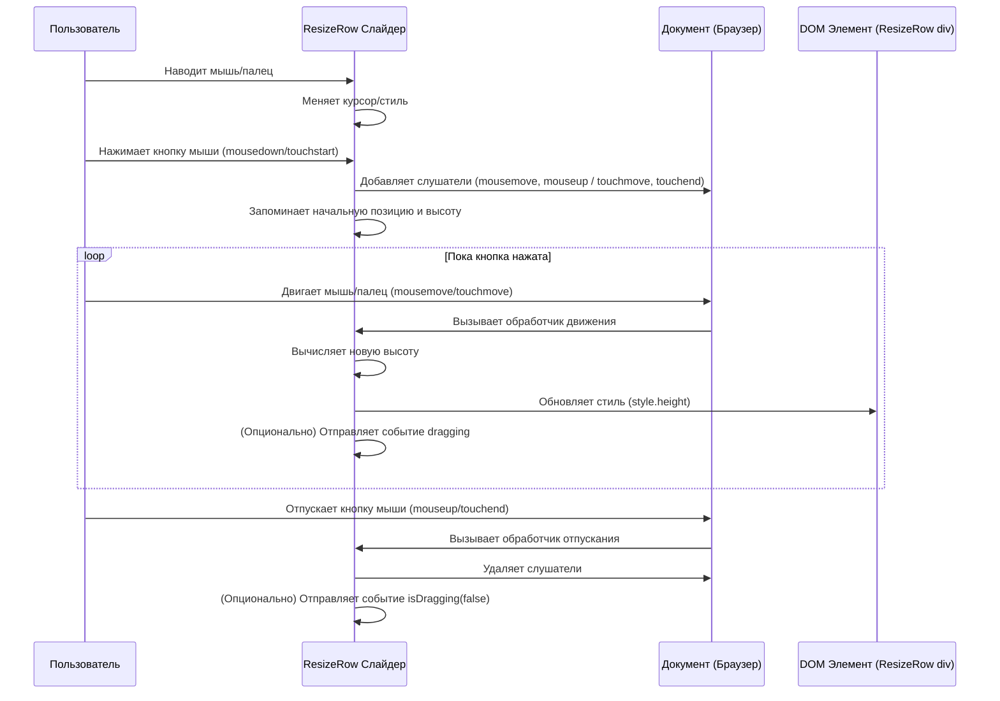

# Chapter 5: Изменение размера и перетаскивание панелей


В [предыдущей главе](04_компоненты_ввода_данных_.md) мы подробно изучили различные [Компоненты ввода данных](04_компоненты_ввода_данных_.md), которые позволяют нам точно настраивать запросы на [Странице визуализации данных](03_страница_визуализации_данных_.md). Мы научились выбирать временные интервалы, измерения, фильтры и многое другое. Но что, если нам захочется настроить не только *что* мы видим, но и *как* это расположено на экране? Например, сделать график побольше, а таблицу под ним — поменьше?

Именно для таких задач и существуют компоненты для изменения размера и перетаскивания панелей.

## Зачем это нужно? Гибкая компоновка

Представьте себе [Страницу визуализации данных](03_страница_визуализации_данных_.md). На ней есть область с графиком и область с таблицей под ним. Иногда вам может понадобиться внимательнее рассмотреть детали на графике, и вы захотите увеличить его высоту. В другой раз, возможно, вам важнее увидеть больше строк в таблице, и вы захотите ее расширить, уменьшив при этом график.

Было бы неудобно, если бы размеры этих областей были жестко заданы. Гораздо лучше, когда пользователь сам может легко настроить компоновку под свои текущие нужды. Это похоже на регулируемые полки в шкафу или раздвижные перегородки в комнате — вы сами решаете, сколько места выделить для каждой секции.

Для реализации такой интерактивности Akvorado использует компоненты из внешней библиотеки `vue-resizer`. Эти компоненты добавляют специальные "разделители" или "ручки" (слайдеры), которые можно тянуть мышью (или пальцем на сенсорных экранах), чтобы изменить размер контейнера или соотношение между соседними панелями.

## Основные компоненты `vue-resizer`

Библиотека `vue-resizer` предоставляет несколько полезных компонентов. Давайте рассмотрим те, которые могут пригодиться:

*   **`ResizeRow`:** Этот компонент оборачивает какой-либо элемент (например, наш график) и добавляет *горизонтальный* разделитель (слайдер) *под* этим элементом. Перетаскивая этот слайдер вверх или вниз, вы изменяете **высоту** элемента, который обернут в `ResizeRow`. Именно этот компонент используется в Akvorado для настройки высоты графика на [Странице визуализации данных](03_страница_визуализации_данных_.md).

*   **`ResizeCol`:** Похож на `ResizeRow`, но добавляет *вертикальный* разделитель *справа* от обернутого элемента. Перетаскивая его влево или вправо, вы изменяете **ширину** элемента.

*   **`Resize`:** Универсальный компонент, который добавляет сразу два разделителя: горизонтальный снизу и вертикальный справа, позволяя изменять и высоту, и ширину элемента.

*   **`DragRow`:** Этот компонент предназначен для управления двумя панелями, расположенными *одна над другой*. Он вставляет горизонтальный разделитель *между* ними. Перетаскивая разделитель, вы изменяете **соотношение высот** верхней и нижней панелей (одна увеличивается, другая уменьшается).

*   **`DragCol`:** Аналогичен `DragRow`, но для двух панелей, расположенных *рядом друг с другом* (слева и справа). Он добавляет вертикальный разделитель между ними для изменения **соотношения ширин**.

В текущей версии Akvorado активно используется `ResizeRow` на странице визуализации. Другие компоненты могут быть полезны для будущих доработок интерфейса.

## Пример использования: Изменение высоты графика

Давайте посмотрим, как `ResizeRow` применяется на [Странице визуализации данных](03_страница_визуализации_данных_.md) (`VisualizePage.vue`) для того, чтобы сделать область графика изменяемой по высоте.

```vue
<!-- console/frontend/src/views/VisualizePage.vue -->
<template>
  <div class="flex h-full w-full flex-col lg:flex-row">
    <!-- Панель опций слева -->
    <OptionsPanel ... />

    <!-- Основная область справа -->
    <div class="grow overflow-y-auto">
      <!-- ... Сводка запроса и сообщения об ошибках ... -->
      <div class="mx-4 my-2">

        <!-- Компонент для изменения высоты графика -->
        <!-- Мы оборачиваем DataGraph в ResizeRow -->
        <ResizeRow
          :height="graphHeight" <!-- Начальная высота графика -->
          :slider-width="10" <!-- Толщина полосы-разделителя -->
          slider-bg-color="transparent" <!-- Делаем разделитель почти невидимым -->
          slider-bg-hover-color="transparent"
          slider-color="#9ca3af" <!-- Цвет иконки на разделителе -->
          slider-hover-color="#9ca3af"
          class="group" <!-- Класс для стилизации при наведении -->
        >
          <!-- Внутри ResizeRow находится сам компонент графика -->
          <DataGraph :data="fetchedData" @update:time-range="updateTimeRange" />
        </ResizeRow>

        <!-- Компонент таблицы данных идет сразу после ResizeRow -->
        <DataTable :data="fetchedData" class="my-2 ..." />

      </div>
    </div>
  </div>
</template>

<script lang="ts" setup>
import { ref } from "vue";
// Импортируем компонент из библиотеки vue-resizer
import ResizeRow from "vue-resizer/ResizeRow.vue";
import OptionsPanel from "./VisualizePage/OptionsPanel.vue";
import DataGraph from "./VisualizePage/DataGraph.vue";
import DataTable from "./VisualizePage/DataTable.vue";
// ... другие импорты ...

const fetchedData = ref(/* ... */); // Данные для графика и таблицы
const graphHeight = ref(400); // Начальная высота для области графика (в пикселях)

const updateTimeRange = (/* ... */) => { /* ... */ };

// Компонент ResizeRow сам управляет изменением высоты.
// Нам не нужно писать сложную логику для отслеживания перетаскивания.
// Можно было бы подписаться на события @dragging(newHeight) или @isDragging(true/false),
// если бы нам нужно было реагировать на процесс изменения размера.
</script>
```

**Объяснение:**

1.  **Импорт:** Мы импортируем `ResizeRow` из `vue-resizer/ResizeRow.vue`.
2.  **Обертывание:** В шаблоне `<template>` мы помещаем компонент `<DataGraph>` внутрь компонента `<ResizeRow>`.
3.  **Начальная высота:** Мы передаем начальную высоту (например, 400 пикселей) в `ResizeRow` через параметр `:height="graphHeight"`. `graphHeight` — это реактивная переменная (`ref`), хранящая начальное значение.
4.  **Слайдер:** `ResizeRow` автоматически добавляет под `<DataGraph>` горизонтальный слайдер (его внешний вид можно настроить через параметры `slider-width`, `slider-bg-color`, `slider-color` и т.д.).
5.  **Магия:** Когда пользователь перетаскивает этот слайдер, `ResizeRow` **сам** обрабатывает это действие и изменяет свою собственную высоту (и, соответственно, высоту вложенного `<DataGraph>`). Нам не нужно писать сложный код для отслеживания координат мыши!
6.  **Результат:** Пользователь может легко настроить высоту графика, потянув за едва заметную полоску под ним.

## Как это работает "под капотом"?

Хотя нам не нужно писать код для обработки перетаскивания, интересно понять, как `ResizeRow` (и другие компоненты `vue-resizer`) это делают. Вот упрощенная последовательность действий:

1.  **Ожидание:** Компонент отображает свой дочерний элемент и тонкую полоску-слайдер под ним (или справа, для `ResizeCol`).
2.  **Наведение:** Когда пользователь наводит курсор мыши на слайдер, курсор обычно меняется (например, на стрелку вверх-вниз `row-resize`), сигнализируя, что элемент можно тянуть.
3.  **Нажатие:** Пользователь нажимает левую кнопку мыши (событие `mousedown`) или касается экрана (событие `touchstart`) на слайдере.
4.  **Захват:** В этот момент компонент `ResizeRow`:
    *   Запоминает текущую позицию курсора/пальца (`oldPos`) и текущую высоту компонента (`oldHeight`).
    *   "Захватывает" события мыши/касания на уровне всего документа. Это важно, потому что пользователь может увести курсор далеко за пределы слайдера во время перетаскивания. Компонент начинает слушать события `mousemove` (движение мыши) и `mouseup` (отпускание кнопки) на всем `document`. Для сенсорных экранов это `touchmove` и `touchend`.
    *   Может отправить событие `isDragging(true)`.
5.  **Перетаскивание:** Пока пользователь держит кнопку нажатой и двигает мышь/палец (`mousemove`/`touchmove`):
    *   Компонент получает новую позицию курсора/пальца (`newPos`).
    *   Вычисляет разницу (`movingDistance = oldPos - newPos`).
    *   Рассчитывает новую высоту (`newHeight = oldHeight - movingDistance`).
    *   Применяет эту новую высоту к своему основному `div` элементу через встроенный стиль (`style="height: newHeight + 'px'"`). Это мгновенно изменяет видимый размер компонента на экране.
    *   Может отправлять событие `dragging(newHeight)` с текущей высотой.
6.  **Отпускание:** Как только пользователь отпускает кнопку мыши (`mouseup`) или убирает палец с экрана (`touchend`):
    *   Компонент перестает слушать события `mousemove`/`touchmove` и `mouseup`/`touchend` на документе ("отпускает" захват).
    *   Может отправить событие `isDragging(false)`.
    *   Изменение размера завершено. Компонент остается с новой высотой.

Давайте визуализируем этот процесс:



### Взгляд на код `vue-resizer`

Чтобы увидеть это в действии, можно посмотреть на (упрощенный) код метода `resizeRow` внутри компонента `ResizeRow.vue`:

```javascript
// Упрощенный пример из console/frontend/node_modules/vue-resizer/ResizeRow.vue
// (или аналогичного компонента Resize.vue)

// ... другие части компонента ...

methods: {
  // Вызывается при нажатии мыши на слайдере
  resizeRow(e) {
    e = e || window.event;
    e.preventDefault(); // Предотвратить стандартное поведение (например, выделение текста)
    e.stopPropagation(); // Остановить всплытие события

    let oldPos = e.clientY; // Запоминаем Y-координату мыши при нажатии
    let oldHeight = this.reHeight; // Запоминаем текущую высоту (this.reHeight - внутренняя переменная компонента)
    let newPos = 0;
    let newHeight = 0;
    const vue = this; // Сохраняем ссылку на 'this' для использования внутри функций
    this.isDragging = true;
    this.$emit("isDragging", this.isDragging); // Отправляем событие начала перетаскивания

    // Назначаем обработчики на ВЕСЬ ДОКУМЕНТ
    document.onmousemove = sliderDrag; // Функция будет вызываться при движении мыши
    document.onmouseup = cancelSliderDrag; // Функция будет вызываться при отпускании кнопки

    // Эта функция вызывается при КАЖДОМ движении мыши, пока кнопка нажата
    function sliderDrag(e) {
      // (Оптимизация для производительности - пропускать слишком частые события)
      // if (this.time && Date.now() - this.time < 40) return;
      // this.time = Date.now();

      e = e || window.event;
      e.preventDefault();
      e.stopPropagation();

      newPos = e.clientY; // Получаем новую Y-координату
      const movingDistance = oldPos - newPos; // Считаем, насколько сдвинулась мышь
      newHeight = parseInt(oldHeight - movingDistance); // Рассчитываем новую высоту

      // Ограничиваем минимальную высоту
      if (newHeight <= 20) {
        vue.reHeight = 20;
      } else {
        vue.reHeight = newHeight; // Обновляем внутреннюю переменную высоты
      };
      vue.$emit("dragging", vue.reHeight); // Отправляем событие с новой высотой
    }

    // Эта функция вызывается ОДИН РАЗ, когда пользователь отпускает кнопку мыши
    function cancelSliderDrag() {
      vue.isDragging = false;
      vue.$emit("isDragging", vue.isDragging); // Отправляем событие конца перетаскивания

      // Убираем обработчики с документа! Очень важно, чтобы не слушать их постоянно.
      document.onmouseup = null;
      document.onmousemove = null;
    }
  },

  // Существует аналогичный метод mobileResizeRow для обработки touchstart/touchmove/touchend
}

// В шаблоне компонента эта высота применяется к стилю:
// <div class="resize_row" :style="{ height: reHeight + 'px', ... }">
//   ...
// </div>
```

Ключевые моменты здесь:
*   Использование `document.onmousemove` и `document.onmouseup` для отслеживания действий мыши вне самого слайдера.
*   Расчет новой высоты на основе разницы координат.
*   Обновление внутренней переменной `reHeight`, которая связана со стилем `height` основного `div` компонента.
*   Обязательное удаление обработчиков с `document` после завершения перетаскивания (`cancelSliderDrag`).

## Заключение

Мы узнали, как компоненты из библиотеки `vue-resizer`, такие как `ResizeRow`, позволяют пользователям Akvorado легко изменять размеры панелей интерфейса. Это делает работу с приложением, особенно со [Страницей визуализации данных](03_страница_визуализации_данных_.md), более гибкой и удобной, позволяя настраивать соотношение между графиком и таблицей по своему усмотрению. Мы также заглянули "под капот" и поняли основной принцип работы этих компонентов, основанный на отслеживании событий мыши или касаний на уровне документа во время перетаскивания.

Теперь, когда мы рассмотрели основные страницы, компоненты ввода и даже элементы управления компоновкой, пришло время взглянуть на общую картину.

**Далее:** В следующей главе, [Главная структура приложения](06_главная_структура_приложения_.md), мы разберем, как все эти части — страницы, навигация, провайдеры данных — соединяются вместе в единое работающее Vue-приложение.

---

Generated by [AI Codebase Knowledge Builder](https://github.com/The-Pocket/Tutorial-Codebase-Knowledge)