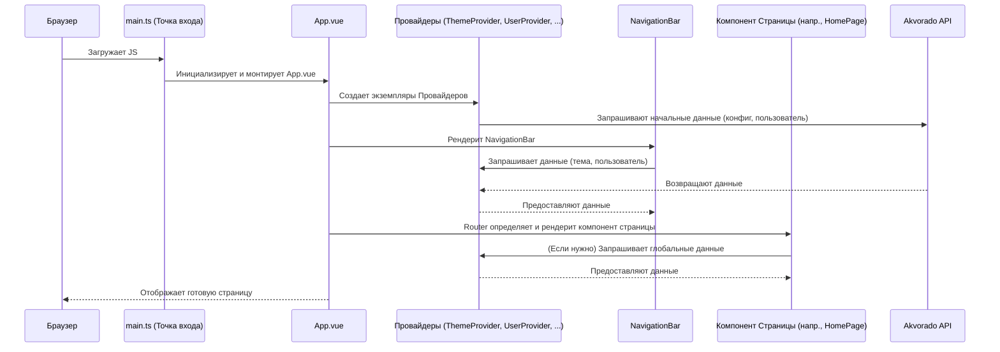

# Chapter 6: Главная структура приложения


В [предыдущей главе](05_изменение_размера_и_перетаскивание_панелей_.md) мы научились настраивать размеры панелей, таких как график и таблица, с помощью компонентов [Изменение размера и перетаскивание панелей](05_изменение_размера_и_перетаскивание_панелей_.md). Теперь давайте сделаем шаг назад и посмотрим на общую картину: как все части приложения — страницы, навигация, элементы управления — собираются воедино? Что служит «скелетом» для всего пользовательского интерфейса Akvorado?

Представьте, что вы строите дом. У вас есть отдельные комнаты (страницы), мебель (компоненты), но вам нужен общий фундамент и каркас, который будет все это держать и соединять. В Akvorado роль такого каркаса выполняет главная структура приложения.

**Проблема:** Как сделать так, чтобы основные элементы интерфейса, такие как [верхняя панель навигации](02_навигация_и_информация_о_пользователе_.md), всегда были видны, независимо от того, на какой странице мы находимся? Как загрузить важную информацию (например, о текущем пользователе или выбранной теме оформления) один раз и сделать ее доступной *везде* в приложении, не передавая ее вручную в каждый компонент?

**Решение:** Использовать центральный компонент-контейнер (`App.vue`), который определяет общую разметку и оборачивает все страницы в специальные компоненты-«провайдеры», предоставляющие глобальные данные.

## `App.vue`: Сердце приложения

Главным файлом, отвечающим за общую структуру, является `App.vue`. Это самый верхний компонент в иерархии Vue-приложения Akvorado. Его основные задачи:

1.  **Определить базовую разметку:** Задать основные блоки интерфейса, которые присутствуют всегда. В Akvorado это верхняя [Панель навигации (`NavigationBar`)](02_навигация_и_информация_о_пользователе_.md) и основная область (`<main>`), где будет отображаться содержимое текущей страницы.
2.  **Предоставить точку входа для маршрутизации:** Использовать специальный компонент `<router-view>`, который действует как «окно» или «портал». В зависимости от текущего URL-адреса, Vue Router (система навигации) автоматически подставляет в это «окно» нужный компонент страницы (например, `HomePage.vue` для пути `/` или `VisualizePage.vue` для `/visualize`).
3.  **Обернуть все в глобальные провайдеры:** Разместить специальные компоненты-обертки вокруг `<router-view>`. Эти обертки, называемые [Провайдерами](07_поставщики_глобального_состояния__провайдеры__.md), отвечают за загрузку и предоставление общих данных (например, темы оформления, информации о пользователе, конфигурации сервера) всем дочерним компонентам, включая любую страницу, которая отображается через `<router-view>`.

Давайте посмотрим на упрощенную структуру файла `App.vue`:

```vue
<!-- console/frontend/src/App.vue -->
<template>
  <!-- 1. Обертка для провайдера конфигурации -->
  <ServerConfigProvider>
    <!-- 2. Обертка для провайдера темы -->
    <ThemeProvider>
      <!-- 3. Обертка для управления заголовком страницы -->
      <TitleProvider>
        <!-- 4. "Окно" для страниц (маршрутизация) -->
        <router-view v-slot="{ Component }">
          <!-- 5. Обертка для провайдера данных пользователя -->
          <UserProvider>
            <!-- 6. Основная структура страницы -->
            <div class="flex h-full max-h-screen flex-col ...">
              <!-- 7. Всегда видимая панель навигации -->
              <NavigationBar class="flex-none ..." />
              <!-- 8. Основная область для контента страницы -->
              <main class="relative flex grow overflow-y-auto">
                <!-- 9. Сюда будет подставлен компонент текущей страницы -->
                <component :is="Component" />
              </main>
            </div>
          </UserProvider>
        </router-view>
      </TitleProvider>
    </ThemeProvider>
  </ServerConfigProvider>
</template>

<script lang="ts" setup>
// Импортируем необходимые компоненты
import NavigationBar from "@/components/NavigationBar.vue";
import TitleProvider from "@/components/TitleProvider.vue";
import ThemeProvider from "@/components/ThemeProvider.vue";
import UserProvider from "@/components/UserProvider.vue";
import ServerConfigProvider from "@/components/ServerConfigProvider.vue";
// Импорт основного CSS
import "./tailwind.css";
</script>
```

**Объяснение:**

*   **`<template>`:** Определяет HTML-структуру. Обратите внимание на вложенность!
*   **Провайдеры (1, 2, 3, 5):** `ServerConfigProvider`, `ThemeProvider`, `TitleProvider`, `UserProvider` — это те самые глобальные обертки. Они не отображают ничего видимого сами по себе, но выполняют логику (например, загрузку данных) и делают эти данные доступными всем компонентам *внутри* них.
*   **`<router-view>` (4):** Место, куда Vue Router будет динамически "вставлять" компонент текущей страницы (например, [Домашнюю страницу](01_домашняя_страница_и_виджеты_.md) или [Страницу визуализации данных](03_страница_визуализации_данных_.md)).
*   **`UserProvider` (5):** Оборачивает основную структуру (6-9), делая информацию о пользователе доступной как для `NavigationBar`, так и для любой страницы, отображаемой в `<main>`.
*   **Основная структура (6):** Контейнер `div`, использующий Flexbox (`flex`, `flex-col`) для расположения навигационной панели сверху (`flex-none`), а основной области (`<main>`) под ней, заставляя ее занимать все оставшееся пространство (`grow`).
*   **`<NavigationBar>` (7):** Наша постоянная [верхняя панель навигации](02_навигация_и_информация_о_пользователе_.md). Она находится *вне* `<router-view>`, поэтому отображается всегда.
*   **`<main>` (8):** Область, где будет показан контент текущей страницы.
*   **`<component :is="Component" />` (9):** Это специальный синтаксис Vue, который рендерит компонент, переданный из `<router-view>`. Именно сюда подставляется `HomePage.vue`, `VisualizePage.vue` и т.д.
*   **`<script setup>`:** Импортирует все необходимые компоненты провайдеров и навигации.

## Провайдеры: Невидимые поставщики данных

Как мы видели, `App.vue` использует несколько компонентов-провайдеров:

*   `ServerConfigProvider`: Загружает с сервера и предоставляет общую конфигурацию приложения (например, версию, список доступных измерений).
*   `ThemeProvider`: Управляет текущей темой (светлая/темная) и предоставляет эту информацию, а также функцию для ее переключения.
*   `TitleProvider`: Позволяет компонентам страниц устанавливать заголовок окна браузера.
*   `UserProvider`: Загружает информацию о текущем пользователе (логин, имя, URL для выхода) и обрабатывает ситуации, когда пользователь не авторизован.

Ключевая идея в том, что они оборачивают `<router-view>`. Представьте, что это как центральная система водоснабжения в доме: трубы проложены по всему зданию (провайдеры обернули все), и любая комната (любая страница или компонент внутри нее) может открыть кран (`inject`) и получить воду (глобальные данные).

Мы подробно разберем, как работают эти провайдеры внутри, в следующей главе: [Поставщики глобального состояния (Провайдеры)](07_поставщики_глобального_состояния__провайдеры__.md). Пока важно понять их роль в `App.vue`: они создают глобальный контекст, доступный всему приложению.

## Как все запускается: Шаг за шагом

Когда вы открываете Akvorado в браузере, происходит примерно следующее:

1.  **Загрузка:** Браузер загружает основной JavaScript-файл (обычно `main.ts` или `main.js`).
2.  **Инициализация Vue:** Этот файл инициализирует приложение Vue, включая Vue Router.
3.  **Монтирование `App.vue`:** Vue создает и "монтирует" (вставляет в DOM) корневой компонент — наш `App.vue`.
4.  **Рендеринг `App.vue`:**
    *   Начинается рендеринг шаблона `App.vue`.
    *   Создаются экземпляры провайдеров (`ServerConfigProvider`, `ThemeProvider` и т.д.).
    *   **Загрузка данных:** Провайдеры начинают выполнять свою логику (например, `ServerConfigProvider` и `UserProvider` отправляют запросы к API для получения конфигурации и информации о пользователе).
    *   Рендерится `NavigationBar`. Он может сразу запросить данные у `ThemeProvider` (чтобы знать, какую иконку темы показать) и у `UserProvider` (чтобы отобразить аватар пользователя, как мы видели в [Главе 2](02_навигация_и_информация_о_пользователе_.md)).
    *   Vue Router определяет, какой компонент страницы соответствует текущему URL.
    *   Этот компонент страницы (например, `HomePage.vue`) рендерится и подставляется вместо `<component :is="Component" />` внутри `<main>`.
5.  **Отображение:** Пользователь видит полностью собранную страницу с навигацией и содержимым конкретного раздела. Любой компонент на этой странице (или сама страница) теперь может получить доступ к данным, предоставленным провайдерами.

Вот как это выглядит на диаграмме:



## Заключение

Мы рассмотрели `App.vue` — фундаментальный компонент, который служит каркасом для всего пользовательского интерфейса Akvorado. Он определяет общую структуру с постоянной навигационной панелью и областью для динамического контента страниц, используя `<router-view>`. Ключевую роль играют компоненты-провайдеры, которые оборачивают все приложение, загружают глобальные данные (тема, пользователь, конфигурация) и делают их доступными для всех дочерних компонентов. Эта архитектура обеспечивает единообразие и упрощает управление общим состоянием приложения.

Теперь, когда мы понимаем общую структуру и роль провайдеров, самое время углубиться в то, как именно эти провайдеры работают.

**Далее:** В следующей главе, [Поставщики глобального состояния (Провайдеры)](07_поставщики_глобального_состояния__провайдеры__.md), мы подробно разберем внутреннее устройство `ThemeProvider`, `UserProvider` и `ServerConfigProvider` и механизм `provide/inject`, который они используют.

---

Generated by [AI Codebase Knowledge Builder](https://github.com/The-Pocket/Tutorial-Codebase-Knowledge)