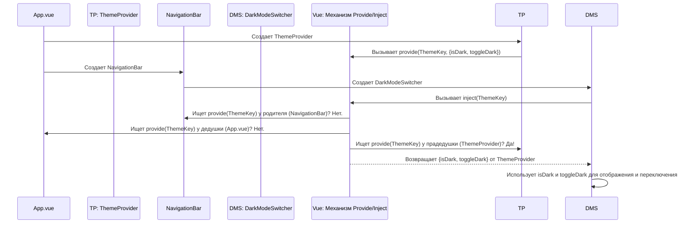

# Chapter 7: Поставщики глобального состояния (Провайдеры)


В [предыдущей главе](06_главная_структура_приложения_.md) мы рассмотрели [Главную структуру приложения](06_главная_структура_приложения_.md) и увидели, как компонент `App.vue` оборачивает все страницы в невидимые компоненты-«провайдеры», такие как `ThemeProvider` и `UserProvider`. Но зачем нужны эти обертки и как они работают?

Представьте, что вам нужно узнать, какая тема оформления (светлая или темная) сейчас включена, чтобы правильно отобразить кнопку переключения темы в [Панели навигации (`NavigationBar`)](02_навигация_и_информация_о_пользователе_.md). Или, может быть, вам нужно получить информацию о текущем пользователе, чтобы показать его имя в [Меню пользователя (`UserMenu`)](02_навигация_и_информация_о_пользователе_.md).

**Проблема:** Как передать эту общую информацию (тема, пользователь, настройки сервера) во все компоненты, которым она может понадобиться? Можно было бы передавать ее "вниз" от компонента к компоненту через входные параметры (`props`), но это быстро стало бы очень громоздко и неудобно, особенно если компоненты находятся глубоко в иерархии. Этот процесс называется "prop drilling" (прокидывание пропсов), и он усложняет код.

**Решение:** Использовать централизованные источники данных, доступные всему приложению. В Akvorado и Vue.js это реализуется с помощью **Поставщиков глобального состояния (Провайдеров)**.

Думайте о провайдерах как о центральной системе отопления или электросети в здании. Вместо того чтобы тянуть провода или трубы в каждую комнату от входа, вы подключаетесь к общей сети, доступной повсюду. Провайдеры так же предоставляют общие "ресурсы" (данные или функции) всему приложению.

В этой главе мы узнаем:
*   Что такое Провайдеры?
*   Как они работают с помощью механизма `provide` и `inject` во Vue?
*   Рассмотрим примеры `ThemeProvider`, `UserProvider` и `ServerConfigProvider`.

## Что такое Провайдеры?

Провайдер (Provider) — это специальный компонент Vue, основная задача которого — **предоставить** (provide) определенные данные или функции всем своим дочерним компонентам, независимо от того, на каком уровне вложенности они находятся.

В `App.vue` мы видели, что провайдеры оборачивают `<router-view>`:

```vue
<!-- console/frontend/src/App.vue (упрощенно) -->
<template>
  <ServerConfigProvider> <!-- 1. Предоставляет конфигурацию сервера -->
    <ThemeProvider>      <!-- 2. Предоставляет тему -->
      <TitleProvider>    <!-- 3. Предоставляет управление заголовком -->
        <router-view v-slot="{ Component }">
          <UserProvider>   <!-- 4. Предоставляет инфо о пользователе -->
            <!-- ... остальная структура с NavigationBar и <main> ... -->
            <component :is="Component" />
          </UserProvider>
        </router-view>
      </TitleProvider>
    </ThemeProvider>
  </ServerConfigProvider>
</template>
```

Это означает, что данные, предоставляемые `ThemeProvider`, `UserProvider` и `ServerConfigProvider`, будут доступны любому компоненту внутри `<router-view>` (то есть любой странице или ее частям), а также компонентам вроде `NavigationBar`.

Основные провайдеры в Akvorado:
*   `ThemeProvider`: Управляет темой (светлая/темная).
*   `UserProvider`: Управляет информацией о текущем пользователе и его аутентификацией.
*   `ServerConfigProvider`: Предоставляет конфигурацию, полученную с сервера (например, список доступных измерений).
*   `TitleProvider`: Позволяет компонентам устанавливать заголовок окна браузера.

## Как это работает: `provide` и `inject`

Vue предоставляет встроенный механизм для реализации паттерна "Провайдер": пару функций `provide` и `inject`.

1.  **`provide` (Предоставить):** Компонент-провайдер использует функцию `provide`. Он как бы говорит: "Эй, все мои потомки! Я предоставляю вот эти данные (`value`) под вот этим секретным ключом (`key`)".
    ```javascript
    // Внутри компонента-провайдера (например, ThemeProvider.vue)
    import { provide, ref, readonly } from 'vue';
    import { ThemeKey } from './keys'; // Импортируем ключ

    const isDark = ref(false); // Реактивное состояние темы
    const toggleDark = () => { isDark.value = !isDark.value }; // Функция для переключения

    // Делаем данные доступными для потомков
    provide(ThemeKey, {
      isDark: readonly(isDark), // Передаем состояние (только для чтения)
      toggleDark: toggleDark     // Передаем функцию переключения
    });
    ```

2.  **`inject` (Внедрить/Получить):** Любой дочерний компонент (даже очень глубоко вложенный) может использовать функцию `inject`, чтобы получить доступ к этим данным. Он говорит: "Мне нужны данные, которые были предоставлены под секретным ключом (`key`)".
    ```javascript
    // Внутри дочернего компонента (например, DarkModeSwitcher.vue)
    import { inject } from 'vue';
    import { ThemeKey } from './keys'; // Импортируем ТОТ ЖЕ ключ

    // Получаем данные, предоставленные предком
    const themeData = inject(ThemeKey);

    // Теперь можно использовать данные
    const isDark = themeData?.isDark;
    const toggleThemeFunction = themeData?.toggleDark;

    // Или сразу деструктурировать:
    const { isDark, toggleDark } = inject(ThemeKey)!; // ! - мы уверены, что данные будут
    ```

**Аналогия:** Представьте `provide` как Wi-Fi роутер, который транслирует сеть (данные) с определенным именем и паролем (ключом). `inject` — это как ваш телефон, который подключается к этой сети, зная ее имя и пароль, и получает доступ в интернет (к данным), независимо от того, в какой комнате дома (компоненте) вы находитесь, пока роутер (провайдер) где-то выше.

Ключевым моментом является **ключ** (`ThemeKey` в примере). Это уникальный идентификатор, который связывает `provide` и `inject`. Обычно для создания таких ключей используют `Symbol()`, чтобы избежать случайных совпадений имен.

## Пример: `ThemeProvider` и `DarkModeSwitcher`

Давайте посмотрим, как это работает на практике для управления темой.

**1. `ThemeProvider.vue` (Провайдер)**

Этот компонент использует `useDark` из `@vueuse/core` для определения и переключения темы, а затем **предоставляет** (`provide`) текущее состояние (`isDark`) и функцию переключения (`toggleDark`) под ключом `ThemeKey`.

```vue
<!-- console/frontend/src/components/ThemeProvider.vue -->
<template>
  <!-- Провайдер обычно не рендерит видимых элементов -->
  <slot></slot>
</template>

<script lang="ts" setup>
import { provide, readonly } from "vue";
import { useDark, useToggle } from "@vueuse/core";
import { ThemeKey } from "./keys"; // Импортируем ключ

// Получаем реактивное состояние темы и функцию переключения
const isDark = useDark();
const toggleDark = useToggle(isDark);

// Предоставляем данные всем потомкам
provide(ThemeKey, {
  isDark: readonly(isDark), // isDark только для чтения
  toggleDark,              // Функция для переключения
});
</script>

<!-- Вспомогательный файл keys.ts (пример) -->
<script lang="ts">
import type { InjectionKey, Ref } from "vue";
// Определяем ключ и тип данных, которые он будет предоставлять
export const ThemeKey: InjectionKey<{
  isDark: Readonly<Ref<boolean>>;
  toggleDark: () => void;
}> = Symbol();
</script>
```
**Объяснение:**
*   Компонент импортирует `provide` из Vue и `ThemeKey` (специальный ключ типа `Symbol`).
*   Он получает `isDark` (реактивная ссылка `ref`, показывающая, темная ли тема) и `toggleDark` (функция для переключения) от `useDark`/`useToggle`.
*   С помощью `provide(ThemeKey, { ... })` он делает эти данные доступными для всех дочерних компонентов. `readonly(isDark)` гарантирует, что дочерние компоненты не смогут напрямую изменить `isDark`.

**2. `DarkModeSwitcher.vue` (Потребитель)**

Этот компонент (который мы видели в [Главе 2](02_навигация_и_информация_о_пользователе_.md) внутри `NavigationBar`) хочет отобразить правильную иконку (солнце/луна) и переключать тему по клику. Он **внедряет** (`inject`) данные, предоставленные `ThemeProvider`.

```vue
<!-- console/frontend/src/components/DarkModeSwitcher.vue -->
<template>
  <button @click="toggleDark()"> <!-- Вызываем полученную функцию -->
    <MoonIcon v-if="!isDark" /> <!-- Используем полученное состояние -->
    <SunIcon v-if="isDark" />
  </button>
</template>

<script lang="ts" setup>
import { inject } from "vue";
import { SunIcon, MoonIcon } from "@heroicons/vue/solid";
import { ThemeKey } from "./keys"; // Используем ТОТ ЖЕ ключ

// Получаем (внедряем) данные от предка-провайдера
const { isDark, toggleDark } = inject(ThemeKey)!;
// '!' говорит TypeScript, что мы уверены, что провайдер существует выше
</script>
```
**Объяснение:**
*   Компонент импортирует `inject` и тот же `ThemeKey`.
*   С помощью `inject(ThemeKey)!` он получает объект `{ isDark, toggleDark }`, который был предоставлен `ThemeProvider`.
*   Теперь он может использовать `isDark` для отображения нужной иконки и `toggleDark` для привязки к событию `@click`.

Заметьте, что `DarkModeSwitcher` ничего не знает о том, *как* `ThemeProvider` получает или изменяет тему. Он просто запрашивает нужные данные и функции по ключу. Между ними могут быть десятки других компонентов, но это не имеет значения!

## Другие примеры: `UserProvider` и `ServerConfigProvider`

Точно такой же механизм используется и другими провайдерами:

*   **`UserProvider.vue`**:
    *   Запрашивает `/api/v0/console/user/info` с помощью `useFetch`.
    *   Обрабатывает ошибки (например, 401 Unauthorized).
    *   Использует `provide(UserKey, { user: shallowReadonly(data) })`, чтобы сделать объект `user` (с полями `login`, `name`, `email`, `logout-url`) доступным.
    *   Компонент `UserMenu.vue` затем использует `inject(UserKey)` для получения и отображения этой информации.

*   **`ServerConfigProvider.vue`**:
    *   Запрашивает `/api/v0/console/configuration` с помощью `useFetch`.
    *   Использует `provide(ServerConfigKey, shallowReadonly(data))`, чтобы сделать конфигурацию (версия, настройки по умолчанию, список измерений `dimensions` и т.д.) доступной.
    *   Компоненты, которым нужен список измерений (например, `InputDimensions.vue` из [Главы 4](04_компоненты_ввода_данных_.md)), могут использовать `inject(ServerConfigKey)` для его получения.

## Под капотом: Как Vue находит данные?

Когда компонент вызывает `inject(key)`, что происходит?

1.  Vue смотрит на **родительский** компонент: предоставлял ли он данные с таким `key`?
2.  Если нет, Vue идет **еще выше** к "дедушке": предоставлял ли он данные с таким `key`?
3.  Vue продолжает подниматься по цепочке предков, пока не найдет компонент, который вызвал `provide(key, ...)`.
4.  Как только такой компонент найден, Vue возвращает значение, которое было передано в `provide`.
5.  Если Vue дойдет до самого корня приложения и не найдет нужный `provide`, `inject` вернет `undefined` (или значение по умолчанию, если оно было указано: `inject(key, defaultValue)`). В наших примерах с `!` мы предполагаем, что провайдер всегда будет найден.

Давайте представим это на диаграмме для примера с темой:



## Зачем нужны `Symbol()` для ключей?

Вы могли заметить, что ключи (`ThemeKey`, `UserKey`) создаются с помощью `Symbol()`. Это делается для того, чтобы гарантировать их уникальность. Если бы мы использовали строки (например, `provide('theme', ...)`), то был бы риск, что какая-нибудь другая библиотека или другой провайдер в приложении случайно используют то же самое строковое имя ключа, что привело бы к конфликтам. `Symbol()` создает абсолютно уникальное значение, даже если передать ему то же описание, что и другому `Symbol()`.

## Заключение

В этой главе мы погрузились в мир Поставщиков Глобального Состояния (Провайдеров) в Akvorado. Мы поняли, что они решают проблему передачи общих данных по всему приложению, избегая неудобного "прокидывания пропсов". Мы изучили механизм `provide` и `inject`, который позволяет компонентам-провайдерам (как `ThemeProvider`, `UserProvider`, `ServerConfigProvider`) предоставлять данные, а дочерним компонентам — легко получать их по уникальному ключу.

Этот паттерн является мощным инструментом для управления состоянием в приложениях Vue, делая код чище и проще в поддержке. Понимание того, как работают провайдеры, завершает наше знакомство с основными концепциями фронтенд-архитектуры Akvorado. Теперь вы имеете представление о том, как страницы собираются, как работает навигация, как настраиваются и визуализируются данные, и как общая информация становится доступной во всем приложении.

---

Generated by [AI Codebase Knowledge Builder](https://github.com/The-Pocket/Tutorial-Codebase-Knowledge)