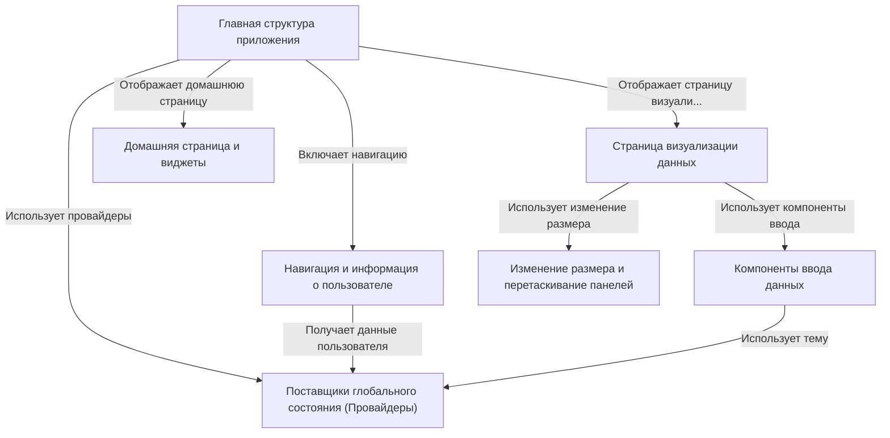

# Tutorial: akvorado

Проект **Akvorado** представляет собой *веб-интерфейс* для анализа и визуализации данных *сетевых потоков*. Он позволяет пользователям исследовать трафик, используя различные **графики** и **фильтры** на специальной странице визуализации, а также просматривать **сводную информацию** на домашней странице. Приложение имеет *модульную структуру*, включающую компоненты для ввода данных, навигации и управления глобальным состоянием.

**Source Repository:** [None](None)

## Chapters

1. [Домашняя страница и виджеты
](01_домашняя_страница_и_виджеты_.md)
2. [Навигация и информация о пользователе
](02_навигация_и_информация_о_пользователе_.md)
3. [Страница визуализации данных
](03_страница_визуализации_данных_.md)
4. [Компоненты ввода данных
](04_компоненты_ввода_данных_.md)
5. [Изменение размера и перетаскивание панелей
](05_изменение_размера_и_перетаскивание_панелей_.md)
6. [Главная структура приложения
](06_главная_структура_приложения_.md)
7. [Поставщики глобального состояния (Провайдеры)
](07_поставщики_глобального_состояния__провайдеры__.md)

---

Generated by [AI Codebase Knowledge Builder](https://github.com/The-Pocket/Tutorial-Codebase-Knowledge)